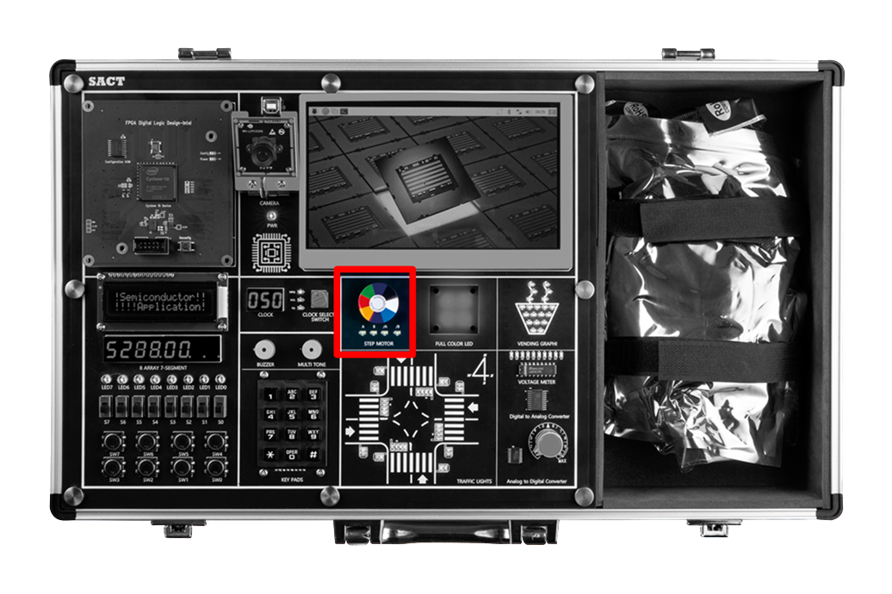

# Semiconductor Application Circuit Training Equipment

**Hanback Electronics SACT**

---

## SACT 

---

## Features

SACT equipment has the features below. 

- Programmable semiconductor training equipment that allows free definition of hardware operations

- Provides touch display, camera, and single board computer (SBC) required for operating the practice instructions.

- Provides 16 types of clock supply functions required for application circuit operating clocks.

- Provides peripheral devices (buttons, text LCD, keypad, stepper motor, RGB-LED, potentiometer, etc.) required for application circuit experiments.
- Provides ADC/DAC for sensor application circuit design and analog signal control.

- Provides a professional design environment based on various design tools, including timing analyzers, state diagram creation tools, and simulation environments.

- Circuit design support using only a schematic editor, making it easy for beginners to access.

- Rapid feedback throughout the design-implement-test cycle allows you to quickly validate and improve your designs.

- Provides a simplified workflow for quickly simulating designed circuits and experimenting with them on lab equipment.

- Systematically supports the design and practice of major combinational logic circuits such as adder, subtractor, comparator, multiplexer.

- Learn with increasing difficulty, from latches and flip-flops to registers and counters.

- Precise timing and synchronization practice possible

- Implementing complex state-based control logic through FSM designs such as Moore/Milley machine.

- Memory design and testing practice available.

- Curriculum support that starts with basic logic gates and gradually progresses to complex combinational and sequential logic circuit.

- Indirect experience with processes used in actual semiconductor design and testing process.

 

---

## Software Environment
   - OS: Windows 10 or later

   - Design Software

      - Semiconductor application circuit design using schematics

      - Simulation of the designed circuit

      - Verifying hardware operation through programming

---

## Block

### Semiconductor Application Circuit Design Block
   - Block that user can design and program semiconductor application circuit in Programmable Logic Device and verify hardware operation.

   

### Clock Control Block
   - Select a clock configured in 16 levels from 0 Hz to 50 MHz for semiconductor application circuit design and use it
    
   - 0Hz, 1Hz, 10Hz, 50Hz, 100Hz, 500Hz, 1kHz, 5kHz, 10kHz, 50kHz, 100kHz, 500kHz, 1MHz, 5MHz, 25MHz, 50MHz

   

### Input
   - Slide Switch 8ea

   - Push Button Switch 8ea	

   - 3 x 4 Keypads 1ea

   
 
### Output
   - Buzzer 1ea

   - Multi Tone Buzzer 1ea

   
 
### Display
   - 16 x 2 Text LCD
   
   - 4 Digit FND 2ea
   
   - LED 8ea
   
   - RGB LED 4ea 

   
  
### Actuator
   - Step Motor (Status LED 4ea)

   
 
### AD/DA Convertor
   - ADC : Parallel 8-bit, Sampling Speed 1MHz

   - DAC : Parallel 8-bit, Sampling Speed 500kHz
   
   - AD In : Volume Resistor(0 ~ +5V)
   
   - Voltage meter : 0 ~ +5V, Display LED 10ea

   
 
### Application Block
   - Traffic Light
      - Controlling the traffic light at intersection using 32 LEDs

      - 24 I/O controls

   

   - Vending Machine Image
      - Expressing cup is filled with water using 20 LEDs

      - 7 I/O controls

   
            

### Assistance Block
   - It consists of x86 series PC, 7-inch monitor, camera
   
   - Showing class through 7-inch TFT LCD

   

    

   - Camera Demo to operate by connecting Programmable Logic Device and Assistance Block

   
        
## 장비 Demo

- Place the switch on Programmmable Logic Device module of SACT equipment to Demo as shown below.

> If it is placed on blank, Demo does not operate.

- Connect the power cable to the equipment as shown below and press the power switch to turn on the power.

- Operate CLOCK block of SACT device at 50MHz as follows. 

Demo on the device is based on 50MHz and it may operate more slowly or operation may not be seen at all at other frequencies.

- If setting DEMO switch and CLOCK 50MHz and power on the device, Demo starts operating.

> To disable the Demo operation, set the switch to Blank in the Programmable Logic Device module.

- DEMO operates as below.

 

1. Left and right movement is displayed by PWM control on 8 LEDs.

 

  

2. Values in which the first four (SEG7, SEG6, SEG5, SEG4) seconds and 1/100 seconds are counted are displayed on the first four (SEG7, SEG6, SEG5, SEG4) of eight 7-Segments.

 

  

3. The values set in Slide Switch (S7-S0) are displayed in HEX format on the middle two (SEG3, SEG2) of eight 7-Segments. 

 

 

4. Values pressed on the button switch (SW7-SW0) and keypad are displayed on the last two (SEG1, SEG0) of eight 7-Segments. 

 

 

5. When button switch SW3 is pressed, 3-octave tone is output on MultiTone Buzzer (PIEZO).

 

 

6. When button switch SW2 is pressed, sound is output on the buzzer.

 

 

7. "Semiconductor / App. Circuit Kit" is displayed on the text LCD. 

 

 

8. Step motor rotates counterclockwise.

 

 

9. RGB LED displays various colors.

 

 

10. Repeat the operation of filling the glass with water in Vending Graphic block.

 

 

11. Traffic light operates on the traffic Light block.

    When button switch SW1 is pressed, yellow light on the road traffic light flashes.

    When the button switch SW0 is pressed, yellow light on the road traffic light flashes in toggle.
 

 

 

 

12. When VR is adjusted, 0-5V value is read by Analog to Digital Converter and transmitted to Digital to Analog Converter.
This is confirmed by 10 LEDs on Voltage Meter block.

 

 

13. Select CAMERA icon in the Assistance Block of TFT LCD.

    It is displayed on the screen as shown below by Slide Switch (SW7, SW6).
    
    |S7|S6||CAMERA DISPLAY MODE|
    |:-:|:-:|:-:|:-:|
    |0|0||NOT DISPLAY|
    |0|1||RGB Mode|
    |1|0||Grayscale Mode|
    |1|1||Canny Mode|

Not Display

 

RGB Mode

 

Grayscale Mode

 

Canny Mode

 

    

