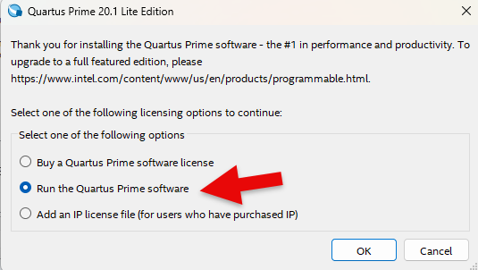

## Tool Install
---

The following is a method to install software used for semiconductor application design practice.

The design software is altera's Quartus Prime software. 

There are paid version and free version depending on the purpose of use. 

The version described here is free version, Quartus Prime 20.1.1 Lite Edition Windows version. 

Free version has no differences in capabilities to use compared to the paid version, only in the devices it supports.

Up to this version is simulator software, which supports ModelSim-Altera Edition. 

Since there is no license required, you can install and use Quartus Prime version 20.1.1 that is used for the actual FPGA design, and is used for semiconductor application design in this equipment.

※	This book was written in June 2025 and website and access method may change over time

 

---
## Download and Install Installation File

1. Go to website: [https://www.altera.com](https://www.altera.com)

        

2. Select Product > Development Software & Tools on the screen.

        

3.	Select “Quartus Prime Design Software” in Design Tools on the screen.

        

4.	After selecting “Downloads”, select “Go to Download” of Lite Edition.

    Lite Edition is free software. 

    There are restrictions in device, and the license can be used for one year without any additional settings. You can reinstall if necessary.

        

5. Select 20.1.1 version. 

    This is for using ModelSim as simulation software.

    To use software beyond this version, separate license setup is required.

        

6.	Select Download in Multiple Download and download the software.

    The total download size is 5.9GB.

       

7.	When downloading, the file appears in download history in the upper right corner of the window in Chrome as shown below.

       

8.	Unzip the downloaded Quartus-lite-20.1.1.720-windows.tar file and run setup.bat file to proceed with the installation.

       

9. When installing, License Agreement window will appear. Select “I accept the agreement” and then click ‘Next’ button.

       

10. Install in the default location as shown below.

       
	
11. Next is screen selects the components to install. If there is enough hard
disk space, you can install them all. Select Quartus Prime Help / Cyclone IV / Cyclone 10LP / Modelsim-IntelFPGA Starter Edition (Free) as shown below.

     

	
12. Press Next and software installation proceeds.
	
       
	

13. When the installation is complete, the window below will appear. Click “Finish” to complete the software installation and install USB Blaster II driver.
    
 
    ※ USB Blaster is a programming hardware device

      
	

14. Install USB Blaster II driver as below. 

     
	

15. After completing the driver installation, Quartus Prime software will run. For the first time only, select “Run the Quartus Prime software” as shown below.

     
	
   

16. Below is the first screen that appears when Quartus Prime is executed.
		
    	 

