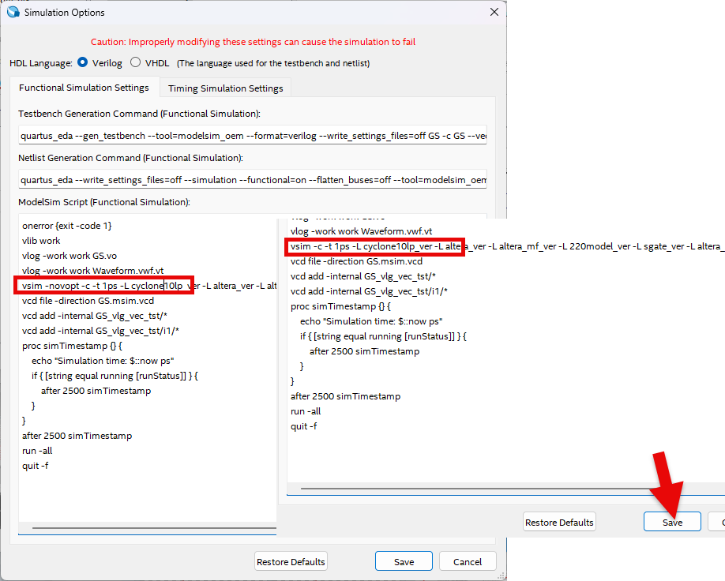

## Getting Started
---

Let’s learn how to use Quartus Prime Lite Edition, which was installed.

Quartus 소프트웨어를 사용하기 위해서는 아래의 과정을 거쳐야 한다. 

To use Quartus software, you must follow the steps below
   1.	Create project
   2.	Design logic 
   3.	Check syntax (Functional Compiler)
   4.	Assign Device & Pin 
   5.	Compile (Place & Route / Timing Analyzer / Generate Programming File)
   6.	Simulation (Functional / Timing)
   7.	Verify Hardware Operation (Programming)

This textbook does not cover the entire process described above. Instead, it simplifies the process focusing on Digital Logic experiment. 

   1.	Open Project
   2.	Design Logic (Add/connect only logic gate in the circuit)
   3.	Compile
   4.	Simulation (Functional Simulation)
   5.	Verify Hardware Operation (Programming)

Entire process of configuring and verifying basic circuit using Quartus software will be explained.

 

---

## Project Setting

Set up the project through the steps below.

1. Launch Quartus Prime Lite Edition software.

      

2. Create a new project file by selecting File > New Project Wizard menu.

      

3. Introduction menu, which appears as shown below, can be moved to the next step by clicking Next button.

      

4. Set Project workspace and Project Name as below noting that case is sensitive.

      

   |Description |Data|
   |:-|:-|
   |Working directory | d:\work\GS|
   |Project Name | GS |
   |Top Level Design Edtity Name | GS|

 

5. When you click Next button, you will be asked whether to create a new directory as below. Select Yes.

      

6. On selecting Project Type, select Empty Project. Then, click Next button.

      
   
7. For the files to add, do not change any other settings and click Next button.

      

8. This is setting the device name for Programmable Logistic Device (FPGA) that will be used for programming on actual hardware to practice an experiment.

   |Device Family | Cyclone 10LP|
   |:-|:-:|
   |Package |FBGA|
   |Pin Count |484|
   |Core speed grade | 8|
   |Device |10CL080YF484C8G|

    

      

9. For EDA Tool Setting, do not change any other settings and click Next button. 

      

10. After checking the project information set, click Finish button to complete project creation.

      

---

## Logic Design

11. If the project creation is complete, project settings appears as below.   
      

12. To create a new design file, select File > New menu as shown below.   
      

13. Select “Block Diagram/Schematic File” in New window to select design by symbol as shown below.   
        
      

14. Double-click the drawing area as shown below, or right-click the drawing area and select Insert > Symbol.

      

15. In symbol input window, enter the symbol name "4count" and click OK button. Then, place it in an appropriate location on the drawing.   
       
      

16. After displaying the symbol input window in the same way, add input and output by entering the symbol name of input and output.   
       
       
       

17. Double-click pin_name1 or pin_name2 in the input and output symbol, and enter CLK and Q[3..0] as the pin names in the Pin Properties window that appears.  
       
       

18. Next is how to connect symbol using wire.   If placing mouse pointer over the end of symbol. Mouse pointer will change to + sign. Then, drag and drop the mouse button to connect symbol and symbol as shown below.   
       
       
   
19. In addition to connecting with wire, there is a way to connect with NET name. Add wire to 4count output, QA, QB, QC, QD, respectively, and set NET NAME to Q0, Q1, Q2, Q3 as shown below. 
    You can either enter Q1 for NET NAME right after drawing the wire or select the wire later and enter net name, such as Q1.  
       
       
       

20. The reason why the output name is Q[3..0] is to set Q0, Q1, Q2, Q3 as 1-bit wire to 4-bit bus port.   
       
   
21. Select File > Save to save the designed file. Before saving, file name will appears with default value of Block.bdf.   
       
    It's recommended to save with the current project name as shown below. Click SAVE button to save.   
       
       

---

## Functional Compile

22. Select Processing > Start > Start Analysis & Elaboration to compile that checks syntax error.   
       

    If there is an error, error message as below will appear. After resolving the error, compile again.   
   
    ※Please note that the error below is due to CLK line between input symbol and 4count symbol not being connected. This can be resolved by reconnecting it properly.

       

---

## Device & Pin Assignment 

23. If there is no error in the syntax, configure the device and pin for the hardware to test.   
    Programmable Logic Device can be used by customizing all I/O pins except for specific pin such as Power / JTAG / Input-only pin. Hardware is currently tested using equipment called SACT, so fixed device and pin must be set up.   

24. Select Assignment > Device to configure the device settings.
      
       

25. Device name is 10CL080YF484C8 of Cyclone 10LP Family, as set previously. 
      
       

    >|Cyclone 10LP | 10CL080YF484C8G |
    >|:-:|:-:|
   
    If the device name set is different, it will not be downloaded on the device, so be careful when setting the device.   

26. Click “Device and Pin Option” button in Device Settings window as shown below. 
      
       

27. In ‘Device and Pin Options’ window, select “As output driving ground” in ‘Reserve all unused pins’ of ‘Category Unused Pins’ as shown below. 
      
    This is to avoid confusion during the operation test by setting the unused pins to GND, that is, 0, when downloading and operating the device later.  
    Default value, As input tri-state with weak pull-up, sets the unused pin to weak pull-up state, which outputs 1 for unused pins.   
    As the remaining unused LEDs light up and cause confusion when checking the operation, set the unused pins to output GND.  
       

28. Select Assignment > Pin Planner to proceed with pin settings.
      
      

29. In Pin Planner window, below shows ‘pin out’ of the device being used. Among these, ‘O’ is User I/O, which sets the pin number corresponding to input/output port of the logic arbitrarily defined and designed by the user. 
      
       

    Set the pin number described in the table below to Location of Node Name in the lower section.  
    They are pin numbers of input Button Switch and output LED for checking operation on SACT device.   
   
    >|Port Name||CLK|Q3|Q2|Q1|Q0|
    >|:-:|:-:|:-:|:-:|:-:|:-:|:-:|
    >|Device||SW7|LED7|LED6|LED5|LED3|
    >|Pin Number||W8|W2|Y1|Y2|Y3|
   
     

    As shown below, click Location section of each input/output port with the mouse and enter the pin number for each device.   
    For example, if you enter W8, which corresponds to Button Switch SW7, which automatically adds PIN_ in front of it to become PIN_W8.  
       
   
30. Like device setting, set up pin carefully. If setting different pin, the hardware may not produce the desired results. 
      
    Close Pin Planner window. Settings will be automatically saved.   

---

## Compile

31. Compile device/device option/pin setting set previously. 
     

    Check for any errors in the settings and create Timing file and Programming file to simulate by reflecting the set hardware.   

32. Select Processing > Start Compilation to proceed with compilation. 
      
       
       
   
33. Compilation goes through several steps.
      
    -	Analysis & Synthesis: Analyze and synthesize logic circuit written using logic gate
    -	Fitter (Place & Route): Convert into logic cell which is the basic unit of the chip based on the synthesized content, and connect logic cells to each other
    -	Assembler (Generate Programming File): Create a programming file to download to chip
    -	Timing Analysis: Generate timing information, such as delay time, for the selected chip

      
       

## Functional Simulation

34. Simulation is to predict hardware operation in software. 
     
    Select File > New, and then select Verification / Debugging Files > University Program VWF from the resulting window.
      
       
       

35. The image below shows Simulation Waveform Editor window that appears when selecting University Program VWF.
      
       

36. To add input/output port simulating, right-click on the screen and select “ Insert Node or Bus”.
      
       

37. Click “Node Finder” in “Insert Node or Bus” window.
      
       

38. When pressing (1) “List”, input/output port like (2) appear in Nodes Found. Click >> (3) to move the input/output port to Selected Nodes (4). Then, press OK.
      
       

39. When ‘Insert Node or Bus’ window appears as shown below on the left, click OK. Then, input/output ports are added to Waveform Editor window.
       

40. To provide input conditions for the simulation, drag and select Waveform of CLK with the mouse (1) and then press 1 icon (2) and enter 1. 
     
    This is how to set CLK input conditions. 
      
       
       

41. Select File > Save to save. Set file name as the default. 
      
       
       

42. Select Simulation > Run Functional Simulation to run it.
      
       

43. An error message like below will appear, which indicates there is an error in the preset options in the software.
      
       

    Click Simulation > Simulation Settings to open the settings window.
       

44. Delete “-novopt” in the settings window and click Save button to save. 
      
       

45. Select Simulation > Run Functional Simulation menu again to run Function Simulation. 
     
    The result is as shown below. Clicking “Q” in the direction of the arrow on the screen, bus data is extended and bit data is also output.
      
  
       

---
## Hardware Test(Programming)

46. Prepare SACT equipment to test hardware operation. 

47. Connect USB cable to USB B Type Connector at the top center of the device and to the PC.

     

48. Connect the power cable to Power Connector on the left side of the device and press the power switch to supply power to the device.

     

49. Select Tool > Programmer in Quartus software.

     

50. If Hardware Setup on Programmer window is set to No Hardware, check that USB cable is properly connected between device and PC, then press “Hardware Setup” button and select “USB Blaster”.

     

     

51. If USB Blaster is connected, press Start button to program and check the operation of NOT gate on the device.

     

52. Operate button switch and check the result through LED.

    >|Port Name||CLK|Q3|Q2|Q1|Q0|
    >|:-:|:-:|:-:|:-:|:-:|:-:|:-:|
    >|Device||SW7|LED7|LED6|LED5|LED3|
    >|Pin Number||W8|W2|Y1|Y2|Y3|

    

