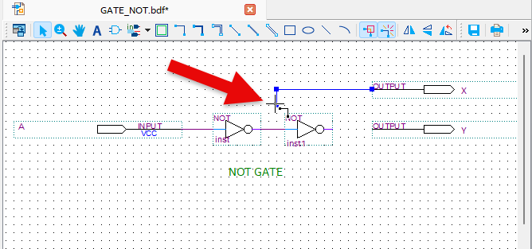

# Not Gate
---
## Theory 

NOT operation outputs the opposite of input logic value. Output value can also be said to be the inverse or complement of input value.

The following figure shows the logic symbol for NOT gate, also called inverter.

This circuit always has one input, and output will be the opposite of input logic value.

That is, when High value is input, Low value is output.

 

 

NOT Operation Truth Table

|A|X = /A  (not A)|
|:---:|:---:|
|0|1|
|1|0|

 

Operation waveform

 

---
## Practice Objectives

Let's design and experiment with the circuit below. 

 

 

Operational truth table of this circuit is as below.

|A|X = /A |Y = /(/A) = A|
|:---:|:---:|:---:|
|0|1|0|
|1|0|1|

 

Devices connected to check SACT equipment are as below.

|A|X|Y|
|:---:|:---:|:---:|
|SW7|LED7|LED6|

 

### Design

1. Prepare project file  <a href="./pds/GATE_NOT.zip" download>GATE_NOT.zip</a> for the experiment. 

 

2. Move the project compressed file downloaded to d:\work and unzip it.

 

3. Run Quartus II and select File > Open Project.

 

4. Go to d:\work\GATE_NOT folder, where the files are unzipped, and open GATE_NOT project. 

 

5. Select File > Open to import GATE_NOT.bdf file. Or double-click GATE_NOT on the left side of the project. 

 

 

6. Unfinished drawing is shown. Let's complete it with the drawing described before.

 

 

7. Double-click the drawing as shown below, or right-click the mouse and select Insert > Symbol.

 

8. In the symbol window, enter symbol name “not” in ‘-Name-’ at bottom left, and click OK button. 

 

9. Place NOT gate symbol on the drawing. Repeat this so that two symbols are placed on the drawing.

 

10. If placing the mouse pointer over the line of symbol, it will change to drawing a wire as shown. Let's complete the circuit by dragging and dropping the mouse.
 
※Note that if the wire in the circuit is not connected correctly, the desired operation may not be done.

 

 

 

### Compile

11. Select File > Save and save, and select Processing > Start Compilation menu to compile.

Compilation is process to verify that there are no errors in the designed logic circuit and create programming file and simulation file.

 

 

12. The image below shows the state in which compilation has been completed.

 

 

### Simulation

13. Select File > Open, and change File Type to All Files (.) in Open File window in the lower right corner, then select Waveform.vwf file.

 

 

 

14. In Waveform window, select Simulation > Run Functional Simulation to run it.

 

15. The figure below shows the simulation result. Check that the simulation conforms to the truth table described previously.

 
 

### Check Hardware Operation

16. Prepare SACT equipment.

17. Connect USB cable to USB B Type Connector at the top center of the device and to the PC.

18. Connect power cable to Power Connector on the left side of the device and press the power switch to supply power to the device.

19. In Quartus software, select Tool > Programmer.

 

20. If Hardware Setup on Programmer window is set to No Hardware, check that USB cable is properly connected between the device and the PC, then press Hardware Setup button and select USB Blaster.

 

 

21. If USB Blaster is connected as below, press Start button to program and check the operation of NOT gate on the device.

 

22. Operate the button switch and check the result through LED.

|A|X|Y|
|:---:|:---:|:---:|
|SW7|LED7|LED6|

 

