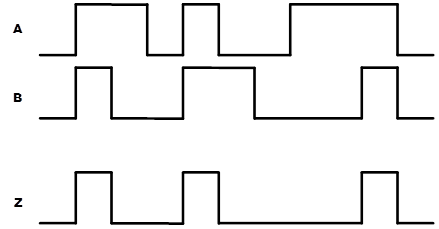
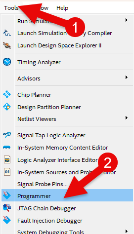

# AND Gate
---
## Theory 

AND operation is performed like normal multiplication between 1 (High) and 0 (Low). 

The following figure shows logic symbol for two-input AND gate. 

Output of AND gate is equal to product of logical input. Output of AND gate is high only when all inputs are high. 

If any of the inputs is Low, Low value is output.

 

 

AND operation truth table

|A|B|Z = AB|
|:---:|:---:|:---:|
|0|0|0|
|0|1|0|
|1|0|0|
|1|1|1|

 

Operation Waveform

 

---
## Practice Objectives

Let's design and experiment with the circuit below.

 

 

The operation truth table of this circuit is as below.

|A|B|Z = AB|
|:---:|:---:|:---:|
|0|0|0|
|0|1|0|
|1|0|0|
|1|1|1|

 

Devices connected to check in SACT equipment are as below.

|A|B|Z|
|:---:|:---:|:---:|
|SW7|SW6|LED7|

 

 

### Design

1. Prepare project file <a href="./pds/GATE_AND.zip" download>GATE_AND.zip</a> for the experiment.

 

2. Move the compressed file of the downloaded project to d:\work and unzip it.

3. Run Quartus II and select File > Open Project.

 

4. Go to the d:\work\GATE_AND folder, which is the location where you unzipped the files above, and open the GATE_AND project.

 

5. Select File > Open and import GATE_AND.bdf file, or double-click GATE_AND on the left side of the project.

 

6. Complete unfinished drawing into the drawing described before.

 

 

7. Double-click the drawing, or right-click and select Insert > Symbol.

 

8. In the symbol window, enter the symbol name “and2” in ‘ -Name- ’ at the bottom left, and click OK.

 

9. Place AND gate symbol on the drawing and connect the symbol with wire to complete the circuit.
 
※ If the wire in the circuit is not connected correctly, it may not operate properly.

 

 

### Compile

10. Select File > Save menu and save. Select Processing > Start Compilation to compile. 

This compilation process verifies error in the designed logic circuit and creates programming file and simulation file.

  

11. Image below shows that compilation is completed.

 

 

### Simulation

12. Select File > Open menu, and change File Type to “All File ( . )” in Open File window that appears, then select Waveform.vwf file.

 

13. Select Simulation > Run Functional Simulation in Waveform window and run functional simulation.

 

14. The figure below shows the simulation result. Check that the simulation conforms to the truth table described previously.

 
 

### Check Hardware Operation

15. Prepare SACT equipment.

16. Connect USB cable to USB B Type Connector at the top center of the device and to the PC.

17. Connect power cable to Power Connector on the left side of the device and press the power switch to supply power to the device.

18. In Quartus software, select Tool > Programmer.

 

19. Check that USB Blaster is connected in Hardware Setup on Programmer window and press Start button to program, and check the operation of AND gate on the device. 

 

20. Operate the button switch and check the result through LED.

|A|B|Z|
|:---:|:---:|:---:|
|SW7|SW6|LED7|

  

 

