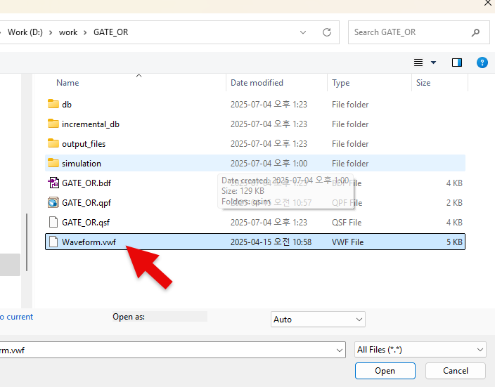

# OR Gate
---
## Theory

OR operation is an operation in which the result is 1 if either of the inputs is 1. 

The figure below is the logic symbol for 2-input OR gate. Output of OR gate performs OR operation of logic input. 

OR gate is circuit in which the output is high when either of the inputs is high. Low is output only when all inputs are low.

 

 

OR Operation Truth Table

|A|B|Z = A+B|
|:---:|:---:|:---:|
|0|0|0|
|0|1|1|
|1|0|1|
|1|1|1|

 

Operation Waveform

 

---
## Practice Objectives

Let's design and experiment with the circuit below.

 

 

The operation truth table of this circuit is as below.

|A|B|Z = A+B|
|:---:|:---:|:---:|
|0|0|0|
|0|1|1|
|1|0|1|
|1|1|1|

 

Devices connected to check in SACT equipment are as below.

|A|B|Z|
|:---:|:---:|:---:|
|SW7|SW6|LED7|

 

### Design

1. Prepare project file <a href="./pds/GATE_OR.zip" download>GATE_OR.zip</a> for the experiment.

 

2. Move the compressed file of the downloaded project to d:\work and unzip it.

3. Run Quartus II and select File > Open Project.

 

4. Go to d:\work\GATE_NOT folder, where the files are unzipped, and open GATE_OR project.

 

5. Select File > Open to import GATE_OR.bdf file. Or double-click GATE_OR on the left side of the project.

 

6. Unfinished drawing is shown. Let's complete it with the drawing described before.

 

 

7. Double-click the drawing or right-click the mouse and select Insert > Symbol.

 

8. In the symbol window, enter symbol name “or2” in ‘-Name-’ at bottom left, and click OK button.

 

9. Place OR gate symbol on the drawing and connect the symbol with wire to complete the circuit.
 
※ If the wire in the circuit is not connected correctly, it may not operate properly.

 

 

### Compile

10. Select File > Save and save, and select Processing > Start Compilation menu to compile.

Compilation is process to verify that there are no errors in the designed logic circuit and create programming file and simulation file.

  

11. The image below shows the state in which compilation has been completed.

 

 

### Simulation

12. Select File > Open, and change File Type to All Files (.) in Open File window in the lower right corner, then select Waveform.vwf file.

 

13. In Waveform window, select Simulation > Run Functional Simulation to run it.

 

 
 

### Check Hardware Operation

14. Prepare SACT equipment.

15. Connect USB cable to USB B Type Connector at the top center of the device and to the PC.

16. Connect power cable to Power Connector on the left side of the device and press the power switch to supply power to the device.

17. In Quartus software, select Tool > Programmer.

 

18. Check that USB Blaster is connected in Hardware Setup on Programmer window and press Start button to program, and check the operation of OR gate on the device.

 

19. Operate the button switch and check the result through LED.

|A|B|Z|
|:---:|:---:|:---:|
|SW7|SW6|LED7|

  

 

