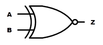
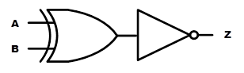
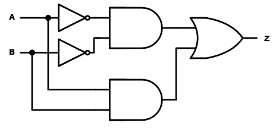
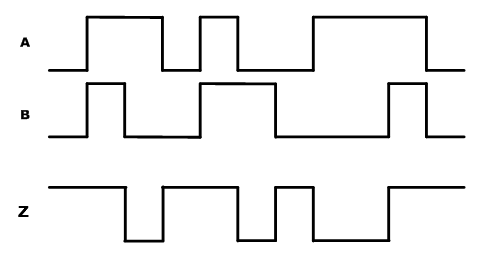
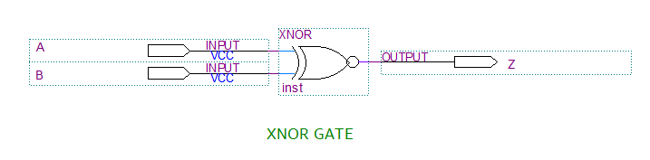
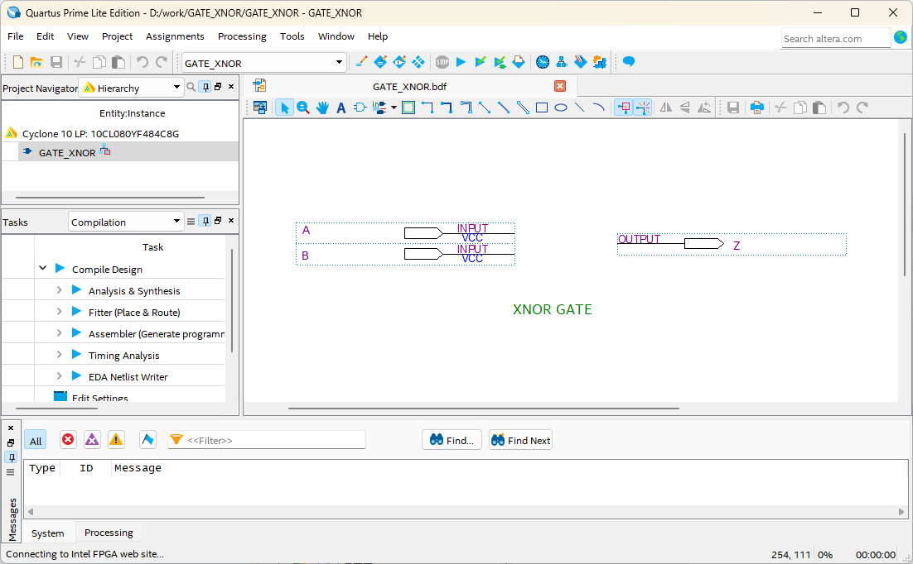
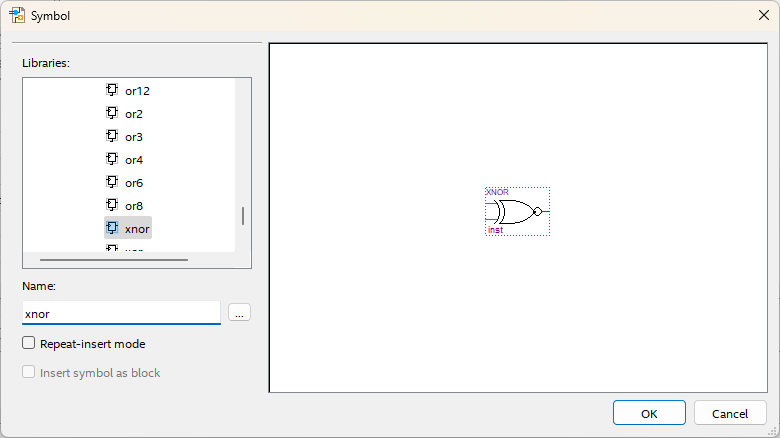
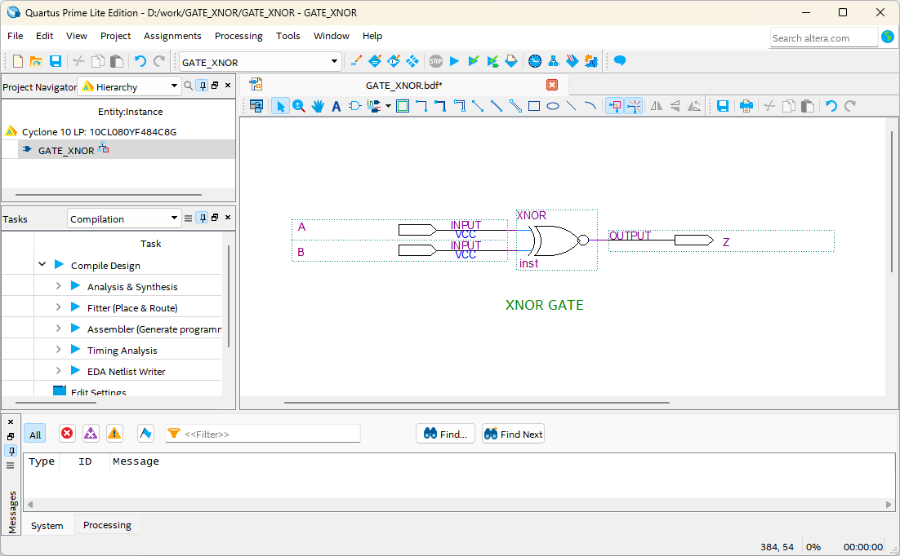
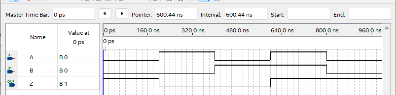

# XNOR Gate
---
## 이론

XNOR is also known as exclusive NOR. and works in the opposite way to XOR. That is, it outputs High only when the inputs are the same. 

The following figure shows the logic symbol of XNOR gate. Like NAND and NOR, it can be considered as an inverter attached to the output of XOR.

 
 

 

XNOR can be expressed using AND, OR, NOT gates as below.

 

XNOR Operation Truth Table   

|A|B|Z |
|:---:|:---:|:---:|
|0|0|1|
|0|1|0|
|1|0|0|
|1|1|1|

 

Operation Waveform

 

---
## Practice Objectives

Let's design and experiment with the circuit below.

 

 

The operation truth table of this circuit is as below.

XNOR Operation Truth Table
|A|B|Z |
|:---:|:---:|:---:|
|0|0|1|
|0|1|0|
|1|0|0|
|1|1|1|

 

Devices connected to check in SACT equipment are as below.

|A|B|Z|
|:---:|:---:|:---:|
|SW7|SW6|LED7|

 

### Design

1. Prepare project file <a href="./pds/GATE_XNOR.zip" download>GATE_XNOR.zip</a> for the experiment.  
 

2. Move the project compressed file downloaded to d:＼work and unzip it.
3. Run Quartus II and select File > Open Project.

 

4. Go to d:＼work＼GATE_XNOR folder, where the files are unzipped, and open GATE_XNOR project.

 

5. Select File > Open to import GATE_XNOR.bdf file. Or double-click GATE_XNOR on the left side of the project.

 

6. Unfinished drawing is shown. Let's complete it with the drawing described before.

 

 

7. Double-click the drawing as shown below, or right-click the mouse and select Insert > Symbol.

 

8. In the symbol window, enter symbol name “xnor” in ‘-Name-’ at bottom left, and click OK button.

 

9. Place XOR gate symbol on the drawing and connect the symbol with wire to complete the circuit.
 
※ If the wire in the circuit is not connected correctly, it may not operate properly.

 

 

### Compile

10. Select File > Save and save, and select Processing > Start Compilation to compile.

Compilation is process to verify that there are no errors in the designed logic circuit and create programming file and simulation file.

  

### Simulation

11. Select File > Open, and change File Type to All Files (.) in Open File window in the lower right corner, then select Waveform.vwf file.

12. In Waveform window, select Simulation > Run Functional Simulation to run it. 

 

 
 

### Check Hardware Operation

13. Prepare SACT equipment.

14. Connect USB cable to USB B Type Connector at the top center of the device and to the PC.

15. Connect power cable to Power Connector on the left side of the device and press the power switch to supply power to the device. 

16. In Quartus software, select Tool > Programmer.

 

17. Check that USB Blaster is connected in Hardware Setup on Programmer window and press Start button to program, and check the operation of XOR gate on the device.

 

18. Operate the button switch and check the result through LED.

|A|B|Z|
|:---:|:---:|:---:|
|SW7|SW6|LED7|

  

 

