# BUFFER Gate
---
## Theory

BUFFER is gate that outputs the input signal without changing it. 

BUFFER Gate is mainly used for signal amplification, fanout increase, signal delay.

The following figure shows the logic symbol of BUFFER gate.
NOT gate is also used as a type of BUFFER gate. However, unlike a general BUFFER, it operates as INVERTER BUFFER.

 
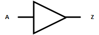 

 

BUFFER Operation Truth Table    

|A|Z|
|:---:|:---:|
|0|0|
|1|1|

 

Operation Waveform

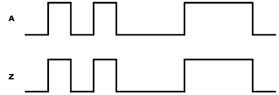

 

It refers to a circuit that has three states 3-STATE (TRI-STATE), High, Low, Hi-Impedance.

Usually a circuit has a state of 0 or 1. Tri-State has Hi-Impedance state that cannot be updated. This difference allows Tri-State circuit to use both input and output directions in one circuit.    

Ultimately, if Enable circuit is connected, it is Tri-State circuit. It is similar to the principle that the circuit must be turned ON to operate 0 or 1 and when the circuit is turned OFF, it operates nothing no matter what the signal comes in.

 
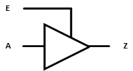 

 

TRI-STATE Operation Truth Table    
|A|E|Z|
|:---:|:---:|:---:|
|0|0|Z|
|1|0|Z|
|0|1|0|
|1|1|1|

---
## Practice Objectives 

Let's design and experiment with the circuit below.

 

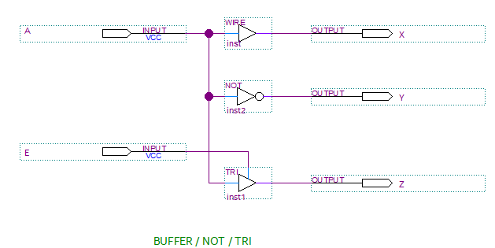

 

The operation truth table of BUFFER circuit is as below.

BUFFER Operation Truth Table
|A|E||X|Y|Z|
|:---:|:---:|-|:---:|:---:|:---:|
|0|0||0|1|Z|
|1|0||1|0|Z|
|0|1||0|1|0|
|1|1||1|0|1|

 

Devices connected to check in SACT equipment are as below.

|A|E|X|Y|Z|
|:---:|:---:|:---:|:---:|:---:|
|SW7|SW6|LED7|LED6|LED5|

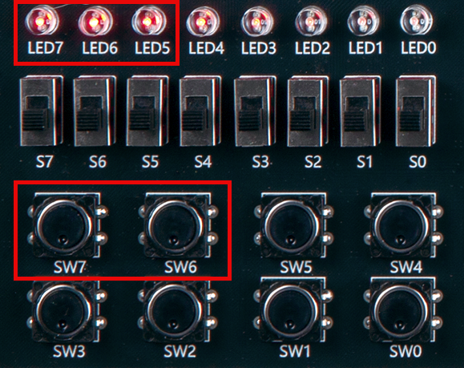

 

### Design

1. Prepare project file <a href="./pds/GATE_BUFFER.zip" download>GATE_BUFFER.zip</a> for the experiment.  
 

2. Move the project compressed file downloaded to d:\work and unzip it.

3. Run Quartus II and select File > Open Project.

 

4. Go to d:\work\GATE_BUFFER folder, where the files are unzipped, and open GATE_BUFFER project.

 

5. Select File > Open to import GATE_BUFFER.bdf file. Or double-click GATE_BUFFER on the left side of the project.

 

6. Unfinished drawing is shown. Let's complete it with the drawing described before.

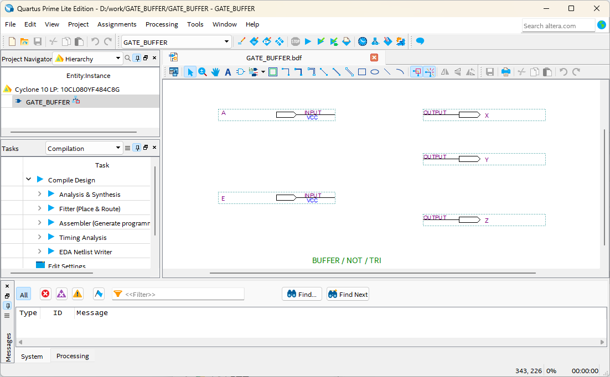 

 

7. Double-click the drawing as shown below, or right-click the mouse and select Insert > Symbol.

 

8. In the symbol window, enter symbol name “wire”, “not”, “tri”  in ‘-Name-’ at bottom left, and click OK button.

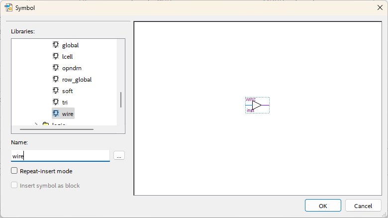 

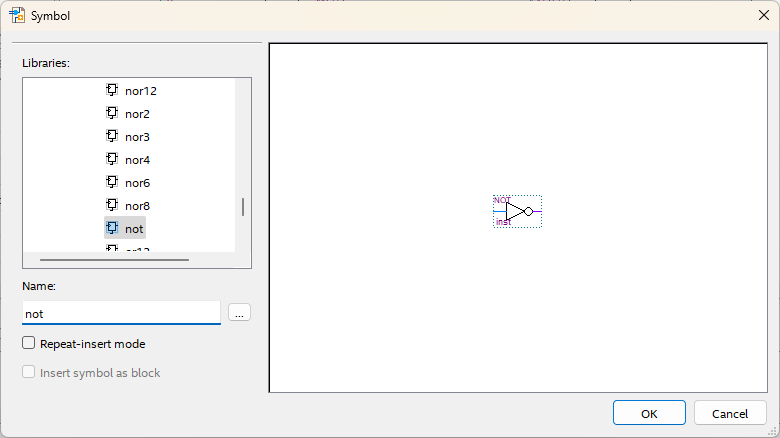 

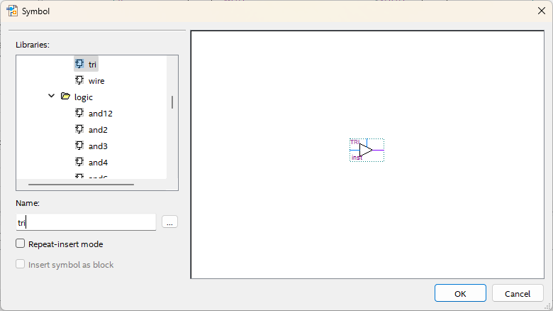 

9. Place symbols on the drawing and connect them with wire to complete the circuit.
 
※ If the circuit is not connected correctly, it may not operate as planned.

  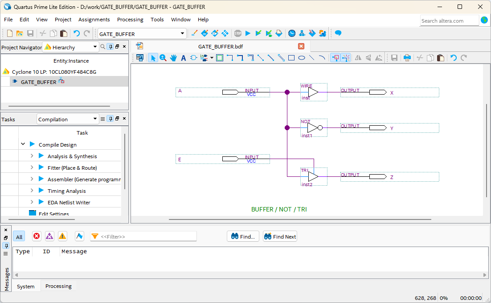 

 

### Compile

10. Select File > Save and save, and select Processing > Start Compilation to compile.

Compilation is process to verify that there are no errors in the designed logic circuit and create programming file and simulation file.

  

### Simulation

11. Select File > Open, and change File Type to All Files (.) in Open File window in the lower right corner, then select Waveform.vwf file.

12. In Waveform window, select Simulation > Run Functional Simulation to run it.

 

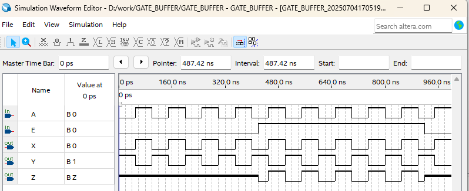 
 

### Check Hardware Operation

13. Prepare SACT equipment.

14. Connect USB cable to USB B Type Connector at the top center of the device and to the PC.

15. Connect power cable to Power Connector on the left side of the device and press the power switch to supply power to the device.

16. In Quartus software, select Tool > Programmer.

 

17. Check that USB Blaster is connected in Hardware Setup on Programmer window and press Start button to program, and check the operation of BUFFER gate on the device.

 

18. Operate the button switch and check the result through LED.

|A|E|X|Y|Z|
|:---:|:---:|:---:|:---:|:---:|
|SW7|SW6|LED7|LED6|LED5|

 

