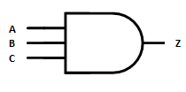
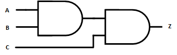
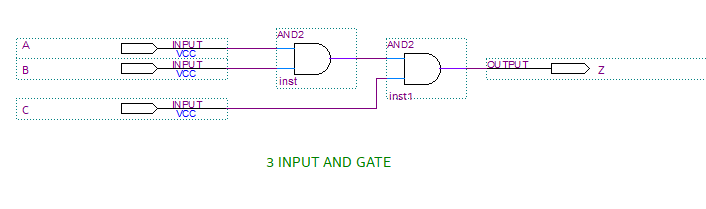
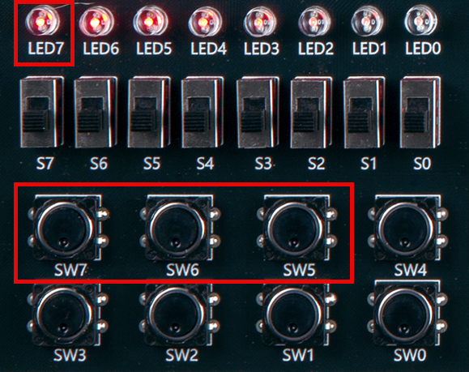
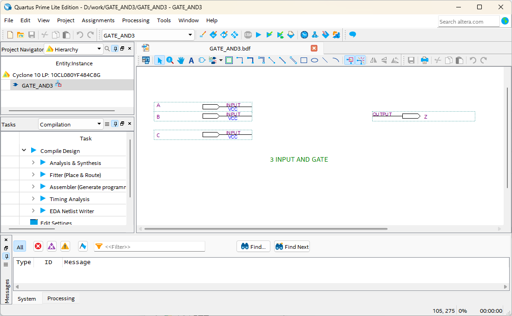
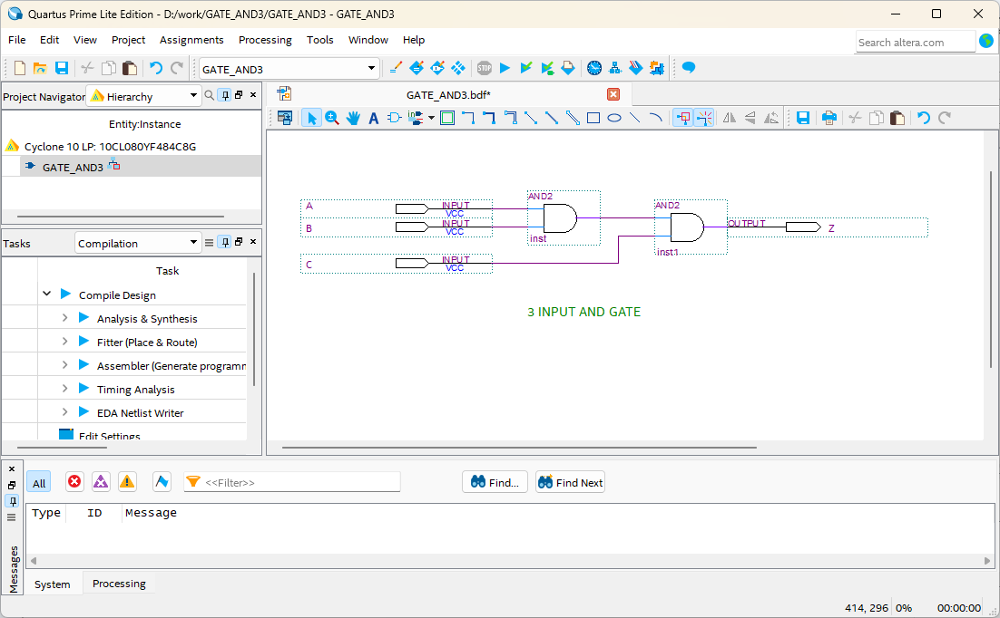
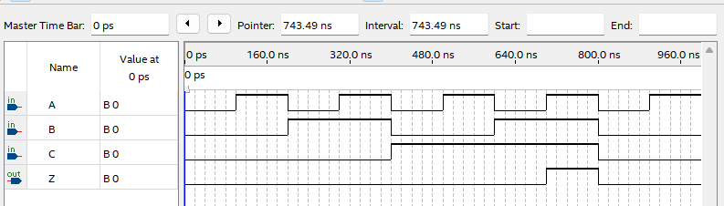

# 3 input AND Gate
---
## Theory

For the previous base gates, usually one input or two inputs were described. 

However, to configure an actual circuit, gates corresponding to N inputs are required, not just one or two inputs.

AND gate with three inputs will be explained here. 

The operation is 3-input logic product, which outputs High value only when all inputs are High.

3-input AND gate can be represented by symbol as below.

 
 

However, in the above case, since special IC must be used, 3-input AND gate is implemented using 2-input AND gate as shown below.  

 

 

3-input AND Operation Truth Table      

|A|B|C|Z |
|:---:|:---:|:---:|:---:|
|0|0|0|0|
|0|0|1|0|
|0|1|0|0|
|0|1|1|0|
|1|0|0|0|
|1|0|1|0|
|1|1|0|0|
|1|1|1|1|

 

 

---
## Practice Objectives

Let's design and experiment with the circuit below.

 

 

Operational truth table of 3-input AND circuit is as follows.

1 is output only when all three inputs are 1.

|A|B|C|Z |
|:---:|:---:|:---:|:---:|
|0|0|0|0|
|0|0|1|0|
|0|1|0|0|
|0|1|1|0|
|1|0|0|0|
|1|0|1|0|
|1|1|0|0|
|1|1|1|1|

 

Devices connected to check in SACT equipment are as below.

|A|B|C|Z|
|:---:|:---:|:---:|:---:|
|SW7|SW6|SW5|LED7|

 

### Design

1. Prepare project file <a href="./pds/GATE_AND3.zip" download>GATE_AND3.zip</a> for the experiment.  
 

2. Move the project compressed file downloaded to d:\work and unzip it.

3. Run Quartus II and select File > Open Project.

 

4. Go to d:＼work＼GATE_3-input AND folder, where the files are unzipped, and open GATE_3-input AND project.

 

5. Select File > Open to import GATE_3-input AND.bdf file. Or double-click GATE_3-input AND on the left side of the project.

 

6. Unfinished drawing is shown. Let's complete it with the drawing described before.

 

 

7. Double-click the drawing as shown below, or right-click the mouse and select Insert > Symbol.

 

8. Enter symbol name “and2” in the symbol window and click OK button.
Since this is 3-input AND gate, design the circuit by importing two “and2” symbols. For reference, the supported 3-input AND gate symbol name is “and3”.

 

9. Place 3-input AND gate symbol on the drawing and connect it with wire to complete the circuit.

 

※ If the circuit is not connected correctly, it may not operate as planned.

 

 
 

 

### Compile

10. Select File > Save and save, and select Processing > Start Compilation to compile.

Compilation is process to verify that there are no errors in the designed logic circuit and create programming file and simulation file.

  

### Simulation

11. Select File > Open, and change File Type to All Files (.) in Open File window in the lower right corner, then select Waveform.vwf file.

12. In Waveform window, select Simulation > Run Functional Simulation to run it.

 

 
 

### **Check Hardware Operation**

13. Prepare SACT equipment.

14. Connect USB cable to USB B Type Connectand3 at the top center of the device and to the PC.

15. Connect power cable to Power Connectand3 on the left side of the device and press the power switch to supply power to the device.

16. In Quartus software, select Tool > Programmer.

17. Check that USB Blaster is connected in Hardware Setup on Programmer window and press Start button to program, and check the operation of 3-input AND gate on the device.

 

18. Operate the button switch and check the result through LED.

|A|B|C|Z|
|:---:|:---:|:---:|:---:|
|SW7|SW6|SW5|LED7|

 

 

