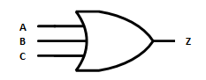
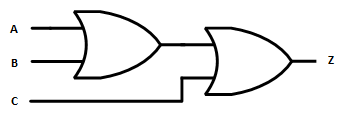
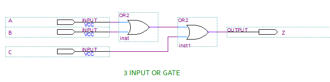
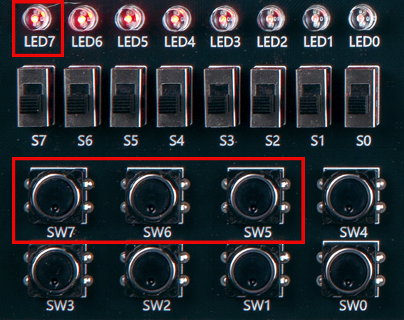
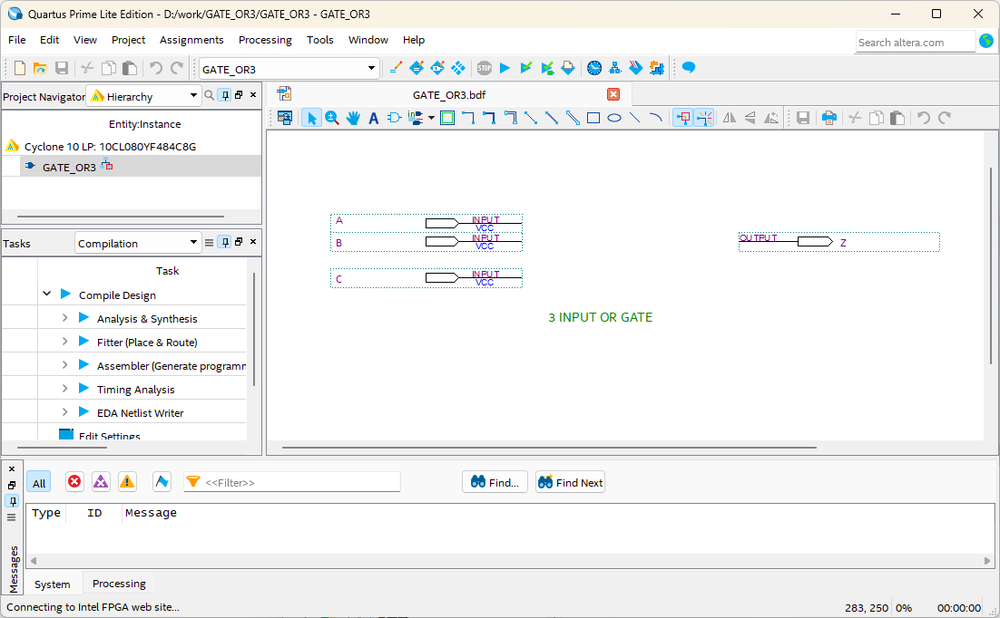
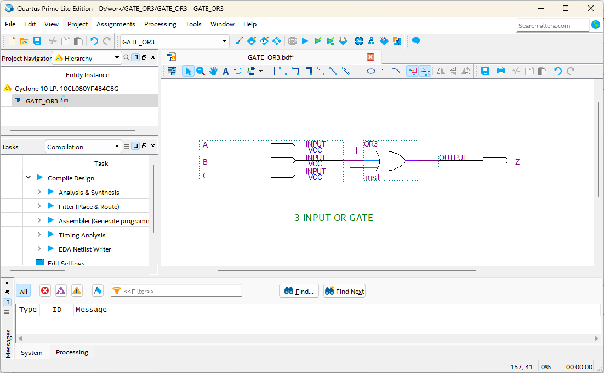
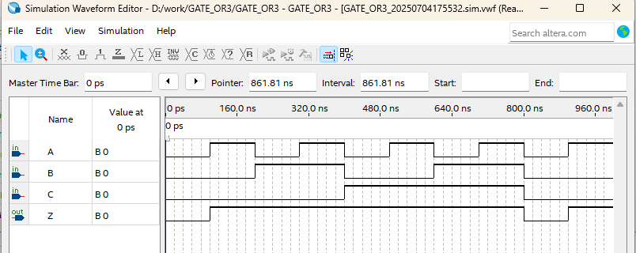

# 3 input OR Gate
---
## Theory

Number of data line inputs can be configured depending on the application environment.

Here, 3-input OR gate will be explained. 

It operates as 3-input logic sum, which outputs High when at least one data line input is high.

3-input OR gate can be represented by symbol as below.

 
 

However, in the above case, since special IC must be used, 3-input OR gate is implemented using 2-input OR gate as shown below.  

 

 

3-input OR Operation Truth Table.

|A|B|C|Z |
|:---:|:---:|:---:|:---:|
|0|0|0|0|
|0|0|1|1|
|0|1|0|1|
|0|1|1|1|
|1|0|0|1|
|1|0|1|1|
|1|1|0|1|
|1|1|1|1|

 

 

---
## Practice Objectives

Let's design and experiment with the circuit below.

 

 

Operational truth table of 3-input OR circuit is as below.

1 is output only when all three inputs are 1.

|A|B|C|Z |
|:---:|:---:|:---:|:---:|
|0|0|0|0|
|0|0|1|1|
|0|1|0|1|
|0|1|1|1|
|1|0|0|1|
|1|0|1|1|
|1|1|0|1|
|1|1|1|1|

 

Devices connected to check in SACT equipment are as below.

|A|B|C|Z|
|:---:|:---:|:---:|:---:|
|SW7|SW6|SW5|LED7|

 

### Design

1. Prepare project file <a href="./pds/GATE_OR3.zip" download>GATE_OR3.zip</a> for the experiment.  
 

2. Move the project compressed file downloaded to d:\work and unzip it.

3. Run Quartus II and select File > Open Project.

 

4. Go to d:＼work＼GATE_3-input OR folder, where the files are unzipped, and open GATE_3-input OR project.

 

5. Select File > Open to import GATE_3-input OR.bdf file. Or double-click GATE_3-input OR on the left side of the project.

 

6. Unfinished drawing is shown. Let's complete it with the drawing described before.

 

 

7. Double-click the drawing as shown below, or right-click the mouse and select Insert > Symbol.

 

8. Enter symbol name “or2” in the symbol window and click OK button.
Since this is 3-input OR gate, design the circuit by importing two “or2” symbols. For reference, the supported 3-input OR gate symbol name is “or3”.

 

9. Place 3-input OR gate symbol on the drawing and connect it with wire to complete the circuit.

 

※ If the circuit is not connected correctly, it may not operate as planned.
 
 

 
 

 

### Compile

10. Select File > Save and save, and select Processing > Start Compilation to compile.

Compilation is process to verify that there are no errors in the designed logic circuit and create programming file and simulation file.

  

### Simulation

11. Select File > Open, and change File Type to All Files (.) in Open File window in the lower right corner, then select Waveform.vwf file.

12. In Waveform window, select Simulation > Run Functional Simulation to run it.

 

 
 

### Check Hardware Operation

13. Prepare SACT equipment.

14. Connect USB cable to USB B Type Connector3 at the top center of the device and to the PC.

15. Connect power cable to Power Connector3 on the left side of the device and press the power switch to supply power to the device.

16. In Quartus software, select Tool > Programmer.

17. Check that USB Blaster is connected in Hardware Setup on Programmer window and press Start button to program, and check the operation of 3-input OR gate on the device.

 

18. Operate the button switch and check the result through LED.

|A|B|C|Z|
|:---:|:---:|:---:|:---:|
|SW7|SW6|SW5|LED7|

 

 

