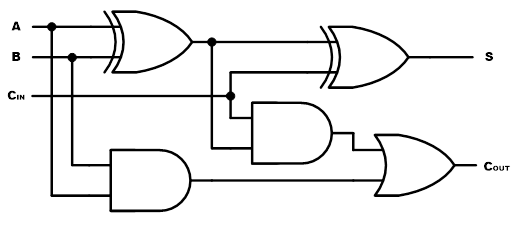
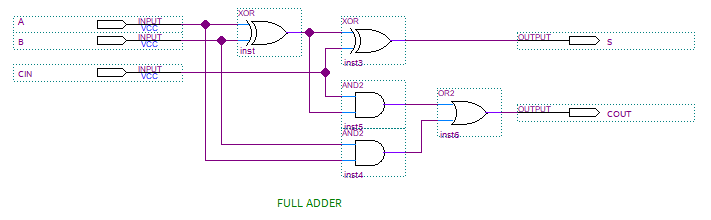
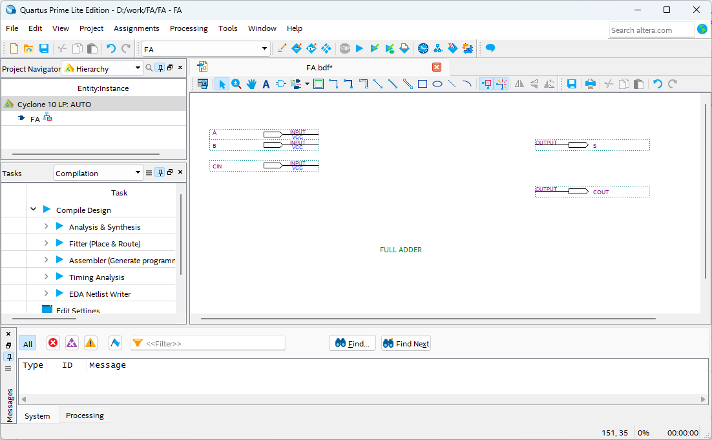
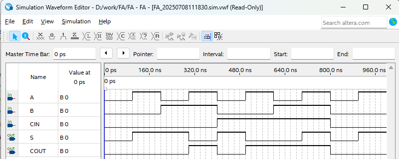

# Full Adder
---
## Theory

Full adder is a logic circuit that adds two input bits and carry input bit (Carry in: CIN) and outputs the sum and carry out (Carry Out: COUT).

It can be considered as adding carry input bit to the input of half adder.

The following table is the truth table of full adder.

 

Full Adder Truth Table      

|A|B|Cin||S|Cout|
|:---:|:---:|:---:|:---:|:---:|:---:|
|0|0|0||0|0|
|0|0|1||1|0|
|0|1|0||1|0|
|0|1|1||0|1|
|1|0|0||1|0|
|1|0|1||0|1|
|1|1|0||0|1|
|1|1|1||1|1|

 

Full adder can be implemented using a combination of XOR gate, AND gate and OR gate as below.

 
 

 

---
## Practice Objectives

Let's design and experiment with the circuit below.

 

 

Operational truth table of full adder circuit is as below.

|A|B|Cin||S|Cout|
|:---:|:---:|:---:|:---:|:---:|:---:|
|0|0|0||0|0|
|0|0|1||1|0|
|0|1|0||1|0|
|0|1|1||0|1|
|1|0|0||1|0|
|1|0|1||0|1|
|1|1|0||0|1|
|1|1|1||1|1|

 

Devices connected to check in SACT equipment are as below.

|A|B|Cin|S|Cout|
|:---:|:---:|:---:|:---:|:---:|
|SW7|SW6|SW5|LED7|LED6|

 

### Design

1. Prepare project file <a href="./pds/FA.zip" download>FA.zip</a> for the experiment. 
 

2. Move the project compressed file downloaded to d:\work and unzip it.

3. Run Quartus II and select File > Open Project.

 

4. Go to d:＼work＼FA folder, where the files are unzipped, and open FA project.

 

5. Select File > Open to import FA.bdf file. Or double-click FA on the left side of the project.

 

6. Unfinished drawing is shown. Let's complete it with the drawing described before.

 

 

 

7. Double-click the drawing as shown below, or right-click the mouse and select Insert > Symbol.

 

8. Complete the circuit by importing “xor”, “or2" and “and2” symbol in the symbol window and connecting the symbols with wire.

 

 

### Compile

9. Select File > Save and save, and select Processing > Start Compilation to compile.

Compilation is process to verify that there are no errors in the designed logic circuit and create programming file and simulation file.

  

### Simulation

10. Select File > Open, and change File Type to All Files (.) in Open File window in the lower right corner, then select Waveform.vwf file.

11. In Waveform window, select Simulation > Run Functional Simulation to run it.

 

 
 

### Check Hardware Operation

12. Prepare SACT equipment. Connect USB cable and power cable and press the power switch to supply power to the device.

13. In Quartus software, select Tool > Programmer.

14. Check that USB Blaster is connected in Hardware Setup on Programmer window and press Start button to program, and check the operation of half adder on the device.

 

15. Operate the button switch and check the result through LED.

|A|B|Cin|S|Cout|
|:---:|:---:|:---:|:---:|:---:|
|SW7|SW6|SW5|LED7|LED6|

 

 

