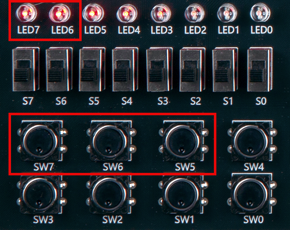
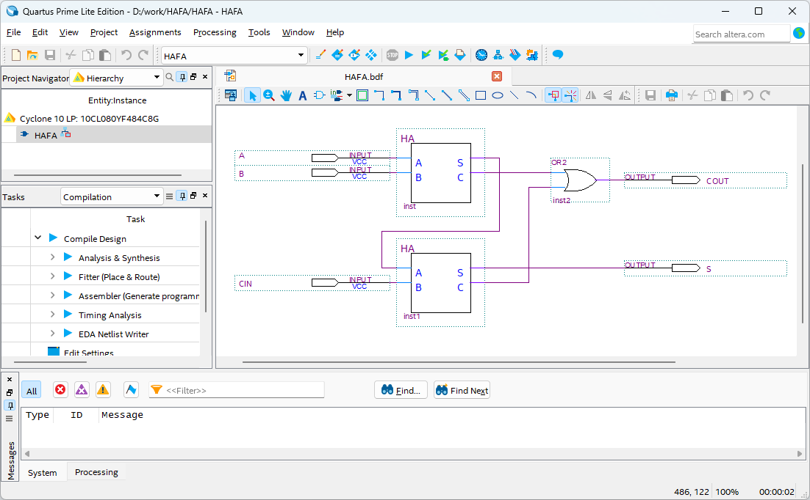

# Full Adder using Half Adder
---
## 3.3.1.	Theory

Let’s design Full adder using XOR, AND, and OR gates tested previously.

Full adder can be implemented using two half adders as below.

Therefore, first import the designed half adder and implement a full adder by connecting two half adders using OR gate.

 
 

 

---
## Practice Objectives 

Let's design and experiment with the circuit below.

 

 

Operational truth table is as below.

|A|B|Cin||S|Cout|
|:---:|:---:|:---:|:---:|:---:|:---:|
|0|0|0||0|0|
|0|0|1||1|0|
|0|1|0||1|0|
|0|1|1||0|1|
|1|0|0||1|0|
|1|0|1||0|1|
|1|1|0||0|1|
|1|1|1||1|1|

 

Devices connected to check in SACT equipment are as below.

|A|B|Cin|S|Cout|
|:---:|:---:|:---:|:---:|:---:|
|SW7|SW6|SW5|LED7|LED6|

 

### Design

1. Prepare project file <a href="./pds/HAFA.zip" download>HAFA.zip</a> for the experiment. 
 

2. Move the project compressed file downloaded to d:＼work and unzip it.

3. Run Quartus II and select File > Open Project.

 

4. Go to d:＼work＼HAFA folder, where the files are unzipped, and open FA project.

 

5. Select File > Open to import HAFA.bdf file. Or double-click HAFA on the left side of the project.

 

6. Unfinished drawing is shown. Let's complete it with the drawing described before.

 

 

 

7. Double-click the drawing as shown below, or right-click the mouse and select Insert > Symbol.

 

8. Complete the circuit by importing “HA”, “or2" symbol in the symbol window and connecting the symbols with wire.

 

 

※ HA symbol is HA that tested in 3-1. You can check the internal circuit connection through HA symbol double-click.

 

 

 

### Compile

9. Select File > Save and save, and select Processing > Start Compilation to compile.

Compilation is process to verify that there are no errors in the designed logic circuit and create programming file and simulation file.

  

### Simulation

10. Select File > Open, and change File Type to All Files (.) in Open File window in the lower right corner, then select Waveform.vwf file.

11. In Waveform window, select Simulation > Run Functional Simulation to run it.

 

 
 

### Check Hardware Operation

12. Prepare SACT equipment. Connect USB cable and power cable and press the power switch to supply power to the device.

13. In Quartus software, select Tool > Programmer.

14. Check that USB Blaster is connected in Hardware Setup on Programmer window and press Start button to program, and check the operation of full adder on the device.

 

15. Operate the button switch and check the result through LED.

|A|B|Cin|S|Cout|
|:---:|:---:|:---:|:---:|:---:|
|SW7|SW6|SW5|LED7|LED6|

 

 

