# 4bit binary Adder / Subtractor
---
## 이론

앞에서 실습한 2진 가산기와 감산기는 하나의 회로 내에서 2진수의 덧셈과 뺄셈을 할 수 있다. 

연산은 제어 신호에 포함된 이진수 값에 다라 수행된다. 

이 장치는 산술 논리 장치(ALU)의 구성 요소 중 하나이다. 

 

아래 그림의 회로는 가산기와 감산기의 동작을 하나의 회로에서 수행하도록 구현한 것이다. 

 
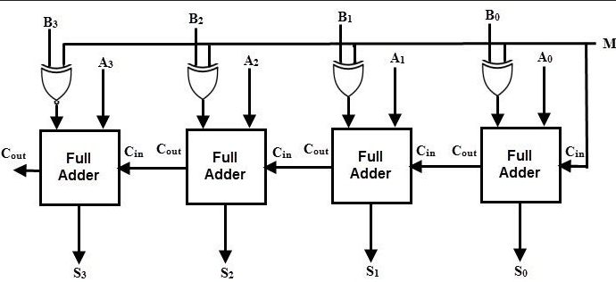 

 

위 회로에서 M의 신호가 0일 때 가산기로의 동작을 하고, M의 신호가 1일 때 감산기의 동작을 한다. 
 
 나타나는데, 이것을 보완하여 부호가 출력되고 일반 수가 표시되도록 다음과 같이 구성하였다. 

 

---
## **실습 목표**

다음의 회로를 설계하여 실험해 보자.

 

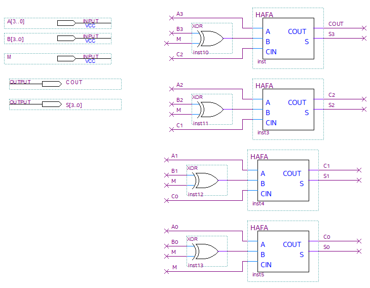

 

SACT 장비에서 확인하기 위하여 연결된 장치는 다음과 같다. 

|A3|A2|A1|A0|B3|B2|B1|B0||M|
|:---:|:---:|:---:|:---:|:---:|:---:|:---:|:---:|:---:|:---:|
|S7|S6|S5|S4|S3|S2|S1|S0||SW7|

 

|COUT||S3|S2|S1|S0|
:---:|:---:|:---:|:---:|:---:|:---:|
|LED7||LED6|LED5|LED4|LED3|

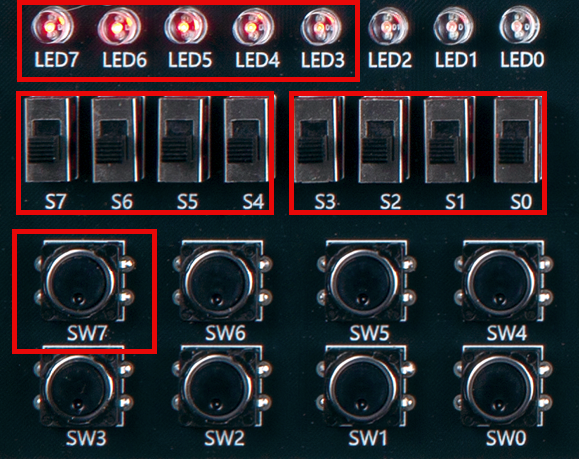

 

### **설계**

1. 실험을 위해 프로젝트 파일 <a href="./pds/P_ADD_SUB.zip" download>P_ADD_SUB.zip</a>을 준비한다. 
 

2. 다운로드된 프로젝트의 압축 파일을 d:\work 이동시킨 후, 압축을 푼다.

3. Quartus II를 실행키고, File> Open Project 메뉴를 선택한다. 

 

4. 위에서 압축을 푼 위치인, d:\work\PAS 폴더로 이동 후,PAS 프로젝트를 OPEN한다. 

 

5. File > Open 메뉴를 선택하여 PAS.bdf 파일을 불러오거나, 프로젝트 왼쪽의 PAS 부분을 마우스로 더블 클릭한다. 

 

6. 아래 그림과 같이 미완성된 도면이 보이는데, 실습 목표에서 설명한 도면으로 완성시키자. 

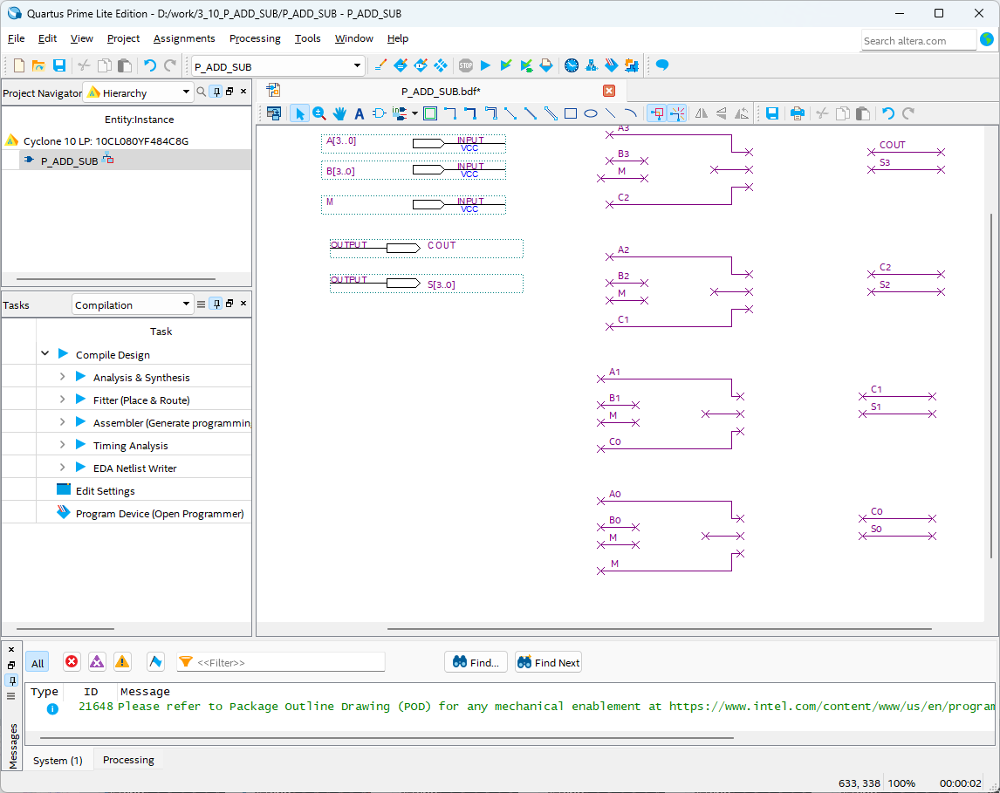 

 

7. 도면을 더블 클릭하거나, 마우스 오른쪽 버튼을 누르고 Insert > Symbol 메뉴를 선택한다. 

 

8. 심볼 창에서 HAFA와 xor 심볼을 불러와 wire로 심볼을 연결시켜 회로를 완성시킨다.  

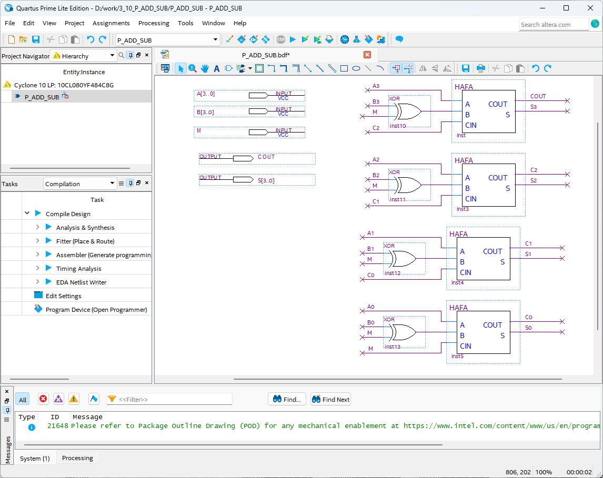 

HAFA는 이전 실습에서 사용한 1비트 전가산기 심볼이다. 

 

### **컴파일**

9. File > Save 메뉴를 선택하여 저장하고, Processing > Start Compilation 메뉴를 선택하여 컴파일을 진행한다. 

이 컴파일 과정은 설계한 논리 회로에 오류가 없는 지를 검증하고, 프로그래밍 파일과 시뮬레이션 파일을 만드는 과정이다. 

  

### **시뮬레이션**

10. 컴파일 완료 후, File > Open 메뉴를 선택하고, 나타나는 Open File 창에서 오른쪽 아래 부분의 File Type을 All File(*.*)로 변경한 후, Waveform.vwf 파일을 선택한다. 

11. 아래 그림과 같이 Waveform 창에서, Simulation > Run Functiona Simulation 메뉴를 선택하여 Functional Simulation을 진행하여, 결과를 확인한다. 

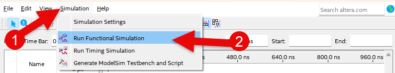 

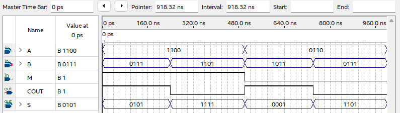 
 

* 시뮬레이션의 값을 변경하기 위해서는 아래 그림과 같이 마우스의 드래그로 변경을 원하는 위치를 선택한다.

 

도구바이 < ? 모양을 선택한다.

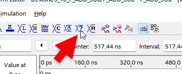 

수정할 값을 적는다.

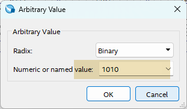 

수정된 결과는 아래 그림과 같다. 

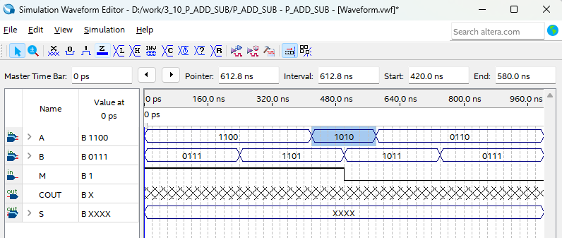 

11번에서 처럼 시뮬레이션을 하면, 수정한 입력값에 대한 결과를 확인할 수 있다. 

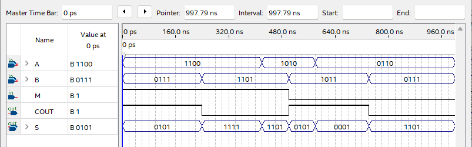 
 

### **하드웨어 동작 확인**

12. SACT 장비를 준비한다. USB 케이블과 파워 케이블을 연결하고, 전원 스위치를 눌러 장비에 전원을 인가시킨다. 

13. Quartus 소프트웨어에서 Tool > Programmer 메뉴를 선택한다.

14. Programmer창의 Hardware Setup이 USB Blaster가 연결되어 있는지 확인하고, Start 버튼을 눌러 프로그래밍 하고 장비에서 4비트 가산기/감산기의 동작을 확인한다. 

 

15. 슬라이드 스위치를 이동시켜 가산기로 동작시킬 것인지, 감산기로 동작시킬 것인지를 결정하고, 버튼 스위치를 동작시켜 값을 입력시켜, LED를 통해 결과를 확인해 보자.

|A3|A2|A1|A0|B3|B2|B1|B0||M|
|:---:|:---:|:---:|:---:|:---:|:---:|:---:|:---:|:---:|:---:|
|S7|S6|S5|S4|S3|S2|S1|S0||SW7|

 

|COUT||S3|S2|S1|S0|
:---:|:---:|:---:|:---:|:---:|:---:|
|LED7||LED6|LED5|LED4|LED3|

 

 

