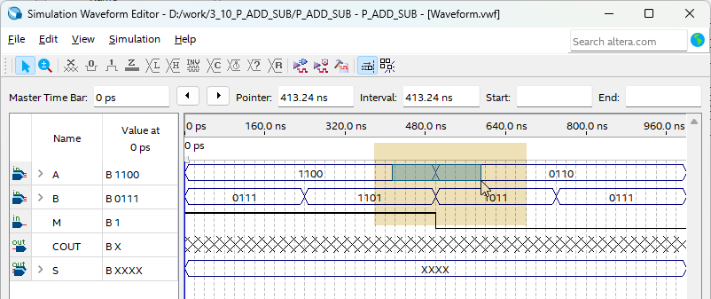

# 4bit binary Adder / Subtractor
---
## Theory

Binary adder and subtractor practiced previously can perform addition and subtraction of binary number within a single circuit. 

The operation is performed based on the binary value contained in the control signal.

This device is one of the components of the arithmetic logic unit (ALU).

 

The circuit below implements the operation of adder and subtractor in a single circuit.

 
 

 

In the above circuit, when M signal is 0, it operates as an adder, and when M signal is 1, it operates as a subtractor. 
 
It is configured so that the code is output and the general number is displayed.

 

---
## Practice Objectives

Let's design and experiment with the circuit below.

 

 

Devices connected to check in SACT equipment are as below.

|A3|A2|A1|A0|B3|B2|B1|B0||M|
|:---:|:---:|:---:|:---:|:---:|:---:|:---:|:---:|:---:|:---:|
|S7|S6|S5|S4|S3|S2|S1|S0||SW7|

 

|COUT||S3|S2|S1|S0|
:---:|:---:|:---:|:---:|:---:|:---:|
|LED7||LED6|LED5|LED4|LED3|

 

### Design

1. Prepare project file <a href="./pds/P_ADD_SUB.zip" download>P_ADD_SUB.zip</a> for the experiment.
 

2. Move the project compressed file downloaded to d:\work and unzip it.

3. Run Quartus II and select File > Open Project.

 

4. Go to d:\work\PAS folder, where the files are unzipped, and open PAS project.

 

5. Select File > Open to import PAS.bdf file. Or double-click PAS on the left side of the project.

 

6. Unfinished drawing is shown. Let's complete it with the drawing described before.

 

 

7. Double-click the drawing as shown below, or right-click the mouse and select Insert > Symbol.

 

8. Complete the circuit by importing “HAFA”, “xor” symbol in the symbol window and connecting them with wire. 

 

※ HAFA is 1-bit full adder symbol used in the previous exercise.

 

### Compile

9. Select File > Save and save, and select Processing > Start Compilation to compile.

Compilation is process to verify that there are no errors in the designed logic circuit and create programming file and simulation file.

  

### Simulation

10. Select File > Open, and change File Type to All Files (.) in Open File window in the lower right corner, then select Waveform.vwf file.

11. In Waveform window, select Simulation > Run Functional Simulation to run it.

 

 
 

※ To change the simulation value, select the location to change by dragging the mouse as below.

 

Select the tool bar < ? .

 

Enter the value to change.

 

Changed result is shown as below.

 

If simulating as 11, you can check the result for the modified input value.

 
 

### Check Hardware Operation

12. Prepare SACT equipment. Connect USB cable and power cable and press the power switch to supply power to the device.

13. In Quartus software, select Tool > Programmer.

14. Check that USB Blaster is connected in Hardware Setup on Programmer window and press Start button to program, and check the operation of 4-bit adder/subtractor on the device.

 

15. Decide whether to operate it as adder or subtractor by moving the slide switch. Operate the button switch to input value, and check the result through LED.

|A3|A2|A1|A0|B3|B2|B1|B0||M|
|:---:|:---:|:---:|:---:|:---:|:---:|:---:|:---:|:---:|:---:|
|S7|S6|S5|S4|S3|S2|S1|S0||SW7|

 

|COUT||S3|S2|S1|S0|
:---:|:---:|:---:|:---:|:---:|:---:|
|LED7||LED6|LED5|LED4|LED3|

 

 

