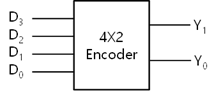
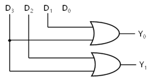
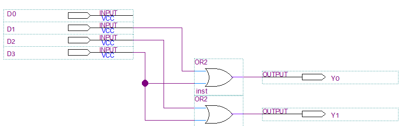
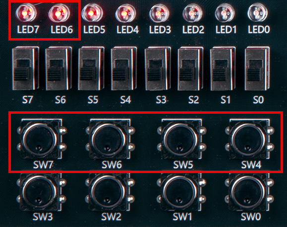
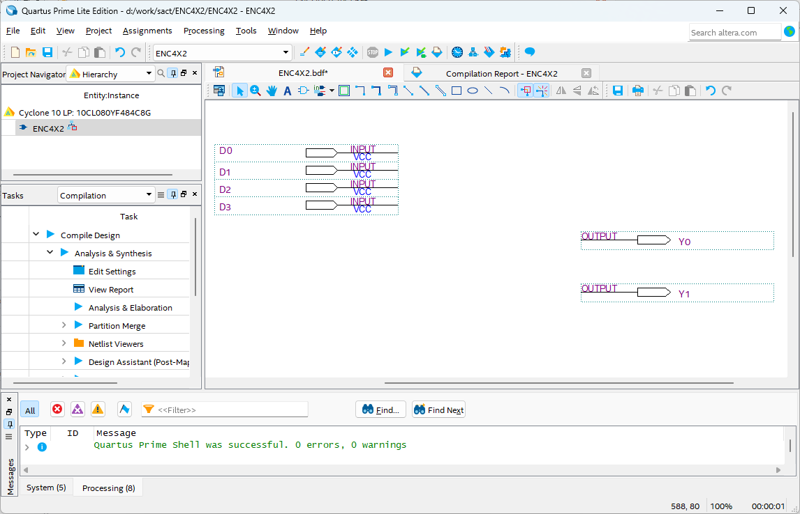
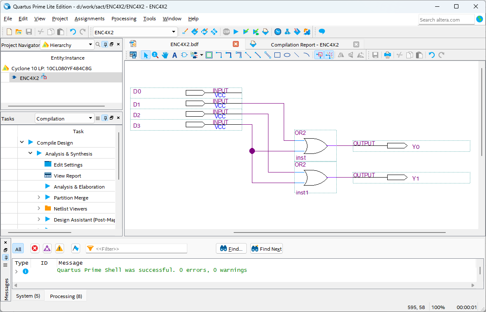
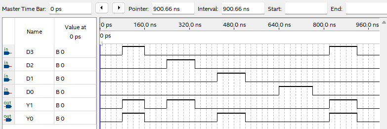

# Encoder
---
## 3.8.1.	Theory

Encoder has multiple input lines, one of which operates at a given time, and  N-bit output code is generated depending on the input. 

For example, 4x2 encoder takes four input lines and generates 2-bit output code based on the input. 

This can be explained with the following symbol.

 
 
 

This circuit is configured with GATE as below.

 

 

4x2 Encoder Truth Table

|D3|D2|D1|D0||Y1|Y0|
|:---:|:---:|:---:|:---:|:---:|:---:|:---:|
|0|0|0|1||0|0|
|0|0|1|0||0|1|
|0|1|0|0||1|0|
|1|0|0|0||1|1|

---
## Practice Objectives

Let's design and experiment with the circuit below.

 

 

Operational truth table is as below.

|D3|D2|D1|D0||Y1|Y0|
|:---:|:---:|:---:|:---:|:---:|:---:|:---:|
|0|0|0|1||0|0|
|0|0|1|0||0|1|
|0|1|0|0||1|0|
|1|0|0|0||1|1|

 

Devices connected to check in SACT equipment are as below.

|D3|D2|D1|D0|Y1|Y0|
|:---:|:---:|:---:|:---:|:---:|:---:|
|SW7|SW6|SW5|SW4|LED7|LED6|

 

### Design

1. Prepare project file <a href="./pds/ENC4X2.zip" download>ENC4X2.zip</a> for the experiment. 
 

2. Move the project compressed file downloaded to d:＼work and unzip it.

3. Run Quartus II and select File > Open Project.

 

4. Go to d:＼work＼ENC4X2 folder, where the files are unzipped, and open ENC4X2 project.

 

5. Select File > Open to import ENC4X2.bdf file. Or double-click ENC4X2 on the left side of the project.

 

6. Unfinished drawing is shown. Let's complete it with the drawing described before.

 

 

7. Double-click the drawing as shown below, or right-click the mouse and select Insert > Symbol.

 

8. Complete the circuit by importing “or” symbol in the symbol window and connecting it with wire.

 

 

### Compile

9. Select File > Save and save, and select Processing > Start Compilation to compile.

Compilation is process to verify that there are no errors in the designed logic circuit and create programming file and simulation file.

  

### Simulation

10. Select File > Open, and change File Type to All Files (.) in Open File window in the lower right corner, then select Waveform.vwf file.

11. In Waveform window, select Simulation > Run Functional Simulation to run it.

 

 
 

### Check Hardware Operation

12. Prepare SACT equipment. Connect USB cable and power cable and press the power switch to supply power to the device.

13. In Quartus software, select Tool > Programmer.

14. Check that USB Blaster is connected in Hardware Setup on Programmer window. Press Start button to program to check the operation of 4x2 encoder  on the device.

15. Operate the button switch and check the result through LED.

 

Devices connected to check in the SACT equipment are as below.

|D3|D2|D1|D0|Y1|Y0|
|:---:|:---:|:---:|:---:|:---:|:---:|
|SW7|SW6|SW5|SW4|LED7|LED6|

 

 

