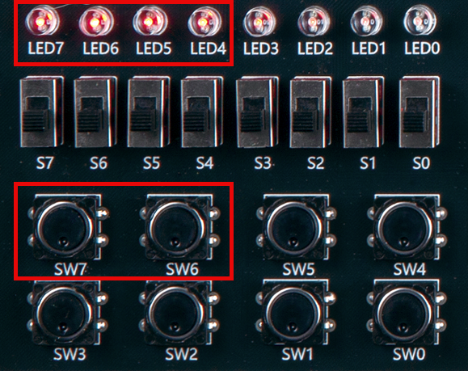

# Decoder
---
## Theory

Decoder is a logic circuit that activates only the output corresponding to any input number, converting N-bit binary input signal into M(M=2^N) output signal.

Only one of M output terminals outputs High value, while the remaining output terminals output Low values. Most decoders are designed to be in Low state, so if the selected output terminal is Low, all other terminals become High.

2x4 decoder is a decoder that has 2 input lines and 4 output lines.

 
 
 

This circuit is configured with GATE as below.

 

 

2x4 decoder truth table
|A|B||D3|D2|D1|D0|
|:---:|:---:|:---:|:---:|:---:|:---:|:---:|
|0|0||0|0|0|1|
|0|1||0|0|1|0|
|1|0||0|1|0|0|
|1|1||1|0|0|0|

---
## Practice Objectives

Let's design and experiment with the circuit below.

 

 

Operational truth table is as below.

|A|B||D3|D2|D1|D0|
|:---:|:---:|:---:|:---:|:---:|:---:|:---:|
|0|0||0|0|0|1|
|0|1||0|0|1|0|
|1|0||0|1|0|0|
|1|1||1|0|0|0|

 

Devices connected to check in SACT equipment are as below.

|A|B|D3|D2|D1|D0|
|:---:|:---:|:---:|:---:|:---:|:---:|
|SW7|SW6|LED7|LED6|LED5|LED4|

 

### Design

1. Prepare project file <a href="./pds/DEC2X4.zip" download>DEC2X4.zip</a> for the experiment.  
 

2. Move the project compressed file downloaded to d:＼work and unzip it.

3. Run Quartus II and select File > Open Project.

 

4. Go to d:＼work＼DEC2X4 folder, where the files are unzipped, and open DEC4X2 project.

 

5. Select File > Open to import DEC2X4.bdf file. Or double-click DEC2X4 on the left side of the project.

 

6. Unfinished drawing is shown. Let's complete it with the drawing described before.

 

 

7. Complete the circuit by connecting symbol with wire.

 

 

### Compile

8. Select File > Save and save, and select Processing > Start Compilation to compile.

Compilation is process to verify that there are no errors in the designed logic circuit and create programming file and simulation file.

  

### Simulation

9. Select File > Open, and change File Type to All Files (.) in Open File window in the lower right corner, then select Waveform.vwf file.

10. In Waveform window, select Simulation > Run Functional Simulation to run it.

 

 
 

### Check Hardware Operation

11. Prepare SACT equipment. Connect USB cable and power cable and press the power switch to supply power to the device.

12. In Quartus software, select Tool > Programmer.

13. Check that USB Blaster is connected in Hardware Setup on Programmer window. Press Start button to program to check the operation on the device.

 

14. Operate the button switch and check the result through LED.

Devices connected to check in the SACT equipment are as below.

|A|B|D3|D2|D1|D0|
|:---:|:---:|:---:|:---:|:---:|:---:|
|SW7|SW6|LED7|LED6|LED5|LED4|

 

 

