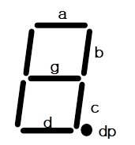
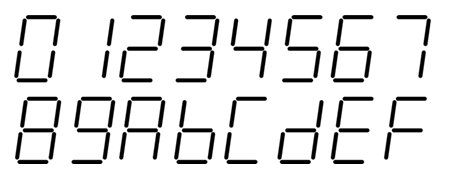
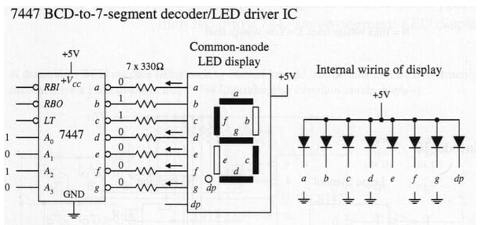
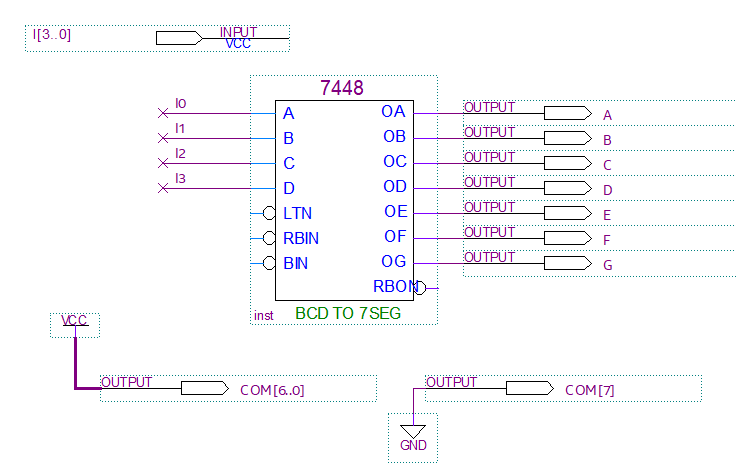
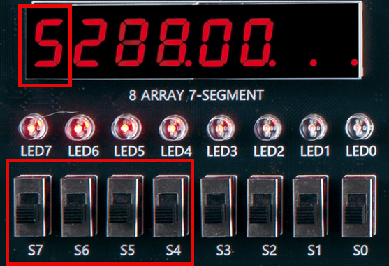
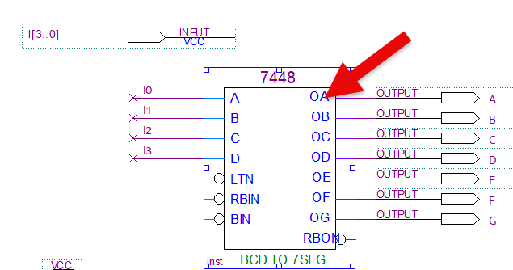
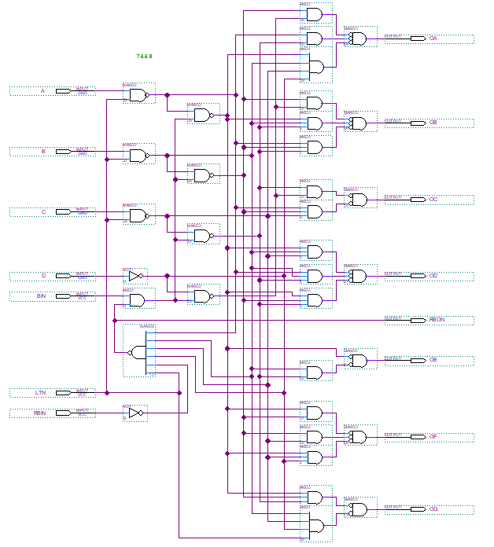
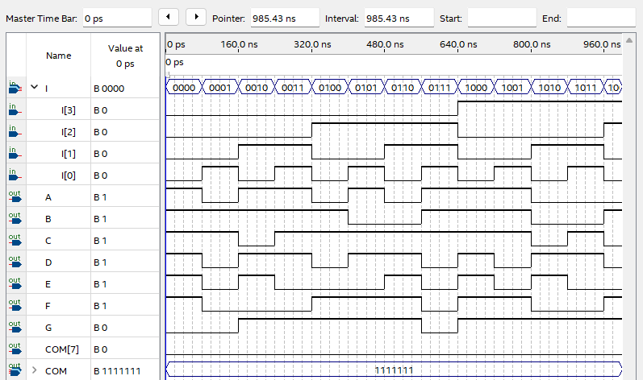

# 7-Segment Decoder
---
## Theory

7-Segment is a device that can display number or letter using 7 elements. 

It is widely used as a device to display number or character.

 
 
 

7-Segment consists of 8 LEDs, a, b, c, d, e, f, g, dp, as shown above and number or letter can be expressed by controlling LEDs. 

The data that displays actual number and letter are a, b, c, d, e, f, g, and dp is used to indicate division and so on. 

For example, if entering “01100000” in line of “a, b, c, d, e, f, g, dp", number “1” will be displayed. 

In the same way, if entering data in “a, b, c, d, e, f, g, dp" line of FND, numbers and characters below will be displayed.

 
 
 

The table below shows 7-Segment decoder data to display 16 numbers and letters above.

|Display||a|b|c|d|e|f|g|dp|
|:---:|:---:|:---:|:---:|:---:|:---:|:---:|:---:|:---:|:---:|
|0||1|1|1|1|1|1|0|0|
|1||0|1|1|0|0|0|0|0|
|2||1|1|0|1|1|0|1|0|
|3||1|1|1|1|0|0|1|0|
|4||0|1|1|0|0|1|1|0|
|5||1|0|1|1|0|1|1|0|
|6||1|0|1|1|1|1|1|0|
|7||1|1|1|0|0|0|0|0|
|8||1|1|1|1|1|1|1|0|
|9||1|1|1|1|0|1|1|0|
|A||1|1|1|0|1|1|1|0|
|B||0|1|1|1|1|0|0|0|
|C||1|0|0|1|1|1|0|0|
|D||0|1|1|1|1|0|1|0|
|E||1|0|0|1|1|1|1|0|
|F||1|0|0|0|1|1|1|0|

 

Since there are many controlled signals, 7-Segment decoder is generally used.

7448 is a decoder that changes 4-bit BCD input into data to display decimal numbers on 7-segment among widely used TTLs.

 
 

Truth table for this IC operation is as below.

|Display|A3|A2|A1|A0||a|b|c|d|e|f|g|dp|
|:---:|:---:|:---:|:---:|:---:|:---:|:---:|:---:|:---:|:---:|:---:|:---:|:---:|:---:|
|0|0|0|0|0||1|1|1|1|1|1|0|0|
|1|0|0|0|1||0|1|1|0|0|0|0|0|
|2|0|0|1|0||1|1|0|1|1|0|1|0|
|3|0|0|1|1||1|1|1|1|0|0|1|0|
|4|0|1|0|0||0|1|1|0|0|1|1|0|
|5|0|1|0|1||1|0|1|1|0|1|1|0|
|6|0|1|1|0||1|0|1|1|1|1|1|0|
|7|0|1|1|1||1|1|1|0|0|0|0|0|
|8|1|0|0|0||1|1|1|1|1|1|1|0|
|9|1|0|0|1||1|1|1|1|0|1|1|0|

---
## Practice Objectives

Let's design and experiment with the circuit below.

 

 

Operational truth table is as below.

Truth table of TTL 7448

|Display|i3|i2|i1|i0||a|b|c|d|e|f|g|dp|
|:---:|:---:|:---:|:---:|:---:|:---:|:---:|:---:|:---:|:---:|:---:|:---:|:---:|:---:|
|0|0|0|0|0||1|1|1|1|1|1|0|0|
|1|0|0|0|1||0|1|1|0|0|0|0|0|
|2|0|0|1|0||1|1|0|1|1|0|1|0|
|3|0|0|1|1||1|1|1|1|0|0|1|0|
|4|0|1|0|0||0|1|1|0|0|1|1|0|
|5|0|1|0|1||1|0|1|1|0|1|1|0|
|6|0|1|1|0||1|0|1|1|1|1|1|0|
|7|0|1|1|1||1|1|1|0|0|0|0|0|
|8|1|0|0|0||1|1|1|1|1|1|1|0|
|9|1|0|0|1||1|1|1|1|0|1|1|0|

 

Devices connected to check in SACT equipment are as below.

|I3|I2|I1|I0||A|B|C|D|E|F|G|
|:---:|:---:|:---:|:---:|:---:|:---:|:---:|:---:|:---:|:---:|:---:|:---:|
|S7|S6|S5|S4||SEG_A|SEG_B|SEG_C|SEG_D|SEG_E|SEG_F|SEG_G|

 

COM7, COM[6:0] shown in the drawing are set to display where 7-SEGMENT is displayed and set to be displayed on the first of 8 7-Segments.

 

 

### Design

1. Prepare project file <a href="./pds/BCD2SEG.zip" download>BCD2SEG.zip</a> for the experiment.
 

2. Move the project compressed file downloaded to d:＼work and unzip it.

3. Run Quartus II and select File > Open Project.

 

4. Go to d:＼work＼BCD2SEG folder, where the files are unzipped, and open BCD2SEG project.

 

5. Select File > Open to import BCD2SEG.bdf file. Or double-click BCD2SEG on the left side of the project.

 

6. Unfinished drawing is shown. Let's complete it with the drawing described before.

 

 

7. Complete the circuit by importing 7448 symbol and connecting symbol with wire.

 

Double-clicking 7448 symbol, drawing designed with 7448 will be displayed.

 

 

 

 

### Compile

8. Select File > Save and save, and select Processing > Start Compilation to compile.

Compilation is process to verify that there are no errors in the designed logic circuit and create programming file and simulation file.

  

### Simulation

9. Select File > Open, and change File Type to All Files (.) in Open File window in the lower right corner, then select Waveform.vwf file.

10. In Waveform window, select Simulation > Run Functional Simulation to run it.

 

 
 

### Check Hardware Operation
11. Prepare SACT equipment. Connect USB cable and power cable and press the power switch to supply power to the device.

12. In Quartus software, select Tool > Programmer.

13. Check that USB Blaster is connected in Hardware Setup on Programmer window. Press Start button to program to check the operation on the device.

 

14. Operate the slide switch and check the result output on 7-Segment.

Devices connected to check in the SACT equipment are as below.

|I3|I2|I1|I0||A|B|C|D|E|F|G|
|:---:|:---:|:---:|:---:|:---:|:---:|:---:|:---:|:---:|:---:|:---:|:---:|
|S7|S6|S5|S4||SEG_A|SEG_B|SEG_C|SEG_D|SEG_E|SEG_F|SEG_G|

 

 

 

