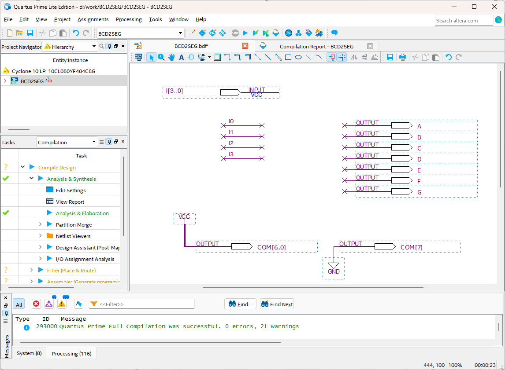
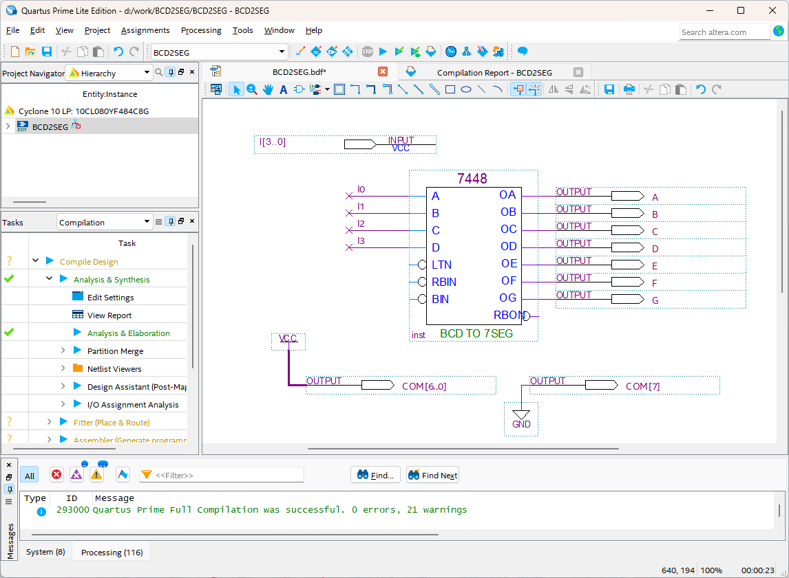

# 7-Segment Decoder
---
## 이론

7-Segment는 7개의 소자를 이용하여 숫자 또는 문자를 표시할 수 있는 장치이다. 

이것은 숫자 또는 문자를 디스플레이 하기 위한 최소의 장치로 많이 사용된다. 

 
 
 

7-Segment는 위의 그림과 같이 a,b,c,d,e,f,g,dp의 8개의 LED로 구성되어 있으며, 이 LED를 제어하여 숫자 또는 문자를 표현할 수 있다.

실제 숫자와 문자를 표시하는 것은 a,b,c,d,e,f,g의 데이터이고, dp는 구분 등의 표시를 나타내는 용도로 사용된다.

 예를 들어 a,b,c,d,e,f,g,dp 라인에 “01100000”의 데이터를 입력 시키면 “1”의 숫자가 표시된다. 
 
 같은 방법으로 FND의 a,b,c,d,e,f,g,dp 라인에 데이터를 입력하여 다음과 같은 숫자와 문자들을 표시할 수 있다.

 
 
 

다음의 표는 위의 16개의 숫자와 문자를 표시하기 위한 7-Segment 디코더 데이터이다. 

|Display||a|b|c|d|e|f|g|dp|
|:---:|:---:|:---:|:---:|:---:|:---:|:---:|:---:|:---:|:---:|
|0||1|1|1|1|1|1|0|0|
|1||0|1|1|0|0|0|0|0|
|2||1|1|0|1|1|0|1|0|
|3||1|1|1|1|0|0|1|0|
|4||0|1|1|0|0|1|1|0|
|5||1|0|1|1|0|1|1|0|
|6||1|0|1|1|1|1|1|0|
|7||1|1|1|0|0|0|0|0|
|8||1|1|1|1|1|1|1|0|
|9||1|1|1|1|0|1|1|0|
|A||1|1|1|0|1|1|1|0|
|B||0|1|1|1|1|0|0|0|
|C||1|0|0|1|1|1|0|0|
|D||0|1|1|1|1|0|1|0|
|E||1|0|0|1|1|1|1|0|
|F||1|0|0|0|1|1|1|0|

 

제어되는 신호가 많기 때문에, 일반적으로 7-Segment 디코더를 사용한다. 

많이 사용되는 TTL 중 7448는 4비트 BCD 입력을 7-Segment에 10진수를 표시하기 위한 데이터로 변경하는 디코더이다. 

 
 

이 IC가 동작하는 진리표는 아래와 같다. 

|Display|A3|A2|A1|A0||a|b|c|d|e|f|g|dp|
|:---:|:---:|:---:|:---:|:---:|:---:|:---:|:---:|:---:|:---:|:---:|:---:|:---:|:---:|
|0|0|0|0|0||1|1|1|1|1|1|0|0|
|1|0|0|0|1||0|1|1|0|0|0|0|0|
|2|0|0|1|0||1|1|0|1|1|0|1|0|
|3|0|0|1|1||1|1|1|1|0|0|1|0|
|4|0|1|0|0||0|1|1|0|0|1|1|0|
|5|0|1|0|1||1|0|1|1|0|1|1|0|
|6|0|1|1|0||1|0|1|1|1|1|1|0|
|7|0|1|1|1||1|1|1|0|0|0|0|0|
|8|1|0|0|0||1|1|1|1|1|1|1|0|
|9|1|0|0|1||1|1|1|1|0|1|1|0|

---
## **실습 목표**

다음의 회로를 설계하여 실험해 보자.

 

 

이 회로의 동작 진리표은 다음과 같다. 

TTL 7448의 진리표

|Display|i3|i2|i1|i0||a|b|c|d|e|f|g|dp|
|:---:|:---:|:---:|:---:|:---:|:---:|:---:|:---:|:---:|:---:|:---:|:---:|:---:|:---:|
|0|0|0|0|0||1|1|1|1|1|1|0|0|
|1|0|0|0|1||0|1|1|0|0|0|0|0|
|2|0|0|1|0||1|1|0|1|1|0|1|0|
|3|0|0|1|1||1|1|1|1|0|0|1|0|
|4|0|1|0|0||0|1|1|0|0|1|1|0|
|5|0|1|0|1||1|0|1|1|0|1|1|0|
|6|0|1|1|0||1|0|1|1|1|1|1|0|
|7|0|1|1|1||1|1|1|0|0|0|0|0|
|8|1|0|0|0||1|1|1|1|1|1|1|0|
|9|1|0|0|1||1|1|1|1|0|1|1|0|

 

SACT 장비에서 확인하기 위하여 연결된 장치는 다음과 같다. 

|I3|I2|I1|I0||A|B|C|D|E|F|G|
|:---:|:---:|:---:|:---:|:---:|:---:|:---:|:---:|:---:|:---:|:---:|:---:|
|S7|S6|S5|S4||SEG_A|SEG_B|SEG_C|SEG_D|SEG_E|SEG_F|SEG_G|

 

도면에 나와 있는 COM7, COM[6:0]은 7-SEGMENT의 표시되는 위치를 위해 설정한 것으로 8개의 7-Segment 중 첫 번째에 표시되도록 설정하는 부분이다. 

 

 

### **설계**

1. 실험을 위해 프로젝트 파일 <a href="./pds/BCD2SEG.zip" download>BCD2SEG.zip</a>을 준비한다. 
 

2. 다운로드된 프로젝트의 압축 파일을 d:\work 이동시킨 후, 압축을 푼다.

3. Quartus II를 실행키고, File> Open Project 메뉴를 선택한다. 

 

4. 위에서 압축을 푼 위치인, d:\work\BCD2SEG 폴더로 이동 후,BCD2SEG 프로젝트를 OPEN한다. 

 

5. File > Open 메뉴를 선택하여 BCD2SEG.bdf 파일을 불러오거나, 프로젝트 왼쪽의 BCD2SEG 부분을 마우스로 더블 클릭한다. 

 

6. 아래 그림과 같이 미완성된 도면이 보이는데, 실습 목표에서 설명한 도면으로 완성시키자. 

 

 

7. 7448 심볼을 불러오고, wire로 심볼을 연결시켜 회로를 완성시킨다.  

 

7448 심볼을 마우스로 더블 클릭하면 7448내에 설계된 도면을 확인할 수 있다. 

 

 

 

 

### **컴파일**

8. File > Save 메뉴를 선택하여 저장하고, Processing > Start Compilation 메뉴를 선택하여 컴파일을 진행한다. 

이 컴파일 과정은 설계한 논리 회로에 오류가 없는 지를 검증하고, 프로그래밍 파일과 시뮬레이션 파일을 만드는 과정이다. 

  

### **시뮬레이션**

9. 컴파일 완료 후, File > Open 메뉴를 선택하고, 나타나는 Open File 창에서 오른쪽 아래 부분의 File Type을 All File(*.*)로 변경한 후, Waveform.vwf 파일을 선택한다. 

10. 아래 그림과 같이 Waveform 창에서, Simulation > Run Functiona Simulation 메뉴를 선택하여 Functional Simulation을 진행하여, 결과를 확인한다. 

 

 
 

### **하드웨어 동작 확인**

11. SACT 장비를 준비한다. USB 케이블과 파워 케이블을 연결하고, 전원 스위치를 눌러 장비에 전원을 인가시킨다. 

12. Quartus 소프트웨어에서 Tool > Programmer 메뉴를 선택한다.

13. Programmer창의 Hardware Setup이 USB Blaster가 연결되어 있는지 확인하고, Start 버튼을 눌러 프로그래밍 하고 장비에서 동작을 확인한다. 

 

14. 슬라이드 스위치를 동작시키고, 7-Segment에 출력된 결과를 확인해 보자.

SACT 장비에서 확인하기 위하여 연결된 장치는 다음과 같다. 

|I3|I2|I1|I0||A|B|C|D|E|F|G|
|:---:|:---:|:---:|:---:|:---:|:---:|:---:|:---:|:---:|:---:|:---:|:---:|
|S7|S6|S5|S4||SEG_A|SEG_B|SEG_C|SEG_D|SEG_E|SEG_F|SEG_G|

 

 

 

