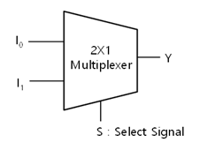
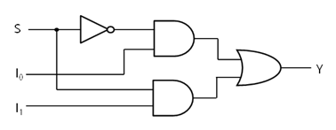
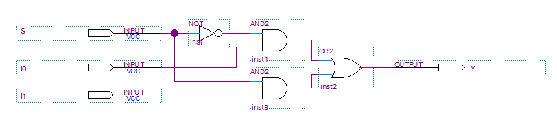
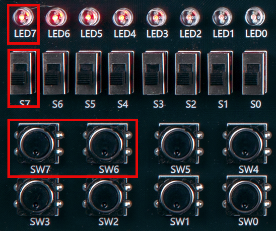
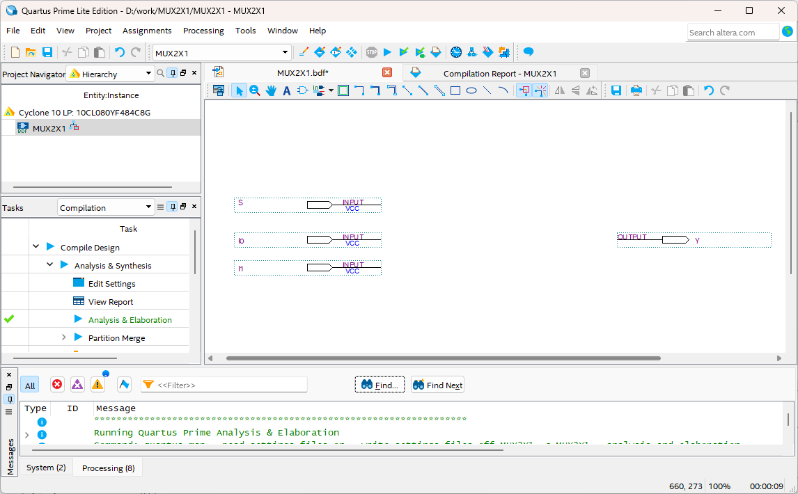
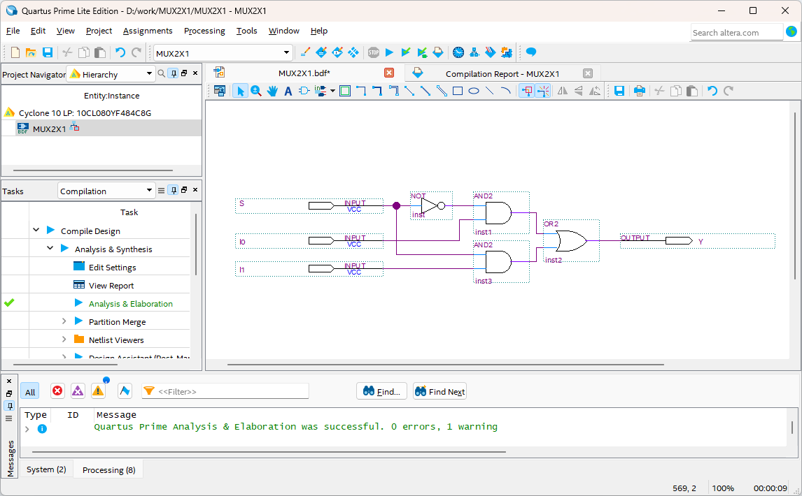
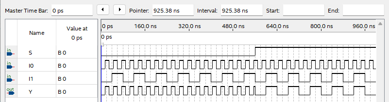

# MUX (Multiplexer)
---
## Theory

Multiplexer or data selector is a logic circuit that receives multiple data inputs and selects one of them for output. 

The input terminal of the data to be output is controlled by input signal selected.

Multiplexer is a device that selects one of N input data and transmits the selected data to one output channel. 

For example, 2-input multiplexer consists of 2 inputs, input signal to select input signal, and one output from which the selected input signal is output.

The following is a block diagram of 2-input multiplexer.

 
 
 

This circuit is configured with GATEs as shown below.

 

 

Truth table of 2X1 MUX

|S|I0|I1||Y|
|:---:|:---:|:---:|:---:|:---:|
|0|0|0||0|
|0|0|1||0|
|0|1|0||1|
|0|1|1||1|
|1|0|0||0|
|1|0|1||1|
|1|1|0||0|
|1|1|1||1|

Truth table above can be expressed as below.

|S||Y|
|:---:|:---:|:---:|
|0||I0|
|1||I1|

 

---
## Practice Objectives

Let's design and experiment with the circuit below.

 

 

Operational truth table is as below.

|S||Y|
|:---:|:---:|:---:|
|0||I0|
|1||I1|

 

Devices connected to check in SACT equipment are as below.

|S|I0|I1|Y|
|:---:|:---:|:---:|:---:|
|S7|SW7|SW6|LED7|

 

 

 

### Design

1. Prepare project file <a href="./pds/MUX2X1.zip" download>MUX2X1.zip</a> for the experiment.  
 

2. Move the project compressed file downloaded to d:\work and unzip it.

3. Run Quartus II and select File > Open Project.

 

4. Go to d:\work\MUX2X1 folder, where the files are unzipped, and open MUX2X1 project.

 

5. Select File > Open to import MUX2X1.bdf file. Or double-click MUX2X1 on the left side of the project.

 

6. Unfinished drawing is shown. Let's complete it with the drawing described before.

 

 

7. Import symbols of AND2 gate, OR2 gate, NOT gate, and connect the symbols with wire to complete the circuit.

 

 

### Compile

8. Select File > Save and save, and select Processing > Start Compilation to compile.

Compilation is process to verify that there are no errors in the designed logic circuit and create programming file and simulation file.

  

### Simulation

9. Select File > Open, and change File Type to All Files (.) in Open File window in the lower right corner, then select Waveform.vwf file.

10. In Waveform window, select Simulation > Run Functional Simulation to run it.

 

 
 

### Check Hardware Operation

11. Prepare SACT equipment. Connect USB cable and power cable and press the power switch to supply power to the device.

12. In Quartus software, select Tool > Programmer.

13. Check that USB Blaster is connected in Hardware Setup on Programmer window. Press Start button to program to check the operation on the device.

 

14. Operate the slide switch, button switch and check MUX operation on LED.

Devices connected to check in the SACT equipment are as below.

|S|I0|I1|Y|
|:---:|:---:|:---:|:---:|
|S7|SW7|SW6|LED7|

 

 

 

 

