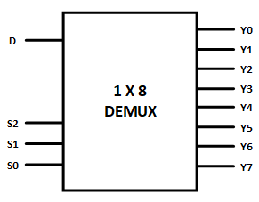
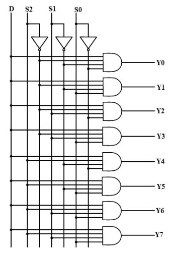
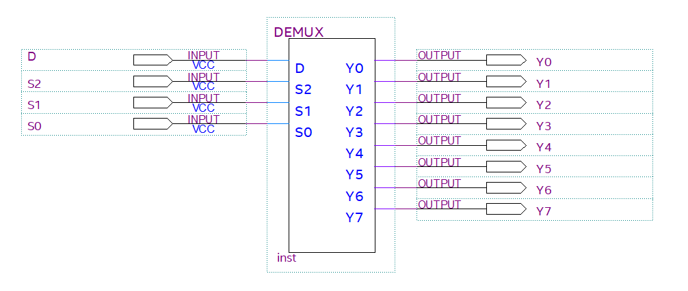
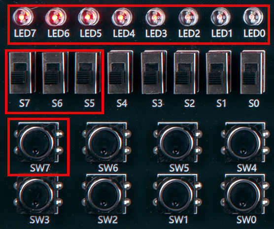
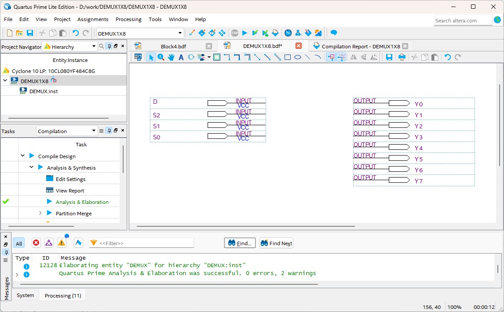
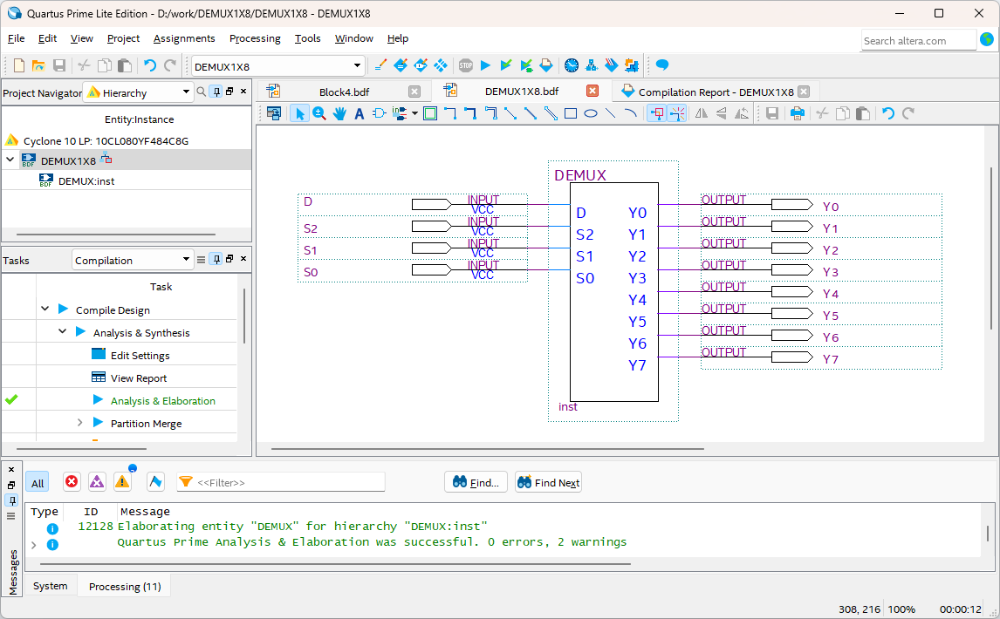
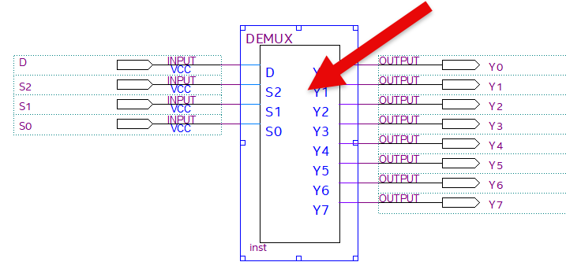
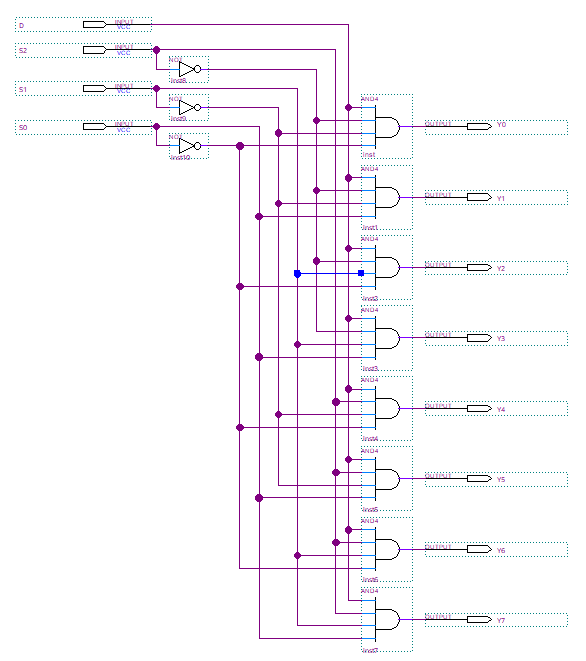
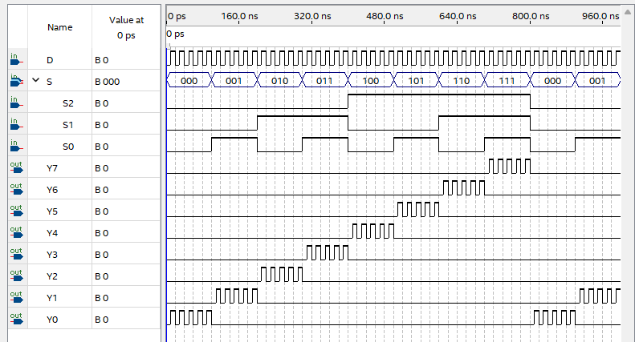

# DEMUX (DeMultiplexer)
---
## 이론

멀티플렉서는 여러 개의 입력을 받아 그 중 하나를 출력으로 전송한다. 

디멀티플렉서는 이와 반대로 동작해서 하나의 입력을 받아들여 여러 개의 출력으로 분배한다. 

다시 말해서 하나의 입력을 받아 선택 신호 입력에 따라서 여러 개의 출력 중 1개를 선택하여 입력 받은 신호를 출력하는 것이 이 디멀티플렉서이다. 

예를 들어 1 x 8 디멀티플렉서의 경우 하나의 입력 선을 8개의 출력 선으로 분배하는 기능을 하는 논리 회로이다. 

입력 선을 I, 선택 신호 입력 선을 S, 출력 선을 O라 할 때, 선택 신호 입력 선에 따라서 출력 선 중 하나에 I의 값이 전달된다.

 1 x 8 디멀티플렉서에서 S2, S1, S0의 값의 “000”이라면, 출력선의 O0에 I의 값이 전달되고, 선택 신호 입력 선 S의 값에 따라서 출력 선인 O 중 하나에 I가 연결되도록 하는 것이다. 

.
 
 
 

이 회로를 GATE로 구성하면 아래 그림과 같다. 

 

 

다음 표는 1 x 8 디멀티플렉서의 동작을 나타내는 진리표이다.

1X8 DEMUX의 진리표

|D|S2|S1|S0||Y7|Y6|Y5|Y4|Y3|Y2|Y1|Y0|
|:---:|:---:|:---:|:---:|:---:|:---:|:---:|:---:|:---:|:---:|:---:|:---:|:---:|
|D|0|0|0||0|0|0|0|0|0|0|D|
|D|0|0|1||0|0|0|0|0|0|D|0|
|D|0|1|0||0|0|0|0|0|D|0|0|
|D|0|1|1||0|0|0|0|D|0|0|0|
|D|1|0|0||0|0|0|D|0|0|0|0|
|D|1|0|1||0|0|D|0|0|0|0|0|
|D|1|1|0||0|D|0|0|0|0|0|0|
|D|1|1|1||D|0|0|0|0|0|0|0|

 

---
## **실습 목표**

다음의 회로를 설계하여 실험해 보자.

 

 

이 회로의 동작 진리표은 다음과 같다. 

|D|S2|S1|S0||Y7|Y6|Y5|Y4|Y3|Y2|Y1|Y0|
|:---:|:---:|:---:|:---:|:---:|:---:|:---:|:---:|:---:|:---:|:---:|:---:|:---:|
|D|0|0|0||0|0|0|0|0|0|0|D|
|D|0|0|1||0|0|0|0|0|0|D|0|
|D|0|1|0||0|0|0|0|0|D|0|0|
|D|0|1|1||0|0|0|0|D|0|0|0|
|D|1|0|0||0|0|0|D|0|0|0|0|
|D|1|0|1||0|0|D|0|0|0|0|0|
|D|1|1|0||0|D|0|0|0|0|0|0|
|D|1|1|1||D|0|0|0|0|0|0|0|

 

SACT 장비에서 확인하기 위하여 연결된 장치는 다음과 같다. 

|D|S2|S1|S0|Y7|Y6|Y5|Y4|Y3|Y2|Y1|Y0|
|:---:|:---:|:---:|:---:|:---:|:---:|:---:|:---:|:---:|:---:|:---:|:---:|
|SW7|S7|S6|S5|LED7|LED6|LED5|LED4|LED3|LED2|LED1|LED0|

 

 

### **설계**

1. 실험을 위해 프로젝트 파일 <a href="./pds/DEMUX1X8.zip" download>DEMUX1X8.zip</a>을 준비한다. 
 

2. 다운로드된 프로젝트의 압축 파일을 d:\work 이동시킨 후, 압축을 푼다.

3. Quartus II를 실행키고, File> Open Project 메뉴를 선택한다. 

 

4. 위에서 압축을 푼 위치인, d:\work\DEMUX1X8 폴더로 이동 후,DEMUX1X8 프로젝트를 OPEN한다. 

 

5. File > Open 메뉴를 선택하여 DEMUX1X8.bdf 파일을 불러오거나, 프로젝트 왼쪽의 DEMUX1X8 부분을 마우스로 더블 클릭한다. 

 

6. 아래 그림과 같이 미완성된 도면이 보이는데, 실습 목표에서 설명한 도면으로 완성시키자. 

 

 

7. DEMUX 심볼을 불러오고, wire로 심볼을 연결시켜 회로를 완성시킨다.  

 

 

DEMUX 심볼을 마우스로 더블 클릭하면 DEMUX로 설계된 도면을 확인할 수 있다. 

 

 

 

 

### **컴파일**

8. File > Save 메뉴를 선택하여 저장하고, Processing > Start Compilation 메뉴를 선택하여 컴파일을 진행한다. 

이 컴파일 과정은 설계한 논리 회로에 오류가 없는 지를 검증하고, 프로그래밍 파일과 시뮬레이션 파일을 만드는 과정이다. 

  

### **시뮬레이션**

9. 컴파일 완료 후, File > Open 메뉴를 선택하고, 나타나는 Open File 창에서 오른쪽 아래 부분의 File Type을 All File(*.*)로 변경한 후, Waveform.vwf 파일을 선택한다. 

10. 아래 그림과 같이 Waveform 창에서, Simulation > Run Functiona Simulation 메뉴를 선택하여 Functional Simulation을 진행하여, 결과를 확인한다. 

 

 
 

### **하드웨어 동작 확인**

11. SACT 장비를 준비한다. USB 케이블과 파워 케이블을 연결하고, 전원 스위치를 눌러 장비에 전원을 인가시킨다. 

12. Quartus 소프트웨어에서 Tool > Programmer 메뉴를 선택한다.

13. Programmer창의 Hardware Setup이 USB Blaster가 연결되어 있는지 확인하고, Start 버튼을 눌러 프로그래밍 하고 장비에서 동작을 확인한다. 

 

14. 슬라이드 스위치와 버튼 스위치를 동작시키고, DEMUX의 동작을 LED에서 확인해 보자. 

SACT 장비에서 확인하기 위하여 연결된 장치는 다음과 같다. 

|D|S2|S1|S0|Y7|Y6|Y5|Y4|Y3|Y2|Y1|Y0|
|:---:|:---:|:---:|:---:|:---:|:---:|:---:|:---:|:---:|:---:|:---:|:---:|
|SW7|S7|S6|S5|LED7|LED6|LED5|LED4|LED3|LED2|LED1|LED0|

 

 

