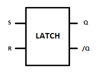
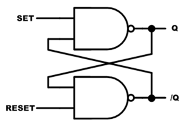
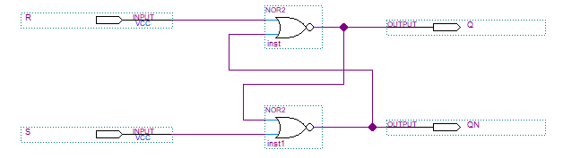
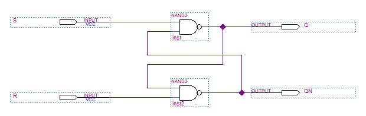
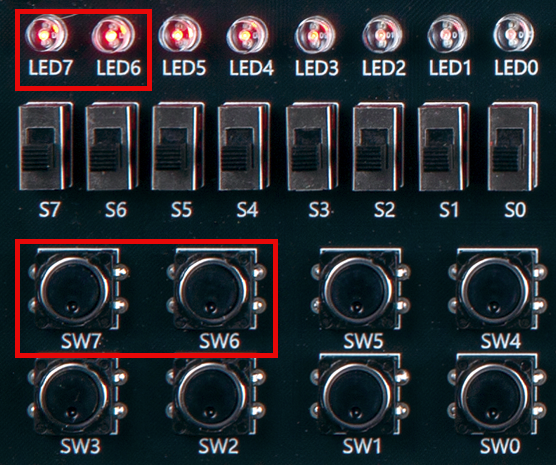
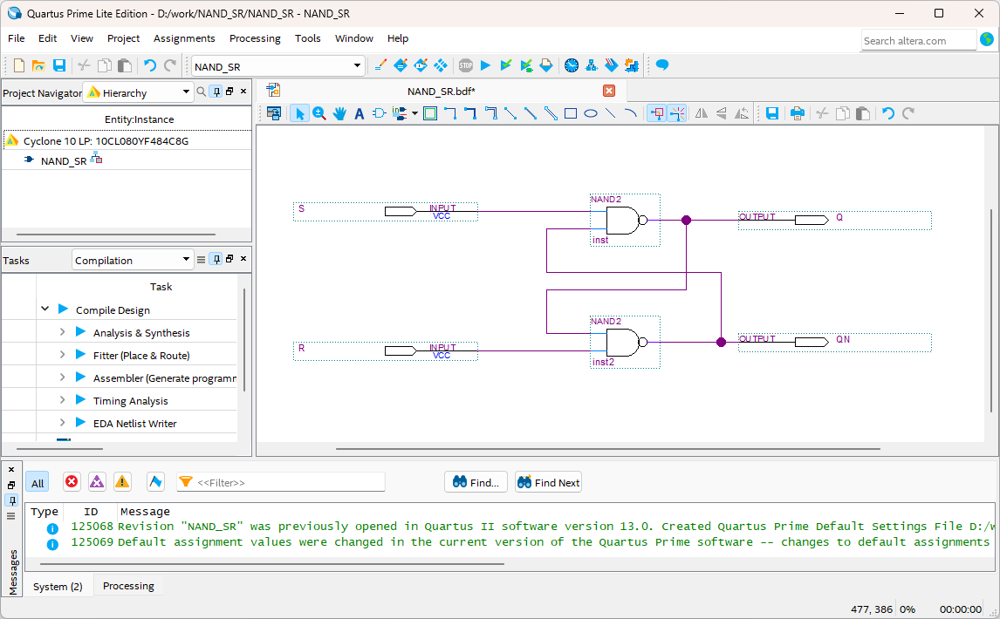
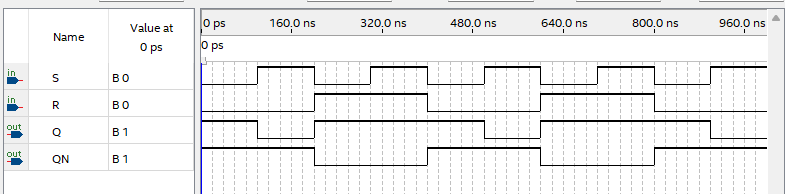
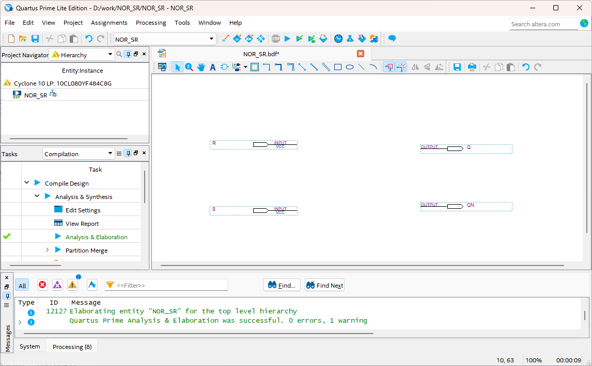
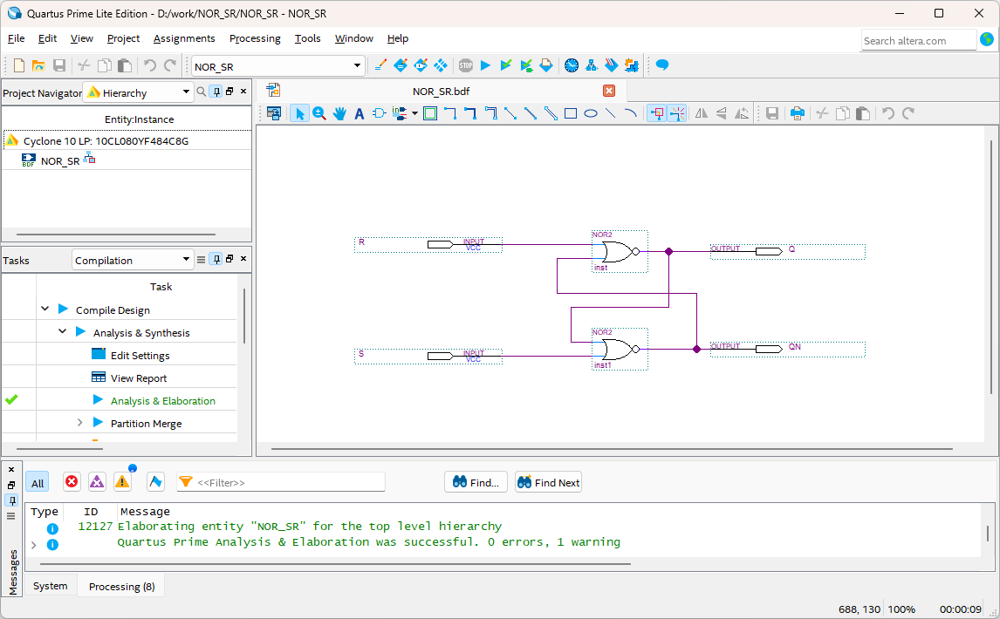
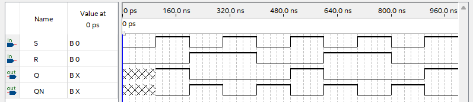

# LATCH
---
## Theory

LATCH is a circuit that stores one bit information in a sequential circuit.

When a signal is supplied to a circuit and then stopped, the circuit loses that signal. Latch is used to maintain the signal.

 

 

- **S R LATCH**

In SR LATCH, S stands for Set and R stands for Reset.

SR Latch has two outputs (Q, /Q) for two inputs (Set, Reset).

 
 
 

Two output Q and /Q have complementary relationship.

Below is a simple characteristics table.

|S|R|Q|/Q|
|:---:|:---:|:---:|:---:|
|0|0|Previous value|Previous value|
|0|1|0|1|
|1|0|1|0|
|1|1|X|X|

 

1. If Set is 1 and Reset is 0, Q becomes 1.

2. If Set is 0 and Reset is 1, Q becomes 0.

3. If Set and Reset are 0, the previous value is maintained. 

4. If Set and Reset are 1, it cannot be established.

 

 

Depending on the gate that creates LATCH, NAND latch and NOR latch are configured.  

- **NAND LATCH**

 
 
 

|SET|RESET|Q|/Q|
|:---:|:---:|:---:|:---:|
|0|0|X|X|
|0|1|1|0|
|1|0|0|1|
|1|1|Previous value|Previous value|

 

1. When SET and RESET = 0, which is to set and reset the latch simultaneously, producing an output of Q and /Q = 1. If the inputs return to 1 at the same time, the output value becomes unpredictable and this input condition is not used(X).

2. When SET = 0 and RESET = 1, output is always set to Q = 1, and even if the SET input becomes 1 again, output does not change. This is because when SET = RESET = 1, the previous value is maintained. This state is called the set state of the latch.

3. When SET = 1 and RESET = 0, output is always set to Q = 0. This state is called clear state of latch or reset state of latch. 

4. When SET and RESET = 1, it is in hold state and has no effect on the output state. Q and /Q outputs maintain the state before input.

** NOR LATCH**

 
 
 

|SET|RESET|Q|/Q|
|:---:|:---:|:---:|:---:|
|0|0|이전 값|이전 값|
|0|1|0|1|
|1|0|1|0|
|1|1|X|X|

1. When SET and RESET = 0, this is hold state for NOR latch and has no effect on the output state. Q and /Q maintain the state before input.

2. When SET = 0 and RESET = 1, output is always set to Q = 0.

3. When SET = 1 and RESET = 0, output is always set to Q = 1. 

4. When SET and RESET = 1, which is to set and reset the latch simultaneously, producing an output of Q and /Q = 0. If set and reset return to 0 at the same time, the output value becomes unpredictable and this input condition is not used(X).

NOR latch and NAND latch operate in the same way, except that it operates when SET=0, RESET=1 or when SET=1 and RESET=0.

 

---
## **Practice Objective 1**

Let's design and experiment with the circuit below.

 

 

Operational truth table of this circuit is as below.

|S|R|Q|QN|
|:---:|:---:|:---:|:---:|
|0|0|X|X|
|0|1|1|0|
|1|0|0|1|
|1|1|Previous |Previous |

 

Devices connected to check in SACT equipment are as below.

|S|R|Q|QN|
|:---:|:---:|:---:|:---:|
|SW7|SW6|LED7|LED6|

 

 

### **Design**

1. . Prepare project file  <a href="./pds/NAND_SR.zip" download>NAND_SR.zip</a> for the experiment. 
 

2. Move the project compressed file downloaded to d:＼work and unzip it.

3. Run Quartus II and select File > Open Project.

4. Go to d:＼work＼NAND_SR folder, where the files are unzipped, and open NAND_SR project.

5. Select File > Open to import NAND_SR.bdf file. Or double-click NAND_SR  on the left side of the project.

6. Unfinished drawing is shown. Let's complete it with the drawing described before.

 

 

7. Complete the circuit by importing nand2 symbol and connecting the symbol with wire.

 

 

### **Compile**

8. Select File > Save and save, and select Processing > Start Compilation to compile.

    Compilation is process to verify that there are no errors in the designed logic circuit and create programming file and simulation file.

  

### **Simulation**

9. Select File > Open, and change File Type to All Files (.) in Open File window in the lower right corner, then select Waveform.vwf file.

10. In Waveform window, select Simulation > Run Functional Simulation to run it.

 

 
 

### **Check Hardware Operation**

11. Prepare SACT equipment. Connect USB cable and power cable and press the power switch to supply power to the device.

12. In Quartus software, select Tool > Programmer.

13. Check that USB Blaster is connected in Hardware Setup on Programmer window. Press Start button to program to check the operation on the device.

14. Operate button switch and check output result on LED.

Devices connected to check in SACT equipment are as below.

|S|R|Q|QN|
|:---:|:---:|:---:|:---:|
|SW7|SW6|LED7|LED6|

 

 

---
## **Practice Objective 2**

Let's design and experiment with the circuit below.

 

 

Operational truth table of this circuit is as below.

|S|R|Q|QN|
|:---:|:---:|:---:|:---:|
|0|0|이전 값|이전 값|
|0|1|0|1|
|1|0|1|0|
|1|1|X|X|

 

Devices connected to check in SACT equipment are as below.

|S|R|Q|QN|
|:---:|:---:|:---:|:---:|
|SW7|SW6|LED7|LED6|

 

 

### **Design**

1. Prepare project file <a href="./pds/NOR_SR.zip" download>NOR_SR.zip</a> for the experiment.  
 

2. Move the project compressed file downloaded to d:＼work and unzip it.

3. Run Quartus II and select File > Open Project.

4. Go to d:＼work＼NOR_SR folder, where the files are unzipped, and open NOR_SR project.

5. Select File > Open to import NOR_SR.bdf file. Or double-click NOR_SR on the left side of the project.

6. Unfinished drawing is shown. Let's complete it with the drawing described before.

 

 

7. Complete the circuit by importing nor2 symbol and connecting the symbol with wire.

 

 

### **Compile**

8. Select File > Save and save, and select Processing > Start Compilation to compile.

    Compilation is process to verify that there are no errors in the designed logic circuit and create programming file and simulation file.

  

### **Simulation**

9. Select File > Open, and change File Type to All Files (.) in Open File window in the lower right corner, then select Waveform.vwf file.

10. In Waveform window, select Simulation > Run Functional Simulation to run it.

 

 
 

### **Check Hardware Operation**

11. Prepare SACT equipment. Connect USB cable and power cable and press the power switch to supply power to the device.

12. In Quartus software, select Tool > Programmer.

13. Check that USB Blaster is connected in Hardware Setup on Programmer window. Press Start button to program to check the operation on the device.

14. Operate button switch and check output result on LED.

Devices connected to check in SACT equipment are as below.

|S|R|Q|QN|
|:---:|:---:|:---:|:---:|
|SW7|SW6|LED7|LED6|

 

 

