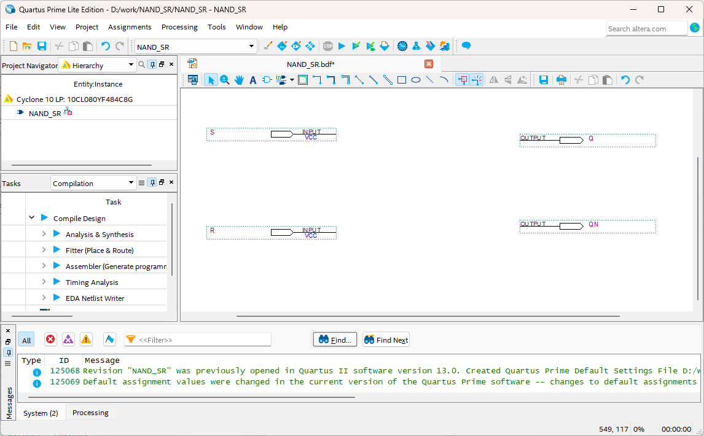

# LATCH
---
## 이론

LATCH는 순차회로에서 한 비트의 정보를 저장하는 회로이다. 

어떤 신호가 회로에 공급되다가 멈추면 회로에서는 그 신호를 잃게 되는데, 여기에서 신호를 계속 유지할 수 있게 해 주는 래치를 사용한다. 

 

 

- **S R LATCH**

SR LATCH에서 S는 Set, R은 Reset을 의미한다. 

SR 래치는 두 개의 입력(Set, Reset)에 따라 두 개의 출력(Q, /Q)을 갖는다. 

 
 
 

여기에서 두 개의 출력 Q와 /Q는 상보 관계를 갖는다. 

아래는 간단한 특성표이다. 

|S|R|Q|/Q|
|:---:|:---:|:---:|:---:|
|0|0|이전 값|이전 값|
|0|1|0|1|
|1|0|1|0|
|1|1|X|X|

 

1. Set이 1, Reset이 0이면 Q가 1이 된다. 

2. Set이 0, Reset이 1이면 Q가 0이 된다. 

3. Set과 Reset이 0이면 이전 값을 유지하며, Set과 Reset이 1일 때는 성립할 수 없다. 

 

 

LATCH를 만드는 게이트에 따라 NOR 래치, NAND 래치로 구성된다.  

- **NAND LATCH**

 
 
 

|SET|RESET|Q|/Q|
|:---:|:---:|:---:|:---:|
|0|0|X|X|
|0|1|1|0|
|1|0|0|1|
|1|1|이전 값|이전 값|

 

1. SET = RESET = 0 일 때, 이 조건은 래치의 세트와 리세트를 동시에 하려는 것으로, Q = /Q = 1의 출력을 만든다. 만일 입력이 동시에 1로 돌아가면 출력 값을 예측 할 수 없게 때문에, 이 입력 조건은 사용하지 않는다.

2. SET = 0, RESET = 1 일 때, 출력은 항상 Q = 1인 상태로 만들며, 여기에서 SET 입력이 다시 1이 되어도 출력은 변하지 않는다. SET = RESET = 1일 때 이전의 값을 유지하기 때문이다. 이 상태를 래치의 세트상태라고 한다.

3. SET = 1, RESET = 0 일 때, 출력은 항상 Q = 0인 상태로 만든다. 이 상태를 래치의 클리어 또는 리셋 상태라고 한다.

4. SET = RESET = 1일 때, 부동 상태로 출력 상태에 아무런 영향을 미치지 않는다. Q와 /Q 출력은 입력이 들어가기 전의 상태를 유지한다.

** NOR LATCH**

 
 
 

|SET|RESET|Q|/Q|
|:---:|:---:|:---:|:---:|
|0|0|이전 값|이전 값|
|0|1|0|1|
|1|0|1|0|
|1|1|X|X|

1. SET = RESET = 0 일 때, 이것은 NOR 래치에 대한 일반적인 부동상태이고, 출력 상태에 아무런 영향을 주지 않는다. Q와 /Q는 이 입력이 인가되기 이전의 상태를 그대로 유지한다.

2. SET = 0, RESET = 1 일 때, 항상 Q = 0으로 만든다.

3. SET = 1, RESET = 0 일 때, 항상 Q = 1로 만든다. 

4. SET = RESET = 1일 때, 이 조건은 동시에 래치를 세트와 리세트를 하게 되고, Q = /Q = 0의 상태를 만든다. 만약 SET과 RESET이 동시에 0의 값으로 되면, 출력 상태를 예측할 수가 없기 때문에 이 입력 조건은 사용되지 않는다. 

 

NOR 래치와 NAND 래치는 SET과 RESET가 0일 때 동작하느냐, 1일 때 동작하느냐인 것을 제외하고는 똑같이 동작한다. 

 

---
## **실습 목표 1**

다음의 회로를 설계하여 실험해 보자.

 

 

이 회로의 동작 진리표은 다음과 같다. 

|S|R|Q|QN|
|:---:|:---:|:---:|:---:|
|0|0|X|X|
|0|1|1|0|
|1|0|0|1|
|1|1|이전 값|이전 값|

 

SACT 장비에서 확인하기 위하여 연결된 장치는 다음과 같다. 

|S|R|Q|QN|
|:---:|:---:|:---:|:---:|
|SW7|SW6|LED7|LED6|

 

 

### **설계**

1. 실험을 위해 프로젝트 파일 <a href="./pds/NAND_SR.zip" download>NAND_SR.zip</a>을 준비한다. 
 

2. 다운로드된 프로젝트의 압축 파일을 d:\work 이동시킨 후, 압축을 푼다.

3. Quartus II를 실행키고, File> Open Project 메뉴를 선택한다. 

 

4. 위에서 압축을 푼 위치인, d:\work\NAND_SR 폴더로 이동 후,NAND_SR 프로젝트를 OPEN한다. 

 

5. File > Open 메뉴를 선택하여 NAND_SR.bdf 파일을 불러오거나, 프로젝트 왼쪽의 NAND_SR 부분을 마우스로 더블 클릭한다. 

 

6. 아래 그림과 같이 미완성된 도면이 보이는데, 실습 목표에서 설명한 도면으로 완성시키자. 

 

 

7. nand2 심볼을 불러오고, wire로 심볼을 연결시켜 회로를 완성시킨다.  

 

 

### **컴파일**

8. File > Save 메뉴를 선택하여 저장하고, Processing > Start Compilation 메뉴를 선택하여 컴파일을 진행한다. 

이 컴파일 과정은 설계한 논리 회로에 오류가 없는 지를 검증하고, 프로그래밍 파일과 시뮬레이션 파일을 만드는 과정이다. 

  

### **시뮬레이션**

9. 컴파일 완료 후, File > Open 메뉴를 선택하고, 나타나는 Open File 창에서 오른쪽 아래 부분의 File Type을 All File(*.*)로 변경한 후, Waveform.vwf 파일을 선택한다. 

10. 아래 그림과 같이 Waveform 창에서, Simulation > Run Functiona Simulation 메뉴를 선택하여 Functional Simulation을 진행하여, 결과를 확인한다. 

 

 
 

### **하드웨어 동작 확인**

11. SACT 장비를 준비한다. USB 케이블과 파워 케이블을 연결하고, 전원 스위치를 눌러 장비에 전원을 인가시킨다. 

12. Quartus 소프트웨어에서 Tool > Programmer 메뉴를 선택한다.

13. Programmer창의 Hardware Setup이 USB Blaster가 연결되어 있는지 확인하고, Start 버튼을 눌러 프로그래밍 하고 장비에서 동작을 확인한다. 

 

14. 버튼 스위치를 동작시키고, 출력 결과를 LED에서 확인해 보자. 

SACT 장비에서 확인하기 위하여 연결된 장치는 다음과 같다. 

|S|R|Q|QN|
|:---:|:---:|:---:|:---:|
|SW7|SW6|LED7|LED6|

 

 

---
## **실습 목표 2**

다음의 회로를 설계하여 실험해 보자.

 

 

이 회로의 동작 진리표은 다음과 같다. 

|S|R|Q|QN|
|:---:|:---:|:---:|:---:|
|0|0|이전 값|이전 값|
|0|1|0|1|
|1|0|1|0|
|1|1|X|X|

 

SACT 장비에서 확인하기 위하여 연결된 장치는 다음과 같다. 

|S|R|Q|QN|
|:---:|:---:|:---:|:---:|
|SW7|SW6|LED7|LED6|

 

 

### **설계**

1. 실험을 위해 프로젝트 파일 <a href="./pds/NOR_SR.zip" download>NOR_SR.zip</a>을 준비한다. 
 

2. 다운로드된 프로젝트의 압축 파일을 d:\work 이동시킨 후, 압축을 푼다.

3. Quartus II를 실행키고, File> Open Project 메뉴를 선택한다. 

 

4. 위에서 압축을 푼 위치인, d:\work\NOR_SR 폴더로 이동 후,NOR_SR 프로젝트를 OPEN한다. 

 

5. File > Open 메뉴를 선택하여 NOR_SR.bdf 파일을 불러오거나, 프로젝트 왼쪽의 NOR_SR 부분을 마우스로 더블 클릭한다. 

 

6. 아래 그림과 같이 미완성된 도면이 보이는데, 실습 목표에서 설명한 도면으로 완성시키자. 

 

 

7. nor2 심볼을 불러오고, wire로 심볼을 연결시켜 회로를 완성시킨다.  

 

 

### **컴파일**

8. File > Save 메뉴를 선택하여 저장하고, Processing > Start Compilation 메뉴를 선택하여 컴파일을 진행한다. 

이 컴파일 과정은 설계한 논리 회로에 오류가 없는 지를 검증하고, 프로그래밍 파일과 시뮬레이션 파일을 만드는 과정이다. 

  

### **시뮬레이션**

9. 컴파일 완료 후, File > Open 메뉴를 선택하고, 나타나는 Open File 창에서 오른쪽 아래 부분의 File Type을 All File(*.*)로 변경한 후, Waveflatchm.vwf 파일을 선택한다. 

10. 아래 그림과 같이 Waveflatchm 창에서, Simulation > Run Functiona Simulation 메뉴를 선택하여 Functional Simulation을 진행하여, 결과를 확인한다. 

 

 
 

### **하드웨어 동작 확인**

11. SACT 장비를 준비한다. USB 케이블과 파워 케이블을 연결하고, 전원 스위치를 눌러 장비에 전원을 인가시킨다. 

12. Quartus 소프트웨어에서 Tool > Programmer 메뉴를 선택한다.

13. Programmer창의 Hardware Setup이 USB Blaster가 연결되어 있는지 확인하고, Start 버튼을 눌러 프로그래밍 하고 장비에서 동작을 확인한다. 

 

14. 버튼 스위치를 동작시키고, 출력 결과를 LED에서 확인해 보자. 

SACT 장비에서 확인하기 위하여 연결된 장치는 다음과 같다. 

|S|R|Q|QN|
|:---:|:---:|:---:|:---:|
|SW7|SW6|LED7|LED6|

 

 

