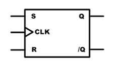
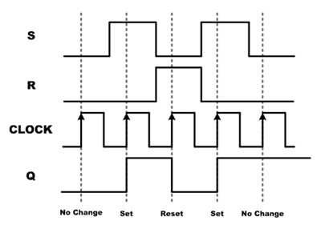
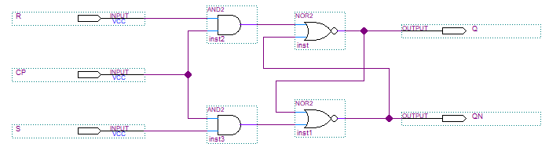
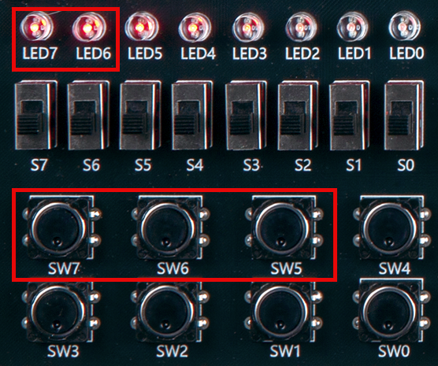
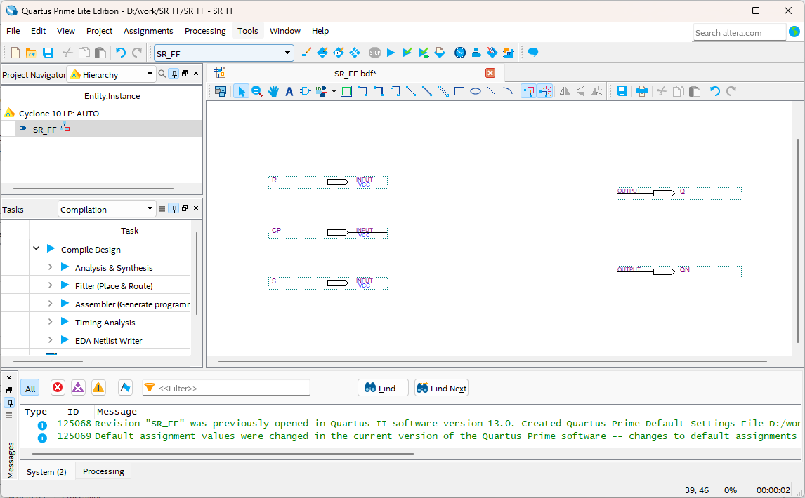
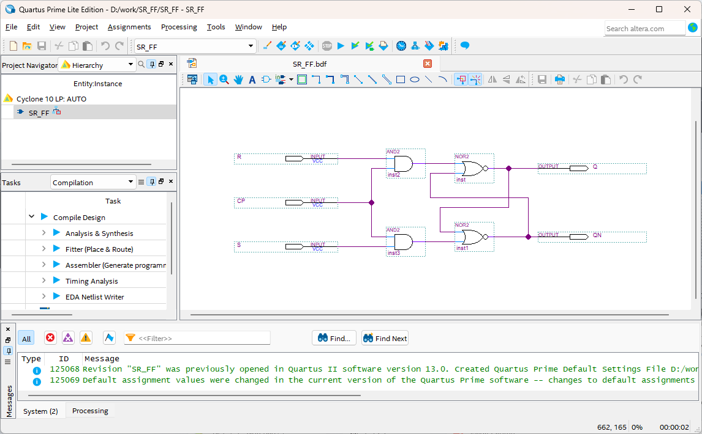
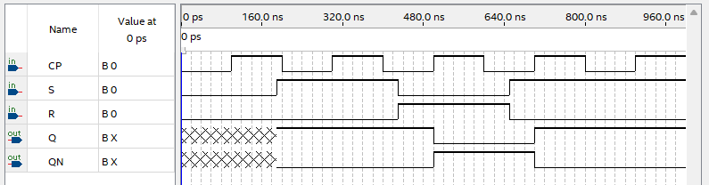

# S-R FLIPFLOP
---
## 이론

S-R 플립플롭은 S-R 래치에 클럭의 입력이라는 부분을 추가했다고 생각하면 된다. 다음 그림은 이 S-R 플립플롭의 논리 회로를 나타낸 것이다. 

SR LATCH에서 S는 Set, R은 Reset을 의미한다. 

SR 래치는 두 개의 입력(Set, Reset)에 따라 두 개의 출력(Q, /Q)을 갖는다. 

 
 
 

여기에서 두 개의 출려 Q와 /Q는 상보 관계를 갖는다. 

아래는 간단한 특성표이다. 

|S|R|CLK|Q|
|:---:|:---:|:---:|:---:|
|0|0|clock|이전 값|
|0|1|clock|1|
|1|0|clock|0|
|1|1|clock|X|

 

NOR 게이트 래치와 동작은 같다는 것을 알 수 있다. 

이 S-R 플립플롭은 NOR 게이트 래치와 같이 동작이 되지만, 출력 값 Q, /Q의 업데이트가 클럭의 Rising Edge에서 이루어 진다는 점에서 차이가 있다. 

클럭이 발생하지 않으면 S, R 입력에 대하여 플립플롭은 응답하지 않는다.

 

다음 그림은 S-R 플립플롭에 임의의 신호를 입력하였을 때의 출력 결과를 나타낸 것이다.

 
 
 

---
## **실습 목표 **

다음의 회로를 설계하여 실험해 보자.

 

 

이 회로의 동작 진리표은 다음과 같다. 

|S|R|CP|Q|QN|
|:---:|:---:|:---:|:---:|:---:|
|0|0|clock|이전 값|이전 값|
|0|1|clock|1|0|
|1|0|clock|0|1|
|1|1|clock|X|X|

 

SACT 장비에서 확인하기 위하여 연결된 장치는 다음과 같다. 

|S|R|CP|Q|QN|
|:---:|:---:|:---:|:---:|:---:|
|SW7|SW6|SW5|LED7|LED6|

 

 

### **설계**

1. 실험을 위해 프로젝트 파일 <a href="./pds/SR_FF.zip" download>SR_FF.zip</a>을 준비한다. 
 

2. 다운로드된 프로젝트의 압축 파일을 d:\work 이동시킨 후, 압축을 푼다.

3. Quartus II를 실행키고, File> Open Project 메뉴를 선택한다. 

 

4. 위에서 압축을 푼 위치인, d:\work\SR_FF 폴더로 이동 후,SR_FF 프로젝트를 OPEN한다. 

 

5. File > Open 메뉴를 선택하여 SR_FF.bdf 파일을 불러오거나, 프로젝트 왼쪽의 SR_FF 부분을 마우스로 더블 클릭한다. 

 

6. 아래 그림과 같이 미완성된 도면이 보이는데, 실습 목표에서 설명한 도면으로 완성시키자. 

 

 

7. and 심볼과 nor2 심볼을 불러오고, wire로 심볼을 연결시켜 회로를 완성시킨다.  

 

 

### **컴파일**

8. File > Save 메뉴를 선택하여 저장하고, Processing > Start Compilation 메뉴를 선택하여 컴파일을 진행한다. 

이 컴파일 과정은 설계한 논리 회로에 오류가 없는 지를 검증하고, 프로그래밍 파일과 시뮬레이션 파일을 만드는 과정이다. 

  

### **시뮬레이션**

9. 컴파일 완료 후, File > Open 메뉴를 선택하고, 나타나는 Open File 창에서 오른쪽 아래 부분의 File Type을 All File(*.*)로 변경한 후, Waveform.vwf 파일을 선택한다. 

10. 아래 그림과 같이 Waveform 창에서, Simulation > Run Functiona Simulation 메뉴를 선택하여 Functional Simulation을 진행하여, 결과를 확인한다. 

 

 
 

### **하드웨어 동작 확인**

11. SACT 장비를 준비한다. USB 케이블과 파워 케이블을 연결하고, 전원 스위치를 눌러 장비에 전원을 인가시킨다. 

12. Quartus 소프트웨어에서 Tool > Programmer 메뉴를 선택한다.

13. Programmer창의 Hardware Setup이 USB Blaster가 연결되어 있는지 확인하고, Start 버튼을 눌러 프로그래밍 하고 장비에서 동작을 확인한다. 

 

14. 버튼 스위치를 동작시키고, 출력 결과를 LED에서 확인해 보자. 

SACT 장비에서 확인하기 위하여 연결된 장치는 다음과 같다. 

|S|R|CP|Q|QN|
|:---:|:---:|:---:|:---:|:---:|
|SW7|SW6|SW5|LED7|LED6|

 

 

