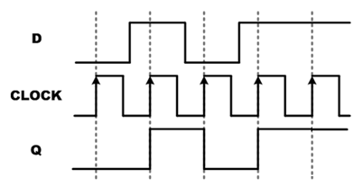
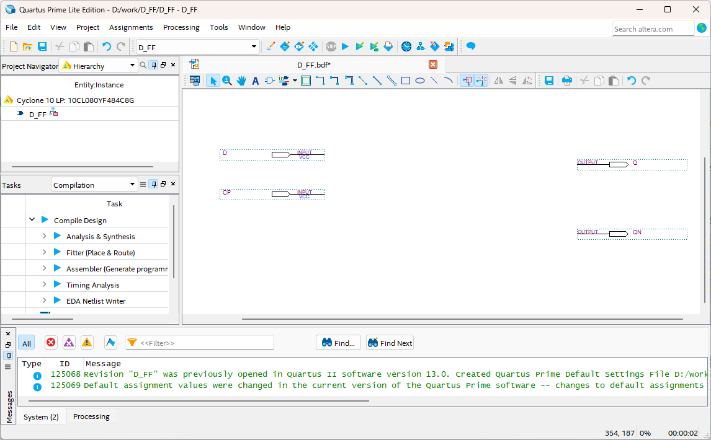

# D FLIPFLOP
---
## Theory

The following figure is a logic circuit representing D flip-flop with clock input.

 
 
 

Unlike SR flip-flop or JK flip-flop, D flip-flop has only one data input, D. 

The operation of this flip-flop is to transfer the state of the D input to Q when the clock is generated.

 
The following table shows the operating state of D flip-flop.

|D|CLK|Q|
|:---:|:---:|:---:|
|0|clock|0|
|1|clock|1|

 

The figure below shows the output result when an arbitrary signal is input to D flip-flop.

 
 
 

---
## **Practice Objective **

Let's design and experiment with the circuit below.

 

 

Devices connected to check in SACT equipment are as below.

|D|CP|Q|QN|
|:---:|:---:|:---:|:---:|
|0|clock|0|1|
|1|clock|1|0|

 

SACT 장비에서 확인하기 위하여 연결된 장치는 다음과 같다. 

|D|CP|Q|QN|
|:---:|:---:|:---:|:---:|
|SW7|SW6|LED7|LED6|

 

 

### **Design**

1. Prepare project file <a href="./pds/D_FF.zip" download>D_FF.zip</a> for the experiment.  
 

2. Move the project compressed file downloaded to d:＼work and unzip it.

3. Run Quartus II and select File > Open Project.

4. Go to d:＼work＼D_FF folder, where the files are unzipped, and open D_FF project.

5. Select File > Open to import D_FF.bdf file. Or double-click D_FF on the left side of the project.

6. Unfinished drawing is shown. Let's complete it with the drawing described before.  

 

 

7. Complete the circuit by importing “nand2” symbol, “not” symbol and connecting them with wire.

 

 

### **Compile**

8. Select File > Save and save, and select Processing > Start Compilation to compile.

    Compilation is process to verify that there are no errors in the designed logic circuit and create programming file and simulation file.

  

### **Simulation**

9. Select File > Open, and change File Type to All Files (.) in Open File window in the lower right corner, then select Waveform.vwf file.

10. In Waveform window, select Simulation > Run Functional Simulation to run it.

 

 
 

### **Check Hardware Operation**

11. Prepare SACT equipment. Connect USB cable and power cable and press the power switch to supply power to the device.

12. In Quartus software, select Tool > Programmer.

13. Check that USB Blaster is connected in Hardware Setup on Programmer window. Press Start button to program to check the operation on the device.

14. Operate the button switch and check output result on LED.

Devices connected to check in SACT equipment are as below.

|D|CP|Q|QN|
|:---:|:---:|:---:|:---:|
|SW7|SW6|LED7|LED6|

 

 

