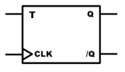
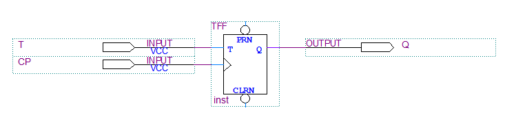
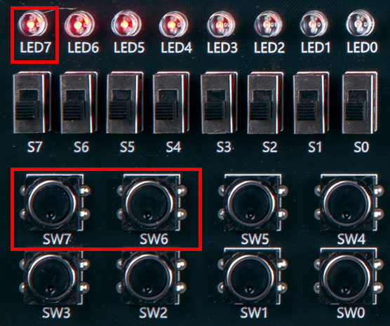
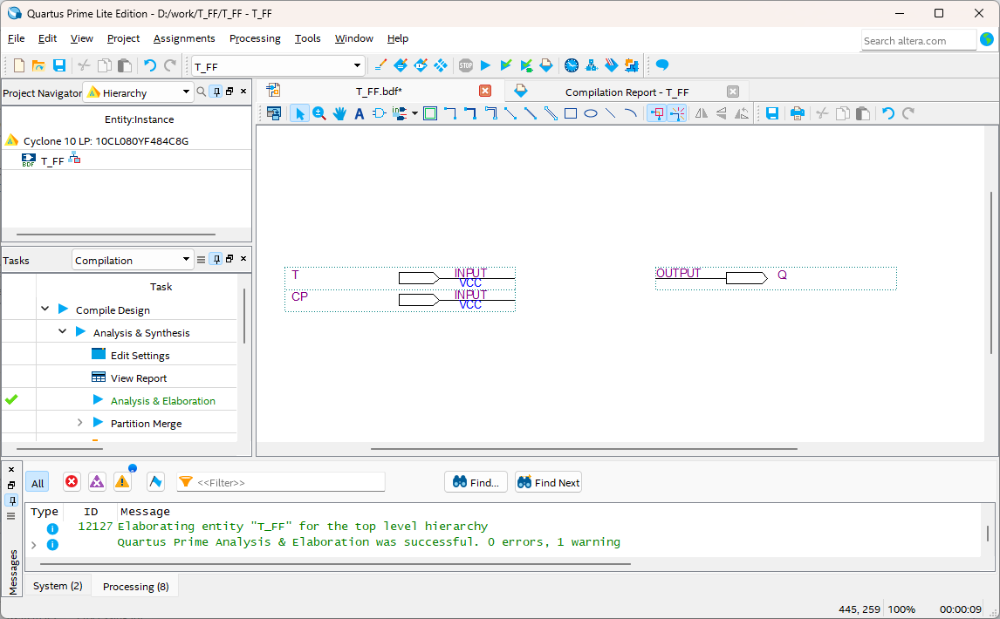
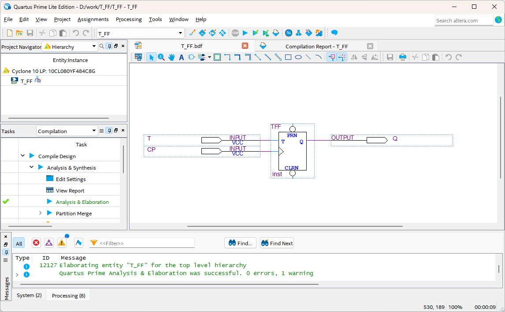
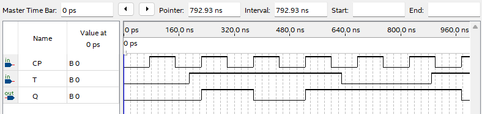

# T FLIPFLOP
---
## Theory

The following figure is a logic circuit representing T flip-flop with clock input.

 
 

 

T flip-flop is the same circuit as J=K flip-flop with input J and K connected. The following table shows the operating state of T flip-flop.

 

|T|CLK|Q|
|:---:|:---:|:---:|
|0|clock|Q0 (previous value)|
|1|clock|/Q0 (toggle previous value)|

 

---
## **Practice Objective **

Let's design and experiment with the circuit below.

 

 

Operational truth table of this circuit is as below.

|T|CLK|Q|
|:---:|:---:|:---:|
|0|clock|Q0 (previous value)|
|1|clock|/Q0 (toggle previous value)|

 

Devices connected to check in SACT equipment are as below.

|T|CP|Q|
|:---:|:---:|:---:|
|SW7|SW6|LED7|

 

 

### **Design**

1. Prepare project file <a href="./pds/T_FF.zip" download>T_FF.zip</a> for the experiment.  
 

2. Move the project compressed file downloaded to d:＼work and unzip it.

3. Run Quartus II and select File > Open Project.

4. Go to d:＼work＼T_FF folder, where the files are unzipped, and open T_FF project.

5. Select File > Open to import T_FF.bdf file. Or double-click T_FF on the left side of the project.

6. Unfinished drawing is shown. Let's complete it with the drawing described before.  

 

 

7. Complete the circuit by importing “tff” symbol and connecting it with wire.

 

 

### **Compile**

8. Select File > Save and save, and select Processing > Start Compilation to compile.

    Compilation is process to verify that there are no errors in the designed logic circuit and create programming file and simulation file.

  

### **Simulation**

9. Select File > Open, and change File Type to All Files (.) in Open File window in the lower right corner, then select Waveform.vwf file.

10. In Waveform window, select Simulation > Run Functional Simulation to run it.

 

 
 

### **Check Hardware Operation**

11. Prepare SACT equipment. Connect USB cable and power cable and press the power switch to supply power to the device.

12. In Quartus software, select Tool > Programmer.

13. Check that USB Blaster is connected in Hardware Setup on Programmer window. Press Start button to program to check the operation on the device.

14. Operate the button switch and check output result on LED.

Devices connected to check in SACT equipment are as below.

|T|CP|Q|
|:---:|:---:|:---:|
|0|clock|Q0 (Previous value)|
|1|clock|/Q0 (Toggle previous value)|

 

 

