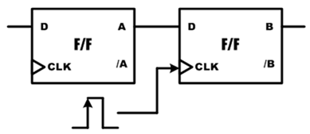
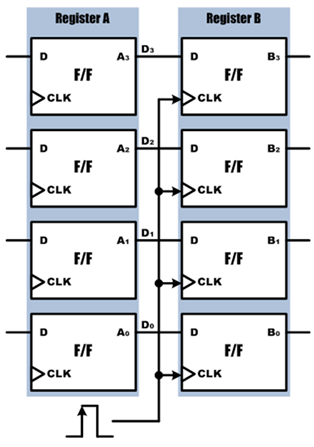
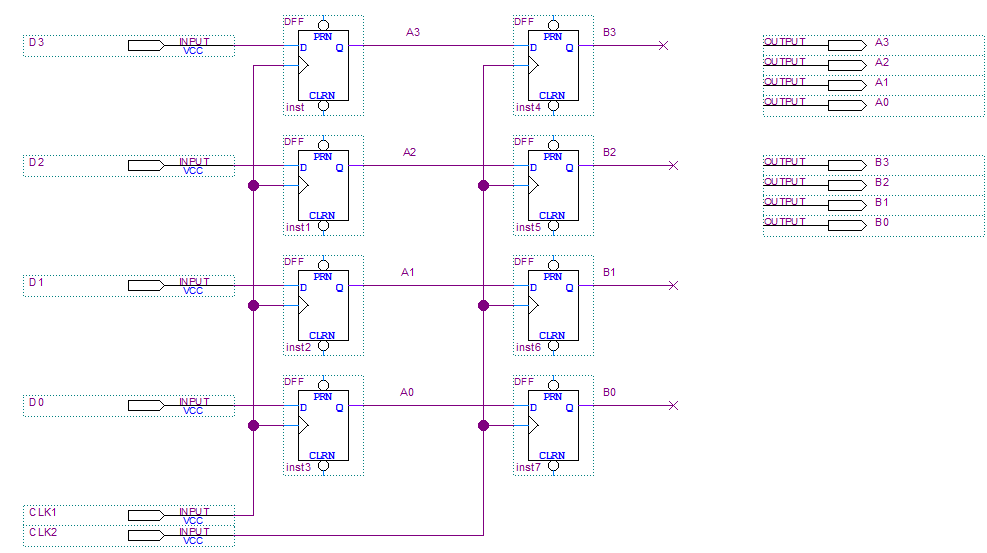
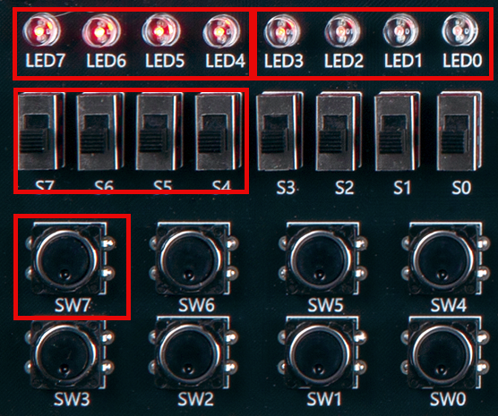
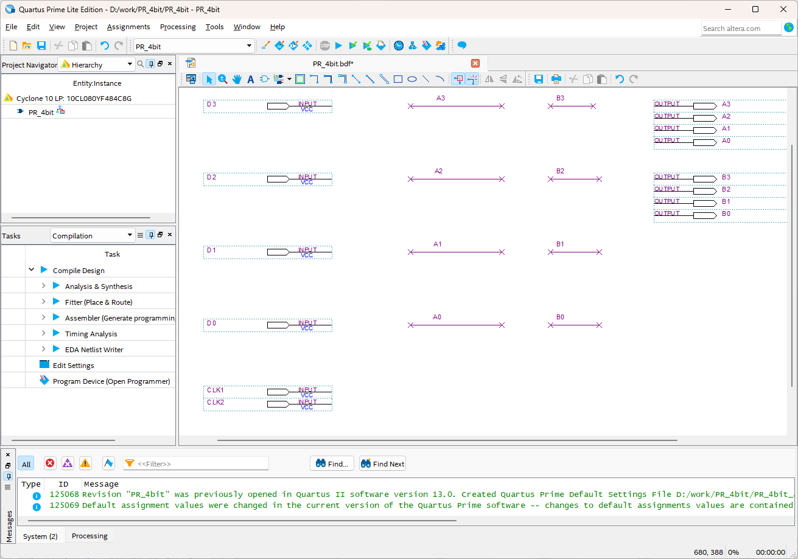
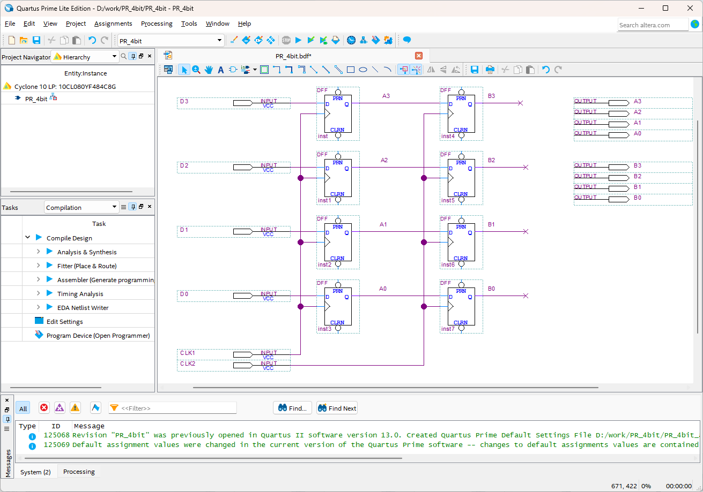
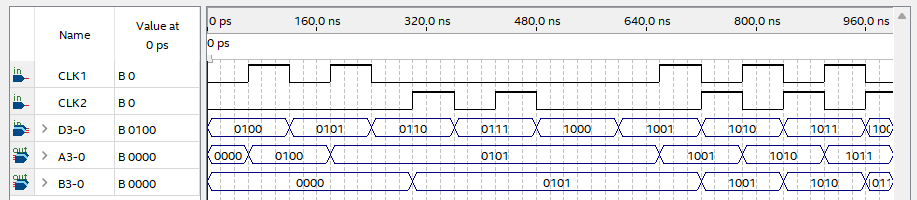

# Parallel Register
---

## Theory

Flip-flop is widely used to store data. Data refers to various types of data encoded in number or binary value.

These data are stored in a group of flip-flop, commonly called register and the operation to store data in the register is called data transfer.

The figure below shows how data transfers in D flip-flop with clock input.

 
 

Logic value stored in the previous flip-flop A is transferred to flip-flop B at the moment the logic value changes the clock from '0' to '1' (rising edge). After the clock is generated in this way, output of A and output of B become the same.

The figure below shows data being transferred from one register to another register.

 
 

Register A consists of four flip-flops, A3, A2, A1, A0. Register B consists of four flip-flops, B3, B2, B1, B0.

When the clock is applied, at the rising edge of the clock, the data of A3, A2, A1, A0 stored in register A are transferred to B3, B2, B1, B0 of register B, respectively.

This method of transmitting multiple data simultaneously is called parallel data transmission, and the method of transmitting the contents of register A to register B one bit at a time is called serial data transmission.

It is important to understand that parallel data transmission does not change the register contents on the transmitting side.

In the figure above, assuming that the contents of register A = 1101 and register B = 1010 before the clock is applied to register B, we can know that after the clock is applied, A = 1101 and B = 1101, which means that the values of the two registers, A, B are the same.

 

---
## **Practice Objective **

Let's design and experiment with the circuit below.

 

 

 

Devices connected to check in SACT equipment are as below.

|D3|D2|D1|D0|CLK1|CLK2|
|:---:|:---:|:---:|:---:|:---:|:---:|
|S7|S6|S5|S4|SW7|SW6|

 

|A3|A2|A1|A0|B3|B2|B1|B0|
|:---:|:---:|:---:|:---:|:---:|:---:|:---:|:---:|
|LED7|LED6|LED5|LED4|LED3|LED2|LED1|LED0|

 

 

### **Design**

1. Prepare project file  <a href="./pds/PR_4BIT.zip" download>PR_4BIT.zip</a> for the experiment.  
 

2. Move the project compressed file downloaded to d:＼work and unzip it.

3. Run Quartus II and select File > Open Project.

4. Go to d:＼work＼PR_4BIT folder, where the files are unzipped, and open PR_4BIT project.

5. Select File > Open to import PR_4BIT.bdf file. Or double-click PR_4BIT on the left side of the project.

6. Unfinished drawing is shown. Let's complete it with the drawing described before.  

 

 

7. Complete the circuit by importing “dff” symbol and connecting it with wire.

 

 

### **Compile**

8. Select File > Save and save, and select Processing > Start Compilation to compile.

    Compilation is process to verify that there are no errors in the designed logic circuit and create programming file and simulation file.

  

### **Simulation**

9. Select File > Open, and change File Type to All Files (.) in Open File window in the lower right corner, then select Waveform.vwf file.

10. In Waveform window, select Simulation > Run Functional Simulation to run it.

 

 
 

### **Check Hardware Operation**

11. Prepare SACT equipment. Connect USB cable and power cable and press the power switch to supply power to the device.

12. In Quartus software, select Tool > Programmer.

13. Check that USB Blaster is connected in Hardware Setup on Programmer window. Press Start button to program to check the operation on the device.

14. Operate the button switch and check output result on LED.

Devices connected to check in SACT equipment are as below.
 

|D3|D2|D1|D0|CLK1|CLK2|
|:---:|:---:|:---:|:---:|:---:|:---:|
|S7|S6|S5|S4|SW7|SW6|

 

|A3|A2|A1|A0|B3|B2|B1|B0|
|:---:|:---:|:---:|:---:|:---:|:---:|:---:|:---:|
|LED7|LED6|LED5|LED4|LED3|LED2|LED1|LED0|

 

 