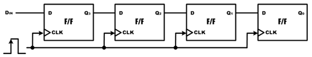
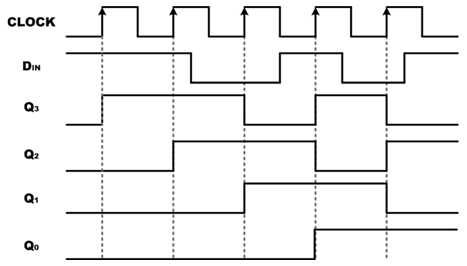
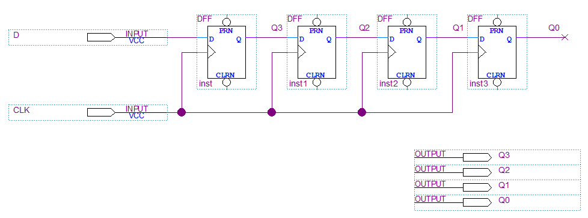
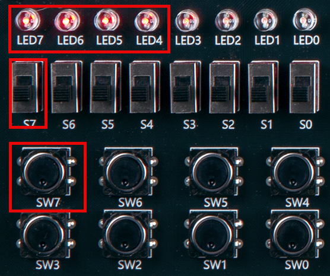
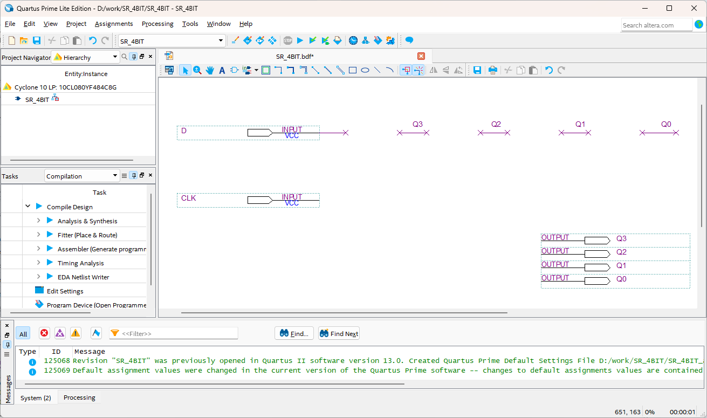
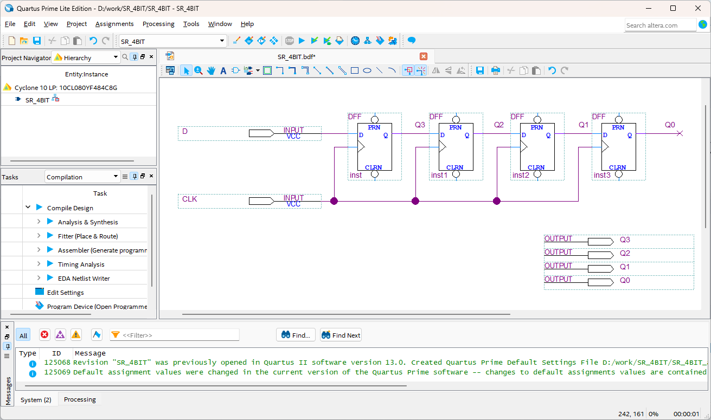
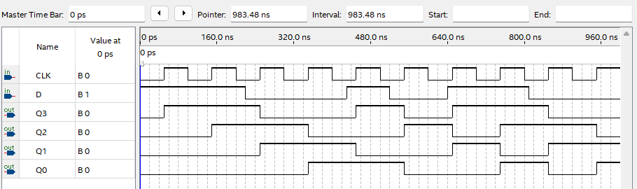

# Shift Register
---

## Theory

Shift register is a set of flip-flops configured to shift a binary number stored in the flip-flop from one flip-flop to another flip-flop on each clock.

Number on the screen moves on one side each time pressing a new number button on calculator or other electronic device. This occurs in a shift register.

The figure below shows the configuration of 4-bit shift register and its operation.

 
 

The waveform above shows how input data moves from the left flip-flop to the right flip-flop when a clock is generated.   

Note that whenever a clock generates, the output of each flip-flop gets its data from the output of the flip-flop on the left just before the clock generates.

The figure below shows that the data is transferred from one register to another register.

 
 

4-bit shift register above is a logic circuit that transmits 1-bit data and it can be called as serial data transmission.

 

---
## **Practice Objective **

Let's design and experiment with the circuit below.

 

 

 

Devices connected to check in SACT equipment are as below.

|S|CLK|Q3|Q2|Q1|Q0|
|:---:|:---:|:---:|:---:|:---:|:---:|
|S7|SW7|LED7|LED6|LED5|LED4|

 

 

### **Design**

1. Prepare project file <a href="./pds/SR_4BIT.zip" download>SR_4BIT.zip</a> for the experiment.  
 

2. Move the project compressed file downloaded to d:＼work and unzip it.

3. Run Quartus II and select File > Open Project.

4. Go to d:＼work＼SR_4BIT folder, where the files are unzipped, and open SR_4BIT project.

5. Select File > Open to import SR_4BIT.bdf file. Or double-click SR_4BIT on the left side of the project.

6. Unfinished drawing is shown. Let's complete it with the drawing described before.  
 

 

 

7. Complete the circuit by importing “dff” symbol and connecting it with wire.

 

 

### **Compile**

8. Select File > Save and save, and select Processing > Start Compilation to compile.

    Compilation is process to verify that there are no errors in the designed logic circuit and create programming file and simulation file.

  

### **Simulation**

9. Select File > Open, and change File Type to All Files (.) in Open File window in the lower right corner, then select Waveform.vwf file.

10. In Waveform window, select Simulation > Run Functional Simulation to run it.

 

 
 

### **Check Hardware Operation**

11. Prepare SACT equipment. Connect USB cable and power cable and press the power switch to supply power to the device.

12. In Quartus software, select Tool > Programmer.

13. Check that USB Blaster is connected in Hardware Setup on Programmer window. Press Start button to program to check the operation on the device.

14. Operate the button switch and check output result on LED.

Devices connected to check in SACT equipment are as below.

|S|CLK|Q3|Q2|Q1|Q0|
|:---:|:---:|:---:|:---:|:---:|:---:|
|S7|SW7|LED7|LED6|LED5|LED4|

 

 