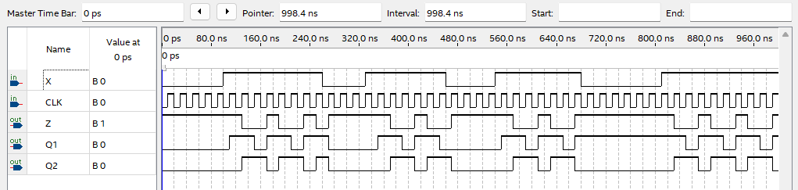

# Finite State Machine - MOORE
---

## 이론

FSM  : Finite State Machine은 순차 회로를 추상적인 상태로 표현하는 모델이다. 
   
조합 회로에서의 출력은 회로의 현재 입력에만 의존한다. 

순차 회로의 경우에는 출력은 현재 입력에 따라 달라질 뿐만 아니라 메모리 요소의 현재 상태에 따라서도 달라진다. 

여기에서 메모리 요소는 본질적으로 플립플롭의 그룹이다. 즉, 순차회로의 출력이 플립플롭의 현재 상태와 회로의 현재 입력에 따라 달라진다. 

그래서 조합회로에서 보면, 주어진 입력 값에 대해 매번 같은 출력을 얻는다. 하지만, 순차 회로에서는 주어진 입력 값에 대해서 동일한 출력을 얻지 못할 수도 있다. 순차 회로에서는 출력이 메모리 소자의 현재 상태에서 따라서도 달라지기 때문이다. 

따라서 유한 상태 머신은 순차 회로를 설명하기 위한 추상적인 모델이다. 

## Mealy Machine

Mealy Machine에서의 출력은 현재의 입력과 내부 메모리 요소의 현재 상태에 따른 함수이다. 

왼쪽의 조합 블록이 메모리 요소에 대한 입력을 생성한다. 

가운데 State Register 블록에서 클럭 에지의 입력에 따라 메모리 요소의 상태가 변경된다. 

따라서 왼쪽의 조합 블록은 메모리 요소의 다음 상태를 결정한다. 

이 조합 블록의 입력은 외부 입력과 메모리 요소의 현재 상태이다. 

그리고, 메모리 소자의 현재 출력은 출력 조합 회로로 전달된다. 따라서 오른쪽의 출력 조합 회로가 전체 회로의 출력을 생성한다. 

이 오른쪽 출력 조합 회로의 입력은 현재 입력 뿐만 아니라 메모리 요소의 현재 상태의 함수이다. 

 

이 Mealy Machine은 다음 블록도와 같이 시스템이 구성된다. 

 

 

## Moore Machine

Moore Machiine과  Mealy Machine의 차이는  외부의 입력이 출력 블록에 연결되지 않았다는 것이다. 

Moore 유형의 유ㅜ한 상태 머신에서는 출력이 메모리 요소의 현재 상태에 대한 함수일 뿐이다. 

 

---

## **실습 목표 **

다음의 회로를 설계하여 실험해 보자.

  

이 회로를 상태도로 나타내면 다음과 같다. 

  

이 스테이트 머신에 대한 상태 변이를 표로 나타내면 다음과 같다. 

|X||(PRESENT)Q1 Q2||(NEXT) Q1 Q2 |
|:-:|:-:|:-:|:-:|:-:|
|0||0 0||0 0|
|0||0 1||0 0|
|0||1 0||1 0|
|0||1 1||0 0|
|1||0 0||1 0|
|1||0 1||1 0|
|1||1 0||1 1|
|1||1 1||0 1|

각 상태에 대한 출력을 표로 나타내면 다음과 같다. 

|Q1 Q2||Z|
|:-:|:-:|:-:|
| 0 0 ||1|
| 0 1 ||0|
| 1 0 ||1|
| 1 1 ||0|

 

SACT 장비에서 확인하기 위하여 연결된 장치는 다음과 같다. 

|X|CLK|Q1|Q2|Z|
|:---:|:---:|:-:|:-:|:-:|
|S7|SW7|LED7|LED6|LED5|

 

 

### **설계**

1. 실험을 위해 프로젝트 파일 <a href="./pds/MOORE.zip" download>MOORE.zip</a>을 준비한다. 
 

2. 다운로드된 프로젝트의 압축 파일을 d:\work 이동시킨 후, 압축을 푼다.

3. Quartus II를 실행키고, File> Open Project 메뉴를 선택한다. 

 

4. 위에서 압축을 푼 위치인, d:\work\MOORE 폴더로 이동 후,MOORE 프로젝트를 OPEN한다. 

 

5. File > Open 메뉴를 선택하여 MOORE.bdf 파일을 불러오거나, 프로젝트 왼쪽의 MOORE 부분을 마우스로 더블 클릭한다. 

 

6. 아래 그림과 같이 미완성된 도면이 보이는데, 실습 목표에서 설명한 도면으로 완성시키자. 

 

 

7. dff 심볼과 and2 심볼, or2 심볼, not 심볼을 불러오고, wire로 심볼을 연결시켜 회로를 완성시킨다.  

 

 

### **컴파일**

8. File > Save 메뉴를 선택하여 저장하고, Processing > Start Compilation 메뉴를 선택하여 컴파일을 진행한다. 

이 컴파일 과정은 설계한 논리 회로에 오류가 없는 지를 검증하고, 프로그래밍 파일과 시뮬레이션 파일을 만드는 과정이다. 

  

### **시뮬레이션**

9. 컴파일 완료 후, File > Open 메뉴를 선택하고, 나타나는 Open File 창에서 오른쪽 아래 부분의 File Type을 All File(*.*)로 변경한 후, Waveform.vwf 파일을 선택한다. 

10. 아래 그림과 같이 Waveform 창에서, Simulation > Run Functiona Simulation 메뉴를 선택하여 Functional Simulation을 진행하여, 결과를 확인한다. 

X 데이터에 대한 현재 State와 Next State의 변화를 자세히 확인하기 바란다. 

 

 
 

### **하드웨어 동작 확인**

11. SACT 장비를 준비한다. USB 케이블과 파워 케이블을 연결하고, 전원 스위치를 눌러 장비에 전원을 인가시킨다. 

12. Quartus 소프트웨어에서 Tool > Programmer 메뉴를 선택한다.

13. Programmer창의 Hardware Setup이 USB Blaster가 연결되어 있는지 확인하고, Start 버튼을 눌러 프로그래밍 하고 장비에서 동작을 확인한다. 

 

14. 버튼 스위치와 슬라이드 스위치를 동작시키고, LED에서 결과를 확인해 보자. 

|X|CLK|Q1|Q2|Z|
|:---:|:---:|:-:|:-:|:-:|
|S7|SW7|LED7|LED6|LED5|

 

 