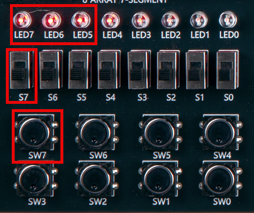
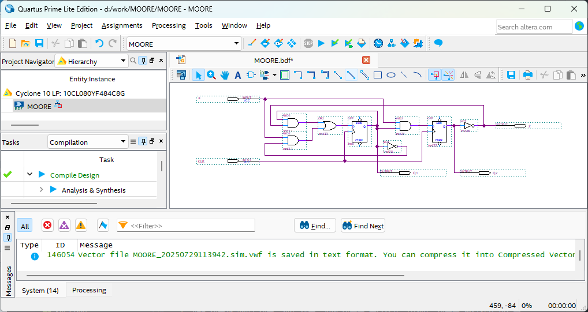

# Finite State Machine - MOORE
---

## Theory

FSM(Finite State Machine) is a model that expresses a sequential circuit as an abstract state.

The output in a combinational circuit depends only on the current input to the circuit. 

In sequential circuit, the output depends not only on the current input, but also on the current state of the memory element. Memory element is essentially a group of flip-flop, meaning that the output of sequential circuit depends on the current state of the flip-flop and the current input to the circuit.

In combinational circuit, output is same for each given input value. However, in a sequential circuit, output may not be same for each given input value. This is because the output in a sequential circuit also depends on the current state of the memory element.

Therefore, finite state machine is an abstract model for describing sequential circuit.

## Mealy Machine

Output from Mealy Machine is a function of the current input and the current state of the internal memory element.
The combination block on the left generates input for memory element.

In State Register block on the center, the state of the memory element changes according to the input of the clock edge. Therefore, the combination block on the left determines the next state of the memory element.

Inputs to combination block are external input and the current state of the memory element. Current output of the memory element is transmitted to the output combination circuit. Therefore, the output combination circuit on the right generates the output of the entire circuit.

Input to the output combination circuit on the right is a function for current input of memory element as well as the current state.

Mealy Machine system is configured as shown below block diagram.

 

 

## Moore Machine

The difference between Moore Machine and Mealy Machine is that the external input is not connected to the output block in Moore Machine.

In Moore-type finite state machine, output is simply a function for the current state of the memory element.

 

---

## **Practice Objective **

Let's design and experiment with the circuit below.

  

State diagram for this circuit is as below.

  

State transition for this State Machine is as below.

|X||(PRESENT)Q1 Q2||(NEXT) Q1 Q2 |
|:-:|:-:|:-:|:-:|:-:|
|0||0 0||0 0|
|0||0 1||0 0|
|0||1 0||1 0|
|0||1 1||0 0|
|1||0 0||1 0|
|1||0 1||1 0|
|1||1 0||1 1|
|1||1 1||0 1|

Output for each state is as below.

|Q1 Q2||Z|
|:-:|:-:|:-:|
| 0 0 ||1|
| 0 1 ||0|
| 1 0 ||1|
| 1 1 ||0|

 
Output for each state is as below.

|X|CLK|Q1|Q2|Z|
|:---:|:---:|:-:|:-:|:-:|
|S7|SW7|LED7|LED6|LED5|

 

 

### **Design**

1. Prepare project file <a href="./pds/MOORE.zip" download>MOORE.zip</a> for the experiment.  
 

2. Move the project compressed file downloaded to d:＼work and unzip it.

3. Run Quartus II and select File > Open Project.

4. Go to d:＼work＼MOORE folder, where the files are unzipped, and open MOORE project.

5. Select File > Open to import MOORE.bdf file. Or double-click MOORE on the left side of the project.

6. Unfinished drawing is shown. Let's complete it with the drawing described before.  
 

 

 

7. Complete the circuit by importing “dff” symbol, “and2” symbol, “or2” symbol, “not” symbol and connecting them with wire.

 

 

### **Compile**

8. Select File > Save and save, and select Processing > Start Compilation to compile.

    Compilation is process to verify that there are no errors in the designed logic circuit and create programming file and simulation file.

  

### **Simulation**

9. Select File > Open, and change File Type to All Files (.) in Open File window in the lower right corner, then select Waveform.vwf file.

10. In Waveform window, select Simulation > Run Functional Simulation to run it.

Check the changes between the Current State and Next State for X data.

 

 
 

### **Check Hardware Operation**
11. Prepare SACT equipment. Connect USB cable and power cable and press the power switch to supply power to the device.

12. In Quartus software, select Tool > Programmer.

13. Check that USB Blaster is connected in Hardware Setup on Programmer window. Press Start button to program to check the operation on the device.

14. Operate button switch, slide switch and check output result on LED.

|X|CLK|Q1|Q2|Z|
|:---:|:---:|:-:|:-:|:-:|
|S7|SW7|LED7|LED6|LED5|

 

 