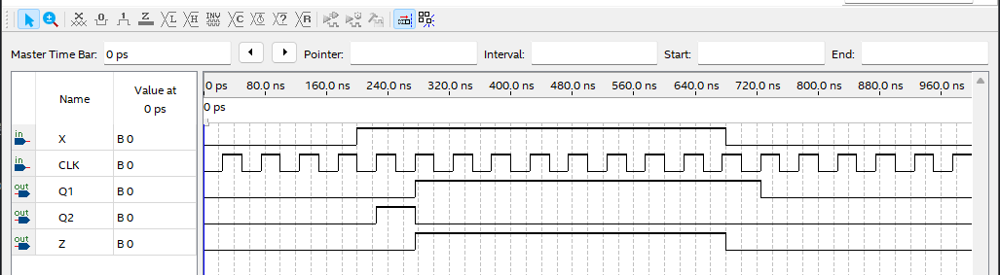

# Finite State Machine - MEALY
---

## Mealy Machine

Mealy Machine system is configured as shown in the block diagram below.

 

Difference between Moore Machine and Mealy Machine is that the external input is not connected to the output block in Mealy Machine. 

---

## **Practice Objective **

Let's design and experiment with the circuit below.

  

State diagram for this circuit is as below.

  

State transition for this State Machine is as below.

|X||(PRESENT)Q1 Q2||(NEXT) Q1 Q2 |
|:-:|:-:|:-:|:-:|:-:|
|0||0 0||0 0|
|0||0 1||0 0|
|0||1 0||0 0|
|0||1 1||0 0|
|1||0 0||0 1|
|1||0 1||1 0|
|1||1 0||1 0|
|1||1 1||1 0|

Output for each state is as below.

|X|Q1 Q2||Z|
|:-:|:-:|:-:|:-:|
|0| 0 0 ||0|
|0| 0 1 ||0|
|0| 1 0 ||0|
|0| 1 1 ||0|
|1| 0 0 ||0|
|1| 0 1 ||0|
|1| 1 0 ||1|
|1| 1 1 ||1|

 

Devices connected to check in SACT equipment are as below.

|X|CLK|Q1|Q2|Z|
|:---:|:---:|:-:|:-:|:-:|
|S7|SW7|LED7|LED6|LED5|

 

 

### **Design**

1. Prepare project file <a href="./pds/MEALY.zip" download>MEALY.zip</a>for the experiment.  
 

2. Move the project compressed file downloaded to d:＼work and unzip it.

3. Run Quartus II and select File > Open Project.

4. Go to d:＼work＼MEALY folder, where the files are unzipped, and open MEALY project.

5. Select File > Open to import MEALY.bdf file. Or double-click MEALY on the left side of the project.

6. Unfinished drawing is shown. Let's complete it with the drawing described before. 

 

 

7. Complete the circuit by importing “dff” symbol, “and2” symbol, “or2” symbol, “not” symbol and connecting them with wire.

 

 

### **Compile**

8. Select File > Save and save, and select Processing > Start Compilation to compile.

    Compilation is process to verify that there are no errors in the designed logic circuit and create programming file and simulation file.

  

### **Simulation**

9. Select File > Open, and change File Type to All Files (.) in Open File window in the lower right corner, then select Waveform.vwf file.

10. In Waveform window, select Simulation > Run Functional Simulation to run it.

Check the changes between Current State and Next State for X data.

 

 
 

### **Check Hardware Operation**

11. Prepare SACT equipment. Connect USB cable and power cable and press the power switch to supply power to the device.

12. In Quartus software, select Tool > Programmer.

13. Check that USB Blaster is connected in Hardware Setup on Programmer window. Press Start button to program to check the operation on the device.

14. Operate button switch, slide switch and check output result on LED.

|X|CLK|Q1|Q2|Z|
|:---:|:---:|:-:|:-:|:-:|
|S7|SW7|LED7|LED6|LED5|

 

 