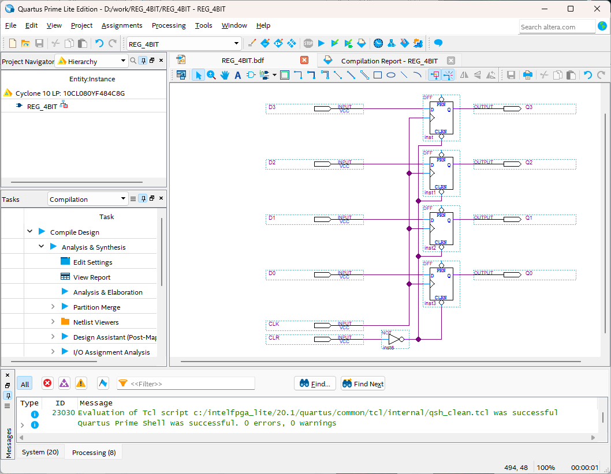

# PIPO(Parallel In Parallel Out)
---

## Theory

A collection of flip-flops that can store multiple bits of data simultaneously and directly use all stored binary data is called Parallel-Input/Parallel-Output register.

The figure below is a block diagram of 4-bit parallel input/parallel output register.

 
 

It receives 4-bit data input and data input of D is output to Q only when it is the rising edge of clock.

CLR is an input terminal to initialize data. When Low data is input, the value of Q is initialized to 0000.

The table below shows the operation.

|CLR|CLK||Q|
|:-:|:-:|-|:-:|
|1|X||0000 (초기화)|
|0|clock||D|

 

---
## **Practice Objectives **

Let's design and experiment with the circuit below.

 

 

 

Devices connected to check in SACT equipment are as below.

|CLR|CLK|D3|D2|D1|D0|Q3|Q2|Q1|Q0|
|:---:|:---:|:---:|:---:|:---:|:---:|:---:|:---:|:---:|:---:|
|SW7|SW6|S7|S6|S5|S4|LED7|LED6|LED5|LED4|

 

 

### **Design**

1. Prepare project file <a href="./pds/REG_4BIT.zip" download>REG_4BIT.zip</a> for the experiment.
 

2. Move the project compressed file downloaded to d:＼work and unzip it.

3. Run Quartus II and select File > Open Project.

4. Go to d:＼work＼REG_4BIT folder, where the files are unzipped, and open REG_4BIT project.

5. Select File > Open to import REG_4BIT.bdf file. Or double-click REG_4BIT on the left side of the project.

6. Unfinished drawing is shown. Let's complete it with the drawing described before.

 

 

7. Complete the circuit by importing “dff” symbol and connecting it with wire.

 

 

### **Compile**

8. Select File > Save and save, and select Processing > Start Compilation to compile.

    Compilation is process to verify that there are no errors in the designed logic circuit and create programming file and simulation file.

  

### **Simulation**

9. Select File > Open, and change File Type to All Files (.) in Open File window in the lower right corner, then select Waveform.vwf file.

10. In Waveform window, select Simulation > Run Functional Simulation to run it.

 

 
 

### **Check Hardware Operation**

11. Prepare SACT equipment. Connect USB cable and power cable and press the power switch to supply power to the device.

12. In Quartus software, select Tool > Programmer.

13. Check that USB Blaster is connected in Hardware Setup on Programmer window. Press Start button to program to check the operation on the device.

14. Operate button switch, slide switch and check output result on LED.

|CLR|CLK|D3|D2|D1|D0|Q3|Q2|Q1|Q0|
|:---:|:---:|:---:|:---:|:---:|:---:|:---:|:---:|:---:|:---:|
|SW7|SW6|S7|S6|S5|S4|LED7|LED6|LED5|LED4|

 

 

 