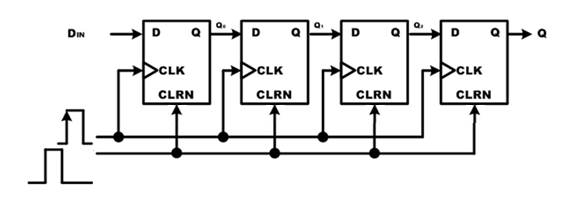
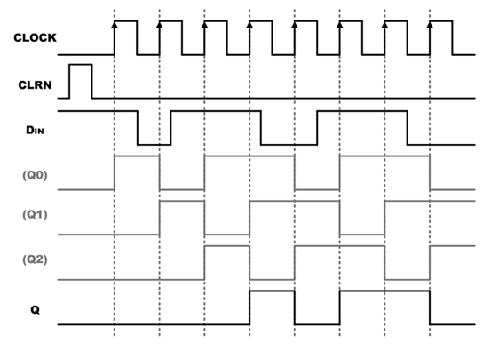
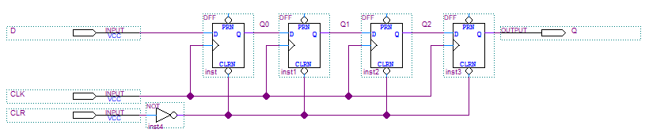
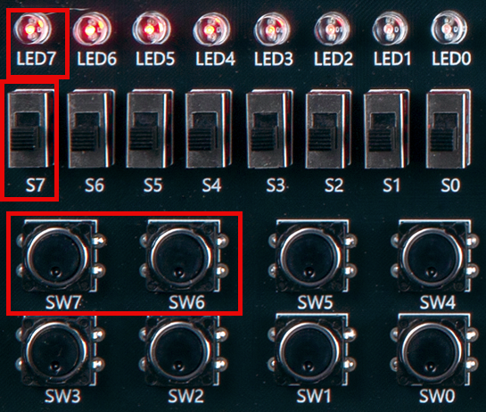
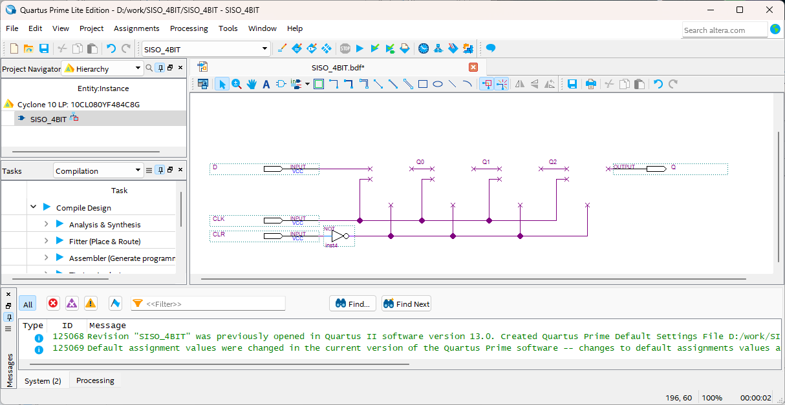
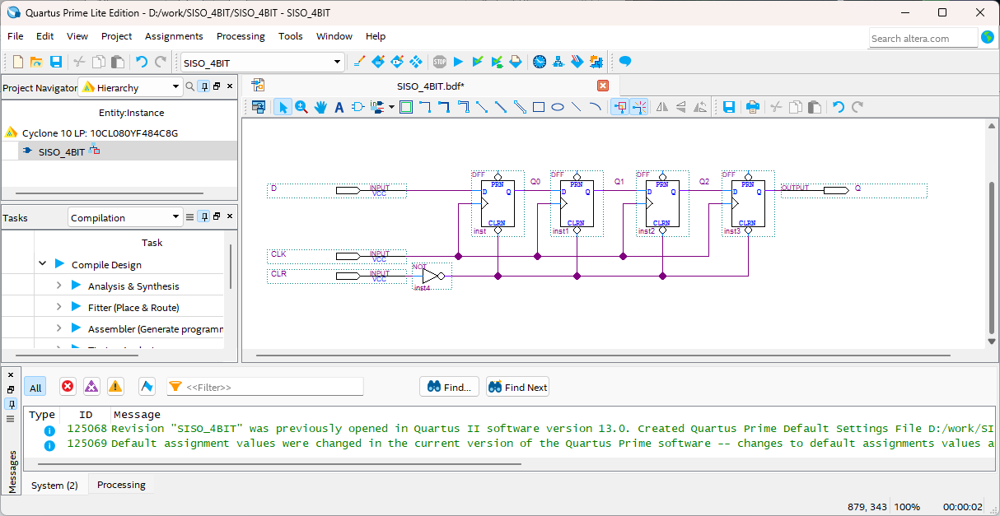
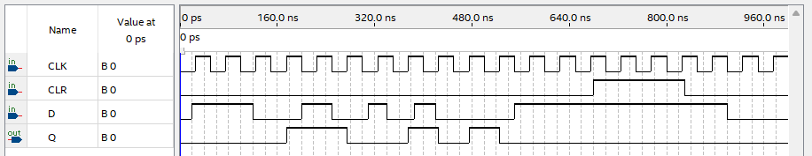

# SISO (Serial In Serial Out)
---

## 이론

직렬입력/직렬출력 레지스터는 한 번에 한 비트씩 데이터가 저장된다는 점의 차이를 제외하고, 병렬입력/병렬출력 레지스터와 구조가 거의 같다. 

직렬입력/직렬출력 레지스터는 매 클럭이 발생할 때마다 데이터는 한 비트씩 플립플롭들을 통과하여 레지스터의 다른 쪽 끝으로 이동한다. 

계속 클럭이 발생하면, 데이터는 처음 저장되는 순서대로 한 번에 한 비트씩 레지스터를 빠져나간다. 

 

다음은 4비트 직렬입력/직렬출력 레지스터의 블록도와 이것을 논리 회로로 구현한 것이다. 

 

DIN에서 입력된 데이터가 클럭의 Rising Edge에서 첫 번째 플립플롭의 출력 Q0으로 출력되어 다음 플립플롭의 입력에 연결된다. 

이 데이터는 클럭의 다음 Rising Edge에서 두 번째 플립플롭의 출력 Q1에 출력된다. 

같은 방법으로 클럭의 Rising Edge에 반응하여 데이터가 전달되며 위의 회로에서는 총 4번의 클럭이 발생한 후에 DIN의 데이터가 Q로 출력 된다. 

CLRN의 신호는 이 값이 0일 때, 모든 레지스터 (플립플롭)의 값이 0으로 초기화 하는 역할을 한다.

 

다음 그림은 4비트 직렬입력/직렬출력 레지스터에 임의의 데이터와 클럭을 인가하였을 때의 동작을 나타낸다. 

 
 

CLRN이 0의 데이터를 갖고 있을 때 모든 레지스터는 초기화가 되고, CLRN이 1일 때 클럭이 발생하면 DIN으로 들어온 데이터가 내부 레지스터에 하나씩 저장이 되어 4번째 클럭에서 외부로 출력되는 것을 확인할 수 있다. 

다음 파형에서 (Q0), (Q1), (Q2)의 파형은 논리 회로 내부에서 동작의 이해를 돕고자 같이 그려놓았다. 

4비트 직렬입력/직렬출력 레지스터의 DIN 입력에 대한 실제 출력 파형은 Q이다. 

4비트 데이터의 입력을 받으며 클럭의 Rising Edge일 때만, D의 데이터 입력이 Q로 출력이 된다. 

CLR은 데이터를 초기화 시키기 위한 입력 단자로 Low의 데이터가 들어왔을 때, Q의 값이 0000으로 초기화 된다.

 

---
## **실습 목표 **

다음의 회로를 설계하여 실험해 보자.

 

 

SACT 장비에서 확인하기 위하여 연결된 장치는 다음과 같다. 

|CLR|CLK|DIN|Q|
|:---:|:---:|:---:|:---:|
|SW7|SW6|S7|LED7|

 

 

### **설계**

1. 실험을 위해 프로젝트 파일 <a href="./pds/SISO_4BIT.zip" download>SISO_4BIT.zip</a>을 준비한다. 
 

2. 다운로드된 프로젝트의 압축 파일을 d:\work 이동시킨 후, 압축을 푼다.

3. Quartus II를 실행키고, File> Open Project 메뉴를 선택한다. 

 

4. 위에서 압축을 푼 위치인, d:\work\SISO_4BIT 폴더로 이동 후,SISO_4BIT 프로젝트를 OPEN한다. 

 

5. File > Open 메뉴를 선택하여 SISO_4BIT.bdf 파일을 불러오거나, 프로젝트 왼쪽의 SISO_4BIT 부분을 마우스로 더블 클릭한다. 

 

6. 아래 그림과 같이 미완성된 도면이 보이는데, 실습 목표에서 설명한 도면으로 완성시키자. 

 

 

7. dff 심볼을 불러오고, wire로 심볼을 연결시켜 회로를 완성시킨다.  

 

 

### **컴파일**

8. File > Save 메뉴를 선택하여 저장하고, Processing > Start Compilation 메뉴를 선택하여 컴파일을 진행한다. 

이 컴파일 과정은 설계한 논리 회로에 오류가 없는 지를 검증하고, 프로그래밍 파일과 시뮬레이션 파일을 만드는 과정이다. 

  

### **시뮬레이션**

9. 컴파일 완료 후, File > Open 메뉴를 선택하고, 나타나는 Open File 창에서 오른쪽 아래 부분의 File Type을 All File(*.*)로 변경한 후, Waveform.vwf 파일을 선택한다. 

10. 아래 그림과 같이 Waveform 창에서, Simulation > Run Functiona Simulation 메뉴를 선택하여 Functional Simulation을 진행하여, 결과를 확인한다. 

 

 
 

### **하드웨어 동작 확인**

11. SACT 장비를 준비한다. USB 케이블과 파워 케이블을 연결하고, 전원 스위치를 눌러 장비에 전원을 인가시킨다. 

12. Quartus 소프트웨어에서 Tool > Programmer 메뉴를 선택한다.

13. Programmer창의 Hardware Setup이 USB Blaster가 연결되어 있는지 확인하고, Start 버튼을 눌러 프로그래밍 하고 장비에서 동작을 확인한다. 

 

14. 버튼 스위치와 슬라이드 스위치를 동작시키고, LED에서 결과를 확인해 보자. 

|CLR|CLK|DIN|Q|
|:---:|:---:|:---:|:---:|
|SW7|SW6|S7|LED7|

 

 