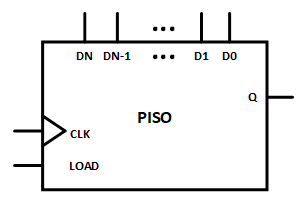
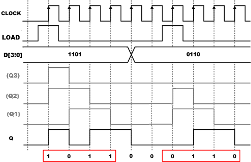
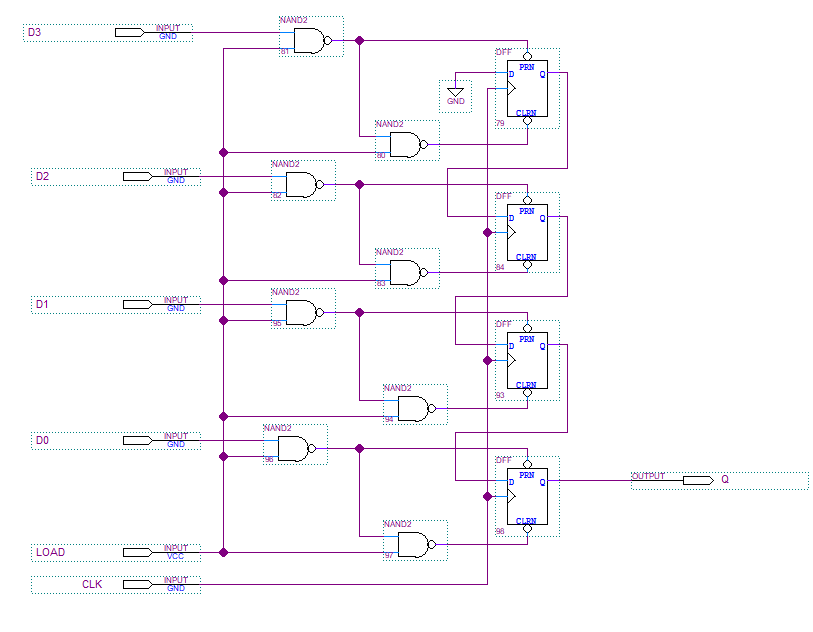
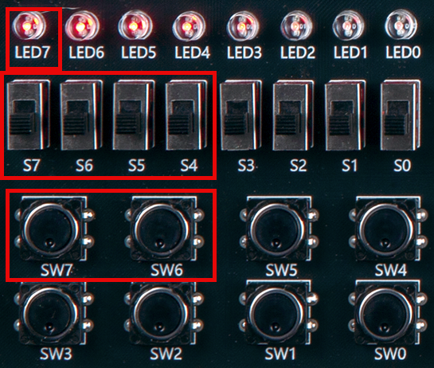
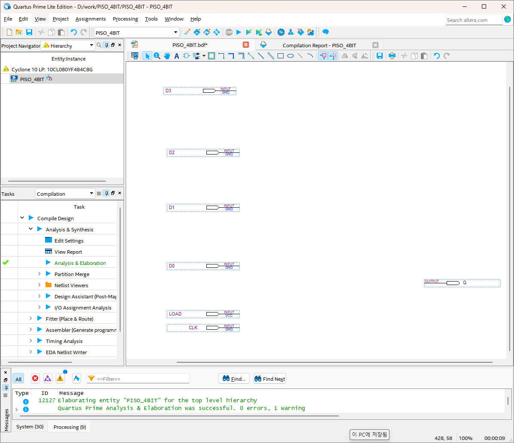
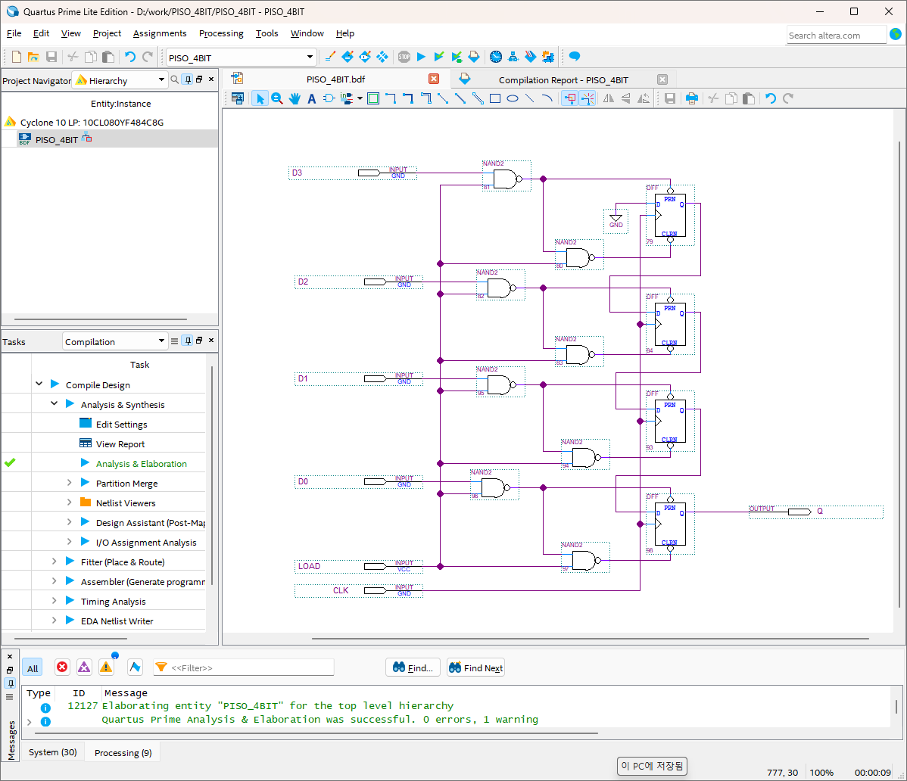
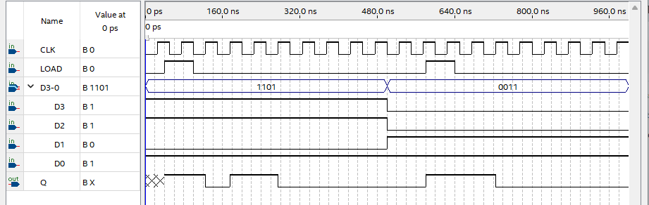

# PISO (Parallel In Serial Out)
---

## Theory

Parallel-input/Serial-output register receives N-bit parallel data input, converts the parallel data received over N clocks into serial data and outputs it.
This can be represented as block diagram as shown below.

 

 

The waveform below is the result of operating by applying arbitrary data into 4-bit parallel-input/serial-output register.

 

 

 

1. When LOAD signal is 1 and CLK is at the rising edge, the value is transferred. 

2. The value of D0 is output to Q.  

3. When LOAD signal is 0 and CLK is at the rising edge, the data is shifted and the input N-bit D data is output to Q in the order of the lower bit to the upper bit (D1, …, DN-1, DN).

 

Advantages of PISO register are as below.

- Efficient data transfer: PISO register help convert parallel data to serial, very suitable for serial communication system.

- Simplified circuit design: PISO register is serially connected, reducing the number of required data lines and simplifying circuit design.

- Flexibility: PISO register is generally flexible and also very suitable when the data width changes from one application to another application.   

- High-speed operation: Multiple bits are loaded at once and moved one at a time, enabling high-speed data transfer.

- Cost-effectiveness: PISO register can reduce the cost of implementation system since multiple communication lines are not required.

 

---
## **Practice Objectives **

Let's design and experiment with the circuit below.

 

 

Devices connected to check in SACT equipment are as below.

|LOAD|CLK|D3|D2|D1|D0|Q|
|:---:|:---:|:---:|:---:|:---:|:---:|:---:|
|SW7|SW6|S7|S6|S5|S4|LED7|

 

 

### **Design**

1. 1. Prepare project file <a href="./pds/PISO_4BIT.zip" download>PISO_4BIT.zip</a> for the experiment.
 

2. Move the project compressed file downloaded to d:＼work and unzip it.

3. Run Quartus II and select File > Open Project.

4. Go to d:＼work＼PISO_4BIT folder, where the files are unzipped, and open PISO_4BIT project.

5. Select File > Open to import PISO_4BIT.bdf file. Or double-click PISO_4BIT on the left side of the project.

6. Unfinished drawing is shown. Let's complete it with the drawing described before.  

 

 

7. Complete the circuit by importing “dff” symbol, “nand2” symbol and connecting them with wire. 

 

 

### **Compile**

8. Select File > Save and save, and select Processing > Start Compilation to compile.

    Compilation is process to verify that there are no errors in the designed logic circuit and create programming file and simulation file.

  

### **Simulation**

9. Select File > Open, and change File Type to All Files (.) in Open File window in the lower right corner, then select Waveform.vwf file.

10. In Waveform window, select Simulation > Run Functional Simulation to run it.

 

 
 

### **Check Hardware Operation**

11. Prepare SACT equipment. Connect USB cable and power cable and press the power switch to supply power to the device.

12. In Quartus software, select Tool > Programmer.

13. Check that USB Blaster is connected in Hardware Setup on Programmer window. Press Start button to program to check the operation on the device.

14. Operate button switch, slide switch and check output result on LED.

|LOAD|CLK|D3|D2|D1|D0|Q|
|:---:|:---:|:---:|:---:|:---:|:---:|:---:|
|SW7|SW6|S7|S6|S5|S4|LED7|

 

 