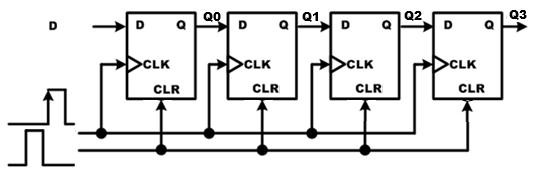
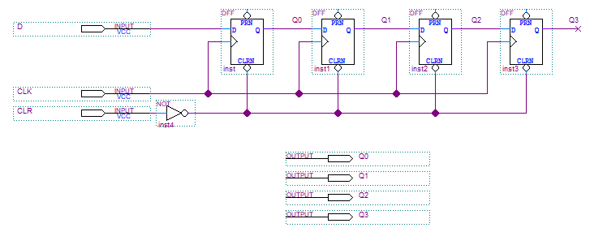
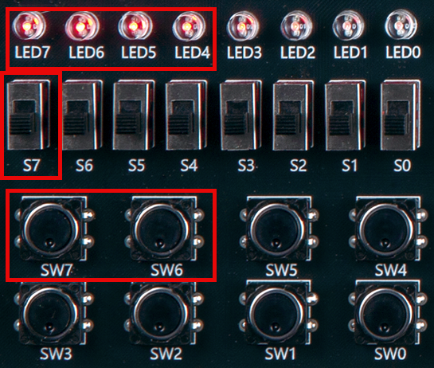
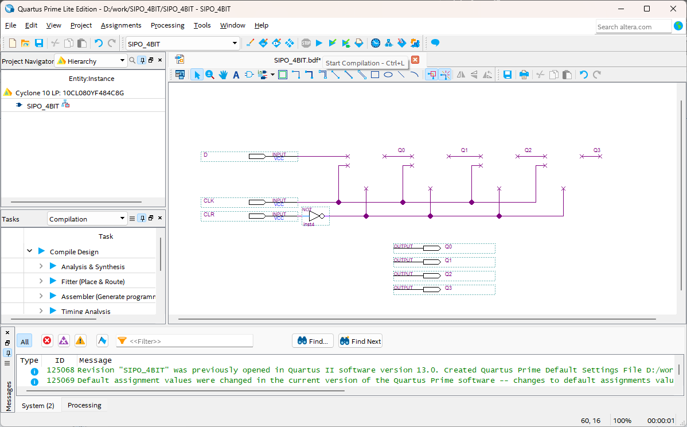
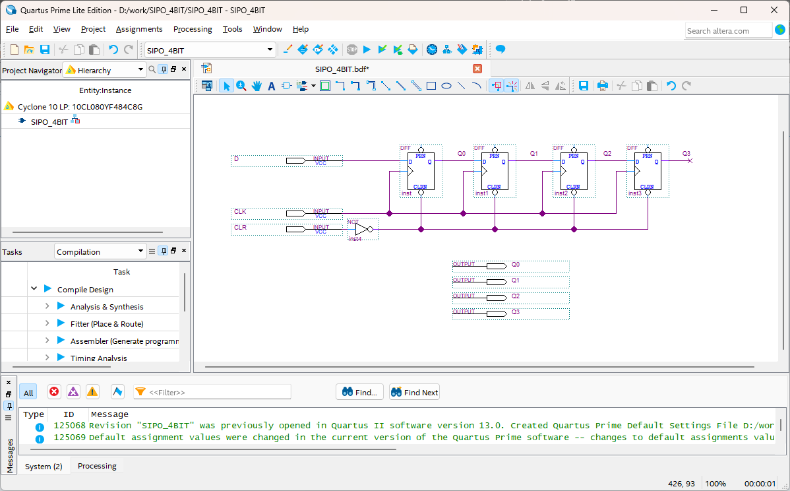
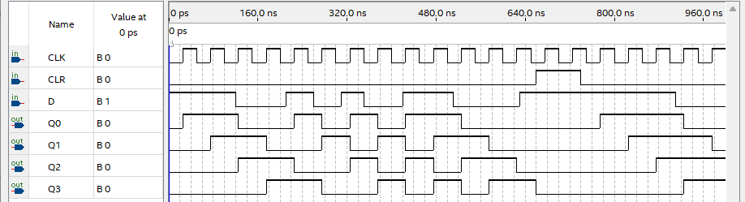

# SIPO (Serial In Parallel Out)
---

## 이론

직렬입력/병렬출력 레지스터는 위의 병렬입력/직렬출력 레지스터와는 정반대의 동작을 수행한다. 

즉 직렬 데이터의 입력을 받아 병렬의 데이터를 출력하는 기능을 한다. 

N비트의 직렬입력/병렬출력 레지스터는 N개의 클럭이 발생하는 데이터에 의해서 병렬데이터가 결정된다.

이것은 시프트 레지스터와 같은 동작을 한다. 

 

다음 그림은 4비트 직렬입력/병렬출력 레지스터이다. 

 

 

다음 표는 D의 입력을 설정하고, 클럭을 발생하였을 때의 그 출력 결과를 보여주고 있다. 

|CLR|CLK|D||Q0|Q1|Q2|Q3|
|:-:|:-:|:-:|:-:|:-:|:-:|:-:|:-:|
|1|X|X||0|0|0|0|
|0|clock|1||1|0|0|0|
|0|clock|1||1|1|0|0|
|0|clock|1||1|1|1|0|
|0|clock|1||1|1|1|1|
|0|clock|0||0|1|1|1|
|0|clock|0||0|0|1|1|

 

1. CLR의 입력이 1일 때 모든 레지스터의 값이 0으로 초기화 된다. 
    
    이 때에는 CLK와 D의 영향을 받지 않는다. 

2. CLR이 1이고, 클럭이 발생할 때마다 D의 값이 Q0로 넘겨지고, Q0의 값이 Q1으로 넘겨지는 방법으로 동작된다. 

    4번의 클럭이 발생하면 4비트의 데이터가 완성된다.

 

---
## **실습 목표 **

다음의 회로를 설계하여 실험해 보자.

 

 

SACT 장비에서 확인하기 위하여 연결된 장치는 다음과 같다. 

|CLR|CLK|D|Q3|Q2|Q1|Q0|
|:---:|:---:|:---:|:---:|:---:|:---:|:---:|
|SW7|SW6|S7|LED7|LED6|LED5|LED4|

 

 

### **설계**

1. 실험을 위해 프로젝트 파일 <a href="./pds/SIPO_4BIT.zip" download>SIPO_4BIT.zip</a>을 준비한다. 
 

2. 다운로드된 프로젝트의 압축 파일을 d:\work 이동시킨 후, 압축을 푼다.

3. Quartus II를 실행키고, File> Open Project 메뉴를 선택한다. 

 

4. 위에서 압축을 푼 위치인, d:\work\SIPO_4BIT 폴더로 이동 후,SIPO_4BIT 프로젝트를 OPEN한다. 

 

5. File > Open 메뉴를 선택하여 SIPO_4BIT.bdf 파일을 불러오거나, 프로젝트 왼쪽의 SIPO_4BIT 부분을 마우스로 더블 클릭한다. 

 

6. 아래 그림과 같이 미완성된 도면이 보이는데, 실습 목표에서 설명한 도면으로 완성시키자. 

 

 

7. dff 심볼을 불러오고, wire로 심볼을 연결시켜 회로를 완성시킨다.  

 

 

### **컴파일**

8. File > Save 메뉴를 선택하여 저장하고, Processing > Start Compilation 메뉴를 선택하여 컴파일을 진행한다. 

이 컴파일 과정은 설계한 논리 회로에 오류가 없는 지를 검증하고, 프로그래밍 파일과 시뮬레이션 파일을 만드는 과정이다. 

  

### **시뮬레이션**

9. 컴파일 완료 후, File > Open 메뉴를 선택하고, 나타나는 Open File 창에서 오른쪽 아래 부분의 File Type을 All File(*.*)로 변경한 후, Waveform.vwf 파일을 선택한다. 

10. 아래 그림과 같이 Waveform 창에서, Simulation > Run Functiona Simulation 메뉴를 선택하여 Functional Simulation을 진행하여, 결과를 확인한다. 

 

 
 

### **하드웨어 동작 확인**

11. SACT 장비를 준비한다. USB 케이블과 파워 케이블을 연결하고, 전원 스위치를 눌러 장비에 전원을 인가시킨다. 

12. Quartus 소프트웨어에서 Tool > Programmer 메뉴를 선택한다.

13. Programmer창의 Hardware Setup이 USB Blaster가 연결되어 있는지 확인하고, Start 버튼을 눌러 프로그래밍 하고 장비에서 동작을 확인한다. 

 

14. 버튼 스위치와 슬라이드 스위치를 동작시키고, LED에서 결과를 확인해 보자. 

SACT 장비에서 확인하기 위하여 연결된 장치는 다음과 같다. 

|CLR|CLK|D|Q3|Q2|Q1|Q0|
|:---:|:---:|:---:|:---:|:---:|:---:|:---:|
|SW7|SW6|S7|LED7|LED6|LED5|LED4|

 

 