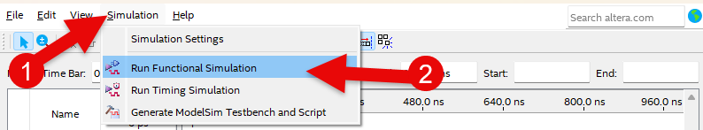

# SIPO (Serial In Parallel Out)
---

## Theory

Serial-input/Parallel-output register operates in the other way as Parallel-input/Serial-output register above. It receives serial data input and outputs parallel data.

For N-bit Serial-input/Parallel-output register, parallel data is determined by data generating N clocks. This operates like shift register.

The figure below shows 4-bit Serial-input/Parallel-output register.

 

 

Table below shows the output result when the input of D is set and the clock is generated.

|CLR|CLK|D||Q0|Q1|Q2|Q3|
|:-:|:-:|:-:|:-:|:-:|:-:|:-:|:-:|
|1|X|X||0|0|0|0|
|0|clock|1||1|0|0|0|
|0|clock|1||1|1|0|0|
|0|clock|1||1|1|1|0|
|0|clock|1||1|1|1|1|
|0|clock|0||0|1|1|1|
|0|clock|0||0|0|1|1|

 
1. When the input of CLR is 1, values of all registers are initialized to 0.
At this time, it is not affected by CLK and D.

2. Value of D is transmitted to Q0 when CLR is 1 and whenever clock generates and value of Q0 is transmitted to Q1.

When 4 clocks generate, 4 bits of data are completed.

 

---
## **Practice Objectives **

Let's design and experiment with the circuit below.

 

 

Devices connected to check in SACT equipment are as below.

|CLR|CLK|D|Q3|Q2|Q1|Q0|
|:---:|:---:|:---:|:---:|:---:|:---:|:---:|
|SW7|SW6|S7|LED7|LED6|LED5|LED4|

 

 

### **Design**

1. Prepare project file <a href="./pds/SIPO_4BIT.zip" download>SIPO_4BIT.zip</a> for the experiment.  
 

2. Move the project compressed file downloaded to d:＼work and unzip it.

3. Run Quartus II and select File > Open Project.

4. Go to d:＼work＼SIPO_4BIT folder, where the files are unzipped, and open SIPO_4BIT project.

5. Select File > Open to import SIPO_4BIT.bdf file. Or double-click SIPO_4BIT on the left side of the project.

6. Unfinished drawing is shown. Let's complete it with the drawing described before.  

 

 

7. Complete the circuit by importing “dff” symbol and connecting it with wire.

 

 

### **Compile**

8. Select File > Save and save, and select Processing > Start Compilation to compile.
    
    Compilation is process to verify that there are no errors in the designed logic circuit and create programming file and simulation file.
 

  

### **Simulation**

9. Select File > Open, and change File Type to All Files (.) in Open File window in the lower right corner, then select Waveform.vwf file.

10. In Waveform window, select Simulation > Run Functional Simulation to run it.

 

 
 

### **Check Hardware Operation**

11. Prepare SACT equipment. Connect USB cable and power cable and press the power switch to supply power to the device.

12. In Quartus software, select Tool > Programmer.

13. Check that USB Blaster is connected in Hardware Setup on Programmer window. Press Start button to program to check the operation on the device.

14. Operate button switch, slide switch and check output result on LED.

Devices connected to check in SACT equipment are as below.

|CLR|CLK|D|Q3|Q2|Q1|Q0|
|:---:|:---:|:---:|:---:|:---:|:---:|:---:|
|SW7|SW6|S7|LED7|LED6|LED5|LED4|

 

 