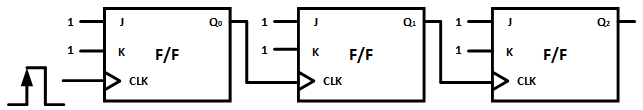
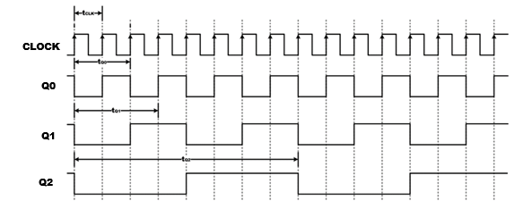
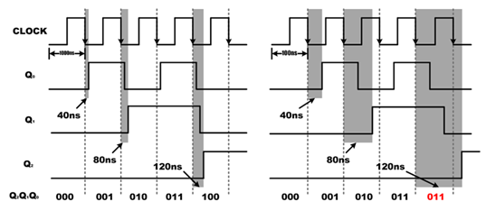
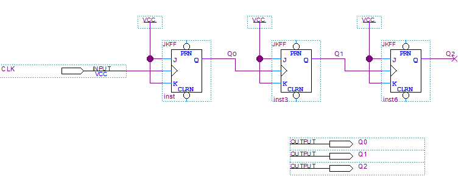
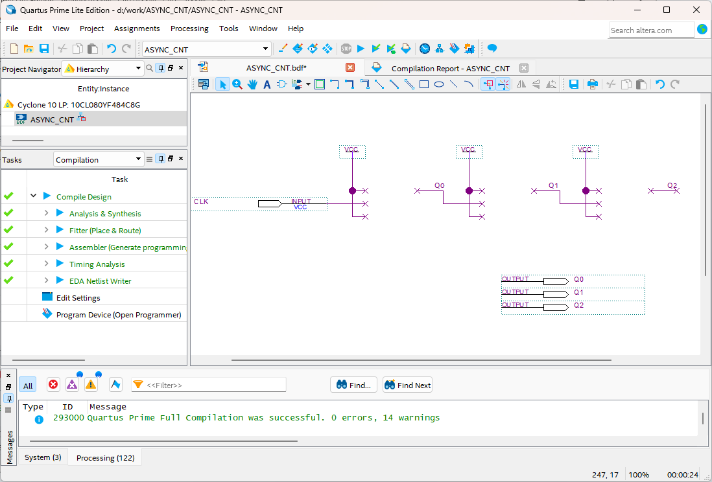
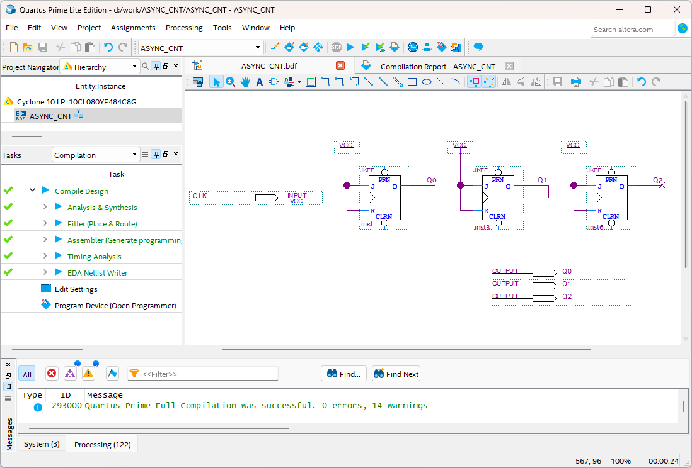
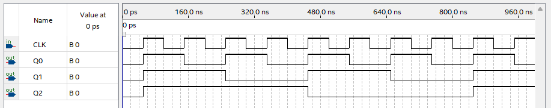

# COUNTER - Asynchronous Counter
---

- **Asynchronous Counter**

As explained above, when high value is connected to J and K in the JK flip-flop, the output state changes to the opposite of the currently output value whenever a clock is generated. 

By using this feature, the output result for the clock input has a frequency of one-half the clock.

The figure below shows the logic circuit for frequency division using JK flip-flop. 

Counter using three JK flip-flops is called 3-bit binary counter.

 

 

The circuit is configured so that the output result generated from Q0 flip-flop is connected to the clock input of Q1 flip-flop, and result of Q1 flip-flop is connected to clock input of Q2 flip-flop, making each is divided by 2.

Clock connected to Q0 flip-flop is an external input, and flip-flop used above operates at the rising edge of the clock.

The result of the above logic circuit is as follows.
 

 

When calling the external clock input cycle as tCLK, tQ0 which is the output result cycle of Q0 is twice the length of tCLK. This means that the frequency is 1/2.

Q1 and Q2 also have a waveform with half the frequency of the previous flip-flop. That is, if using N flip-flops, output frequency of the final flip-flop is equal to 1/2N of the input frequency.

This application of flip-flops is called frequency division.

Oscillators, device that generate frequency, have many output frequencies, but cannot meet the conditions of all users. Therefore, frequency for system to use can be generated using frequency division. 

The above logic circuit operates not only as frequency divider but also as binary counter.

The table below shows the above results. We can see that it consists of 3-bit binary counter that adds 1 whenever a clock generates.

 

|CLOCK||Q2|Q1|Q0||BCD|
|:-:|:-:|:-:|:-:|:-:|:-:|:-:|
|clock||0|0|0||0|
|clock||0|0|1||1|
|clock||0|1|0||2|
|clock||0|1|1||3|
|clock||1|0|0||4|
|clock||1|0|1||5|
|clock||1|1|0||6|
|clock||1|1|1||7|
|clock||0|0|0||0|
|clock||0|0|1||1|

 

- All J and K input terminals of 3 JK flip-flops are connected to high value.

- Clock input is connected only to CLK terminal of flip-flop Q0. Therefore, the result of Q0 is inverted at each falling edge of the clock.

- Output of flip-flop Q0 is connected to CLK terminal of flip-flop Q1. Therefore, whenever the output of Q0 changes from 1 to 0, output of flip-flop Q1 will be inverted. Similarly, whenever the value of Q1 changes from 1 to 0, output of flip-flop Q2 will be inverted.

- Assuming that Q2, Q1, Q0 of flip-flop represent binary number, the output waveform above represents continuous binary count values from 000 to 111 whenever a clock generates.

- If the value of this flip-flop is 111, and the clock is generated again, flip-flop Q0 changes from 1 to 0. This makes the value of flip-flop Q1 change from 1 to 0, and the value of Q2 also change from 1 to 0. In other words, the value of the counter changes from 111 to 000. When the clock is generated again, the counter will start a new count.

 
 
Counter in which the output of each flip-flop is applied to CLK input of the next flip-flop is called asynchronous counter. This is because not all flip-flops change in exactly synchronized with the clock input. Flip-flop that changes in synchronized with the clock is only Q0.

All logic circuits have transmission delay to process operation within the circuit.

As technology has advanced, this transmission delay has become significantly reduced, down to a few nanoseconds (10-9 seconds), but it has not been completely eliminated.

Flip-flop also typically has transmission delay of approximately 5 to 20 ns. Although the delay isn't shown in the waveform above, it actually occurs in hardware and can cause malfunction in system requiring high speed. This counter is usually called Ripple Counter and can be used as asynchronous counter.

Ripple counter is the simplest form of binary counter because it can configure with a minimal number of circuit element to operate a given count operation. However, the problem may occur in that each flip-flop operates when the output value of the previous flip-flop changes.

Assuming transmission delay time of flip-flop is as td, and a ripple counter using multiple flip-flops is designed, the delay time in the first flip-flop is td. As it goes through the stages of flip-flop, that is, at the Nth flip-flop, delay time of N x td is required, which can be a problem.

Assuming 3-bit ripple counter, 40 ns of flip-flop delay time and 1000 ns of clock cycle, the result shows in the left figure below.

Maximum delay time of 120 ns is quite small compared to the clock cycle of 1000 ns, it does not affect the operation of ripple counter and it is not a problem. However, if high frequency clock is applied, it can cause a big problem as shown in the right figure below.

The right figure below shows the operation when the clock cycle is 100 ns. It does not operate as desired on the 5th clock due to delay time.

 

---
## **Practice Objectives **

Let's design and experiment with the circuit below.

 

 

 

Devices connected to check in SACT equipment are as below.

|CLK|Q2|Q1|Q0|
|:---:|:---:|:---:|:---:|
|SW7|LED7|LED6|LED5|

 

 

### **Design**

1. Prepare project file <a href="./pds/ASYNC_CNT.zip" download>ASYNC_CNT.zip</a> for the experiment.
 

2. Move the project compressed file downloaded to d:＼work and unzip it.

3. Run Quartus II and select File > Open Project.

 

4. Go to d:＼work＼ASYNC_CNT folder, where the files are unzipped, and open ASYNC_CNT project.

5. Select File > Open to import ASYNC_CNT.bdf file. Or double-click ASYNC_CNT on the left side of the project.

6. Unfinished drawing is shown. Let's complete it with the drawing described before.  

 

 

7. Complete the circuit by importing “jkff” symbol and connecting it with wire. 

 

 

### **Compile**

8. Select File > Save and save, and select Processing > Start Compilation to compile.

    Compilation is process to verify that there are no errors in the designed logic circuit and create programming file and simulation file.

  

### **Simulation**

9. Select File > Open, and change File Type to All Files (.) in Open File window in the lower right corner, then select Waveform.vwf file.

10. In Waveform window, select Simulation > Run Functional Simulation to run it.

 

 
 

### **Check Hardware Operation**

11. Prepare SACT equipment. Connect USB cable and power cable and press the power switch to supply power to the device.

12. In Quartus software, select Tool > Programmer.

13. Check that USB Blaster is connected in Hardware Setup on Programmer window. Press Start button to program to check the operation on the device.

14. Operate button switch, slide switch and check output result on LED.
Devices connected to check in SACT equipment are as below.
 

|CLK|Q2|Q1|Q0|
|:---:|:---:|:---:|:---:|
|SW7|LED7|LED6|LED5|

 