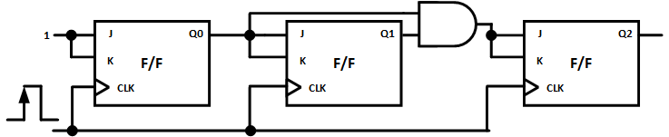
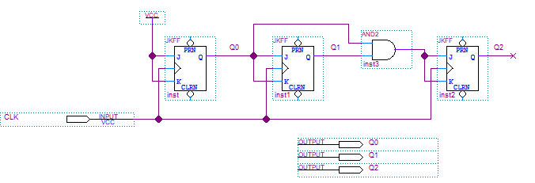
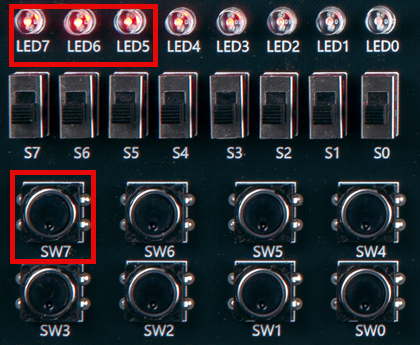
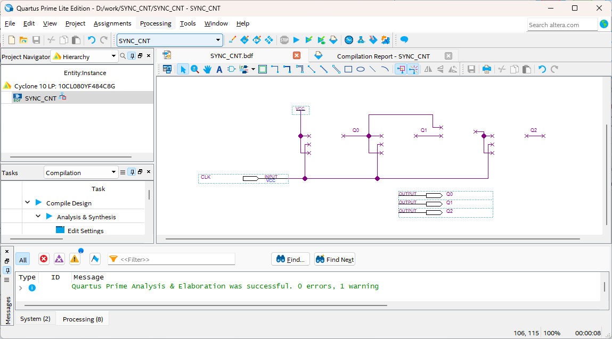
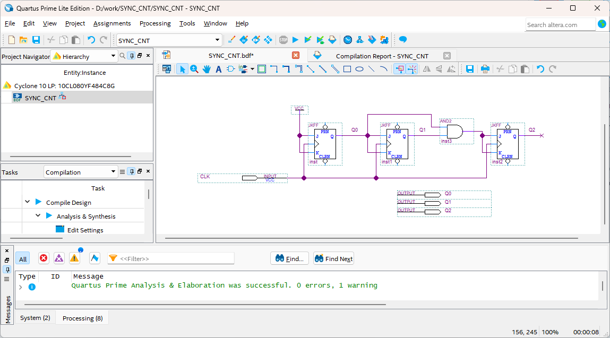
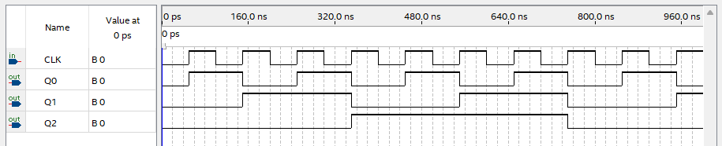

# Synchronous Counter
---

## 이론

- **동기식 카운터**

비동기 카운터 또는 리플카운터의 문제점은 플립플롭의 전달 지연이 누적된다는 것이며, 이것은 플립플롭에서 모든 상태가 입력 펄스에 동기되어 동시에 변하지 않는다는 것을 말한다. 

이러한 문제점은 모든 플립플롭이 입력 클럭 펄스에 의해서 동시에 동작되는 동기식 카운터(synchronous counter) 또는 병렬 카운터(parallel counter)를 사용해서 해결 할 수 있다. 

 

모든 플립플롭에 입력 펄스가 인가되기 때문에, 각 플립플롭의 클럭 펄스에 의하여 반전되거나 현 상태를 유지하기 위한 다른 제어 방법이 사용되어야 한다. 

다음 그림은 이것을 설계한 논리 회로로 3비트 동기식 카운터의 논리 회로이다. 

 

 

위의 회로를 설명하면 다음과 같다.

- 모든 플립플롭의 CLK입력은 같이 연결되어 있어서 클럭은 각 플립플롭에 동시에 인가된다.

- 제일 하위 비트는 Q0 플립플롭의 J와 K 입력 단자에만 High의 값이 고정되어 있고, 다른 플립플롭에는 적절한 조합으로 구동된다. 

- 동기식 카운터는 비동기식 카운터보다 많은 회로 소자가 사용된다.

 
 
이 회로는 다음의 표와 같이 동작된다.

 

|CLOCK||Q2|Q1|Q0||BCD|
|:-:|:-:|:-:|:-:|:-:|:-:|:-:|
|clock||0|0|0||0|
|clock||0|0|1||1|
|clock||0|1|0||2|
|clock||0|1|1||3|
|clock||1|0|0||4|
|clock||1|0|1||5|
|clock||1|1|0||6|
|clock||1|1|1||7|
|clock||0|0|0||0|
|clock||0|0|1||1|

 

---
## **실습 목표 **

다음의 회로를 설계하여 실험해 보자.

 

 

 

SACT 장비에서 확인하기 위하여 연결된 장치는 다음과 같다. 

|CLK|Q2|Q1|Q0|
|:---:|:---:|:---:|:---:|
|SW7|LED7|LED6|LED5|

 

 

### **설계**

1. 실험을 위해 프로젝트 파일 <a href="./pds/SYNC_CNT.zip" download>SYNC_CNT.zip</a>을 준비한다. 
 

2. 다운로드된 프로젝트의 압축 파일을 d:\work 이동시킨 후, 압축을 푼다.

3. Quartus II를 실행키고, File> Open Project 메뉴를 선택한다. 

 

4. 위에서 압축을 푼 위치인, d:\work\SYNC_CNT 폴더로 이동 후,SYNC_CNT 프로젝트를 OPEN한다. 

 

5. File > Open 메뉴를 선택하여 SYNC_CNT.bdf 파일을 불러오거나, 프로젝트 왼쪽의 SYNC_CNT 부분을 마우스로 더블 클릭한다. 

 

6. 아래 그림과 같이 미완성된 도면이 보이는데, 실습 목표에서 설명한 도면으로 완성시키자. 

 

 

7. jkff 심볼을 불러오고, wire로 심볼을 연결시켜 회로를 완성시킨다.  

 

 

### **컴파일**

8. File > Save 메뉴를 선택하여 저장하고, Processing > Start Compilation 메뉴를 선택하여 컴파일을 진행한다. 

이 컴파일 과정은 설계한 논리 회로에 오류가 없는 지를 검증하고, 프로그래밍 파일과 시뮬레이션 파일을 만드는 과정이다. 

  

### **시뮬레이션**

9. 컴파일 완료 후, File > Open 메뉴를 선택하고, 나타나는 Open File 창에서 오른쪽 아래 부분의 File Type을 All File(*.*)로 변경한 후, Waveform.vwf 파일을 선택한다. 

10. 아래 그림과 같이 Waveform 창에서, Simulation > Run Functiona Simulation 메뉴를 선택하여 Functional Simulation을 진행하여, 결과를 확인한다. 

 

 
 

### **하드웨어 동작 확인**

11. SACT 장비를 준비한다. USB 케이블과 파워 케이블을 연결하고, 전원 스위치를 눌러 장비에 전원을 인가시킨다. 

12. Quartus 소프트웨어에서 Tool > Programmer 메뉴를 선택한다.

13. Programmer창의 Hardware Setup이 USB Blaster가 연결되어 있는지 확인하고, Start 버튼을 눌러 프로그래밍 하고 장비에서 동작을 확인한다. 

 

14. 버튼 스위치와 슬라이드 스위치를 동작시키고, LED에서 결과를 확인해 보자. 

SACT 장비에서 확인하기 위하여 연결된 장치는 다음과 같다. 

|CLK|Q2|Q1|Q0|
|:---:|:---:|:---:|:---:|
|SW7|LED7|LED6|LED5|

 

 