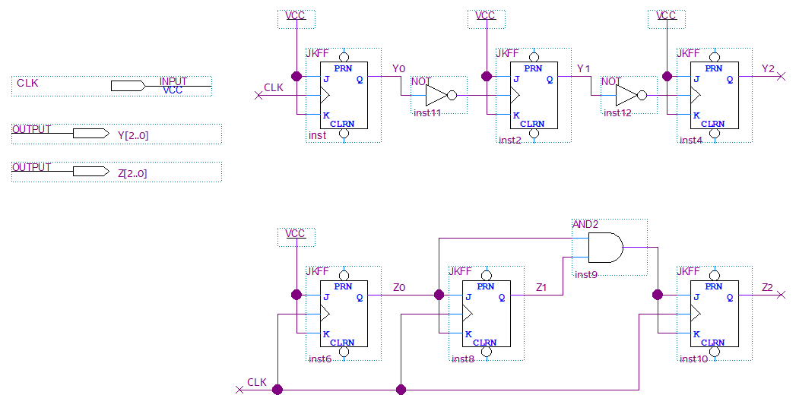
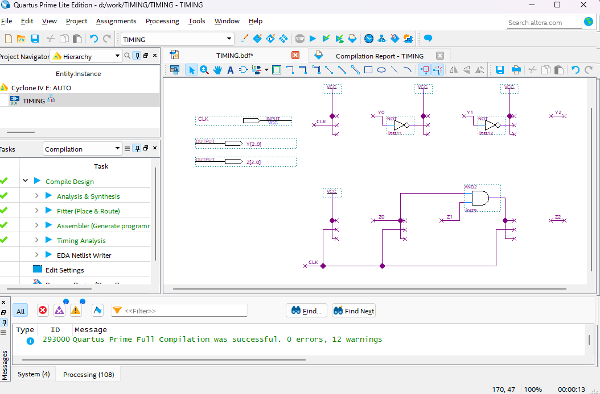
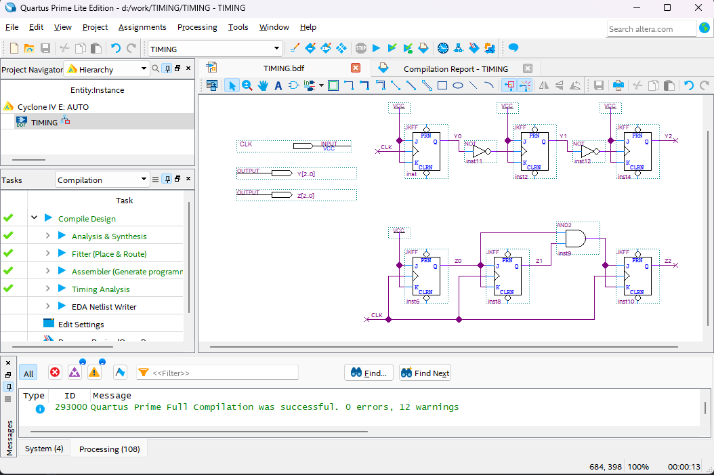
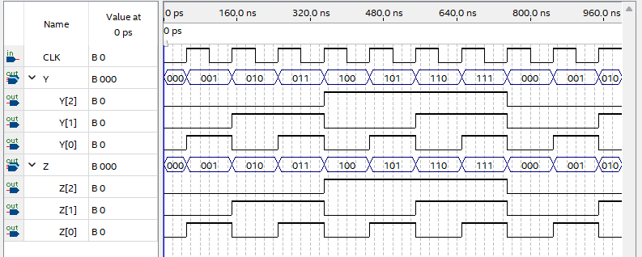
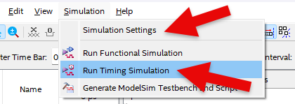
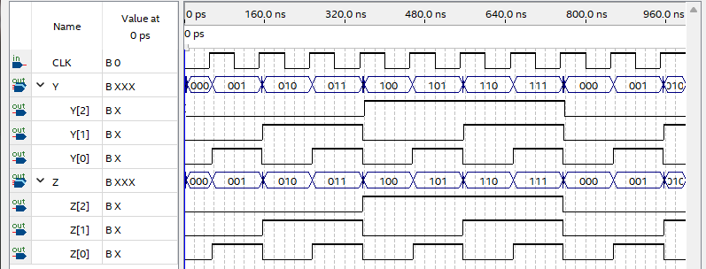
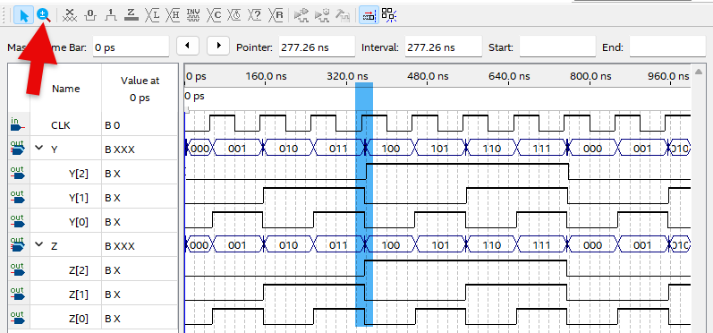
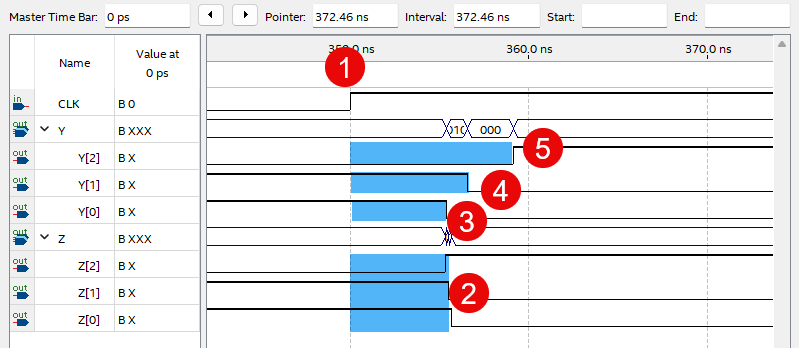

# TIMING SIMULATION

---
## 이론

지금 디지털 논리 회로를 실험하는 Quartus 소프트웨어는 반도체 설계를 위한 과정을 모두 지원한다. 

앞에서 계속 진행했던 설계 / 컴파일 / 시뮬레이션 / 프로그래밍(하드웨어 확인) 의 과정을 Quartus 소프트웨어에서 모두 진행할 수 있으며, 앞의 설명에서도 모든 과정을 진행했다. 

다만, 시뮬레이션의 경우 Functional Simulation으로 논리 회로의 논리적인 사고에 따른 실험 결과를 확인하는 방법만을 사용했다.

앞의 비동기식 카운터와 동기식 카운터의 경우 회로가 간단하기 때문에 하드웨어적인 차이도 보이지 않았으며, 시뮬레이션도 논리만 따지는 기능적인 시뮬레이션만 해서 결과의 차이가 없었을 것이다. 

 

이 절에서는 앞에서 설계한 비동기식 카운터와 동기식 카운터의 시뮬레이션 결과를 통해 둘의 차이를 비교하겠다. 

 

---
## 실습 목표

비동기식 카운터와 동기식 카운터의 차이점을 비교해 보자.
 

 

위의 회로는 앞에서 설계한 비동기식 카운터와 동기식 카운터를 설계한 회로이다. 

6-1의 비동기식 카운터의 카운터 값이 111, 110, ... , 001, 000, 111 이런 식으로 출력되었었기 때문에 not 게이트를 추가하여 000, 001, 010, ... 으로 카운트 되도록 수정하였다. 

따라서 위의 비동기식 카운터와 아래의 동기식 카운터의 출력 결과는 같지만, 지연 시간등의 이유로 성능등의 차이가 있다. 

### **설계**

1. 실험을 위해 프로젝트 파일 <a href="./pds/TIMING.zip" download>TIMING.zip</a>을 준비한다. 
 

2. 다운로드된 프로젝트의 압축 파일을 d:\work 이동시킨 후, 압축을 푼다.

3. Quartus II를 실행키고, File> Open Project 메뉴를 선택한다. 

 

4. 위에서 압축을 푼 위치인, d:\work\TIMING 폴더로 이동 후,TIMING 프로젝트를 OPEN한다. 

 

5. File > Open 메뉴를 선택하여 TIMING.bdf 파일을 불러오거나, 프로젝트 왼쪽의 TIMING 부분을 마우스로 더블 클릭한다. 

 

6. 아래 그림과 같이 미완성된 도면이 보이는데, 실습 목표에서 설명한 도면으로 완성시키자. 

 

 

7. jkff 심볼을 불러오고, wire로 심볼을 연결시켜 회로를 완성시킨다.  

 

 

### **컴파일**

8. File > Save 메뉴를 선택하여 저장하고, Processing > Start Compilation 메뉴를 선택하여 컴파일을 진행한다. 

이 컴파일 과정은 설계한 논리 회로에 오류가 없는 지를 검증하고, 프로그래밍 파일과 시뮬레이션 파일을 만드는 과정이다. 

  

### **시뮬레이션**

9. 컴파일 완료 후, File > Open 메뉴를 선택하고, 나타나는 Open File 창에서 오른쪽 아래 부분의 File Type을 All File(*.*)로 변경한 후, Waveftmm.vwf 파일을 선택한다. 

10. 아래 그림과 같이 Waveftmm 창에서, Simulation > Run Functiona Simulation 메뉴를 선택하여 Functional Simulation을 진행하여, 결과를 확인한다. 

 

 
 

비동기식 카운터의 결과인 Y[2..0]과 동기식 카운터의 결과인 Z[2..0]의 결과가 같게 나타나는 것을 확인할 수 잇따. 

 

11. 아래 그림과 같이 Waveform 창에서, Simulation > Run Timing Simulation 메뉴를 선택하여 Timing Simulation을 진행하여, 결과를 확인한다. 

 

 

결과 보면 앞의 Function Simulation의 결과와 다른 파형이 나타나는 것을 확인할 수 있다. 

12. 파형 중 아래 그림과 같이 확대/축소 아이콘을 선택해서 파란색으로 체크된 부분을 드래그 하여 파형을 확대해 본다. 

이 부분을 확대한 이유는 출력 데이터 3비트의 모든 변화를 확인할 수 있는 부분이기 때문이다. 

 

13. 파형을 확대하면 그림을 통해서 아래의 내용을 확인할 수 있다. 

- (1) CLK의 Rising Edge 부분에서 동기식 카운터의 출력(2)이 비슷한 지연 시간에 후에 출력되는 것을 확인할 수 있따. 

- 비동기식 카운터의 결과의 경우 (1) CLK의 Rising Edge의 영향으로 Y[0]가 출력(3)되고, Y[0]의 값에 의해 Y[1]이 출력(4), Y[1]의 값에 의해 Y[2]가 출력(5)되므로 전체 출력 Y[0], Y[1], Y[2]의 값이 서로 다른 지연시간으로 출력되는 것을 확인할 수 있다. 

    여기에서는 지연 시간이 작지만, 좀 더 크고 복잡한 논리 회로를 설계할 경우에는 지연 시간의 오차에 의해 동작 이상이 생길 수 있는 것에 주의해야 한다. 

 

---
## 결론

위의 결과에서 볼 수 있듯이 비동기식으로 회로가 구성될 경우, 출력의 결과가 서로 다른 지연시간에 나타나기 때문에 고성능의 시스템을 설계할 때에는 문제가 된다. 

출력의 결과가 클럭에 동기되어 출력하는 경우 시스템에 더 좋은 성능을 발휘 할 수 있도록 해주게 한다. 

 

