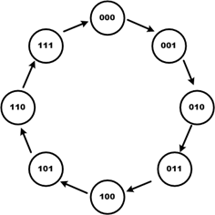
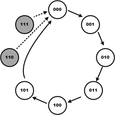
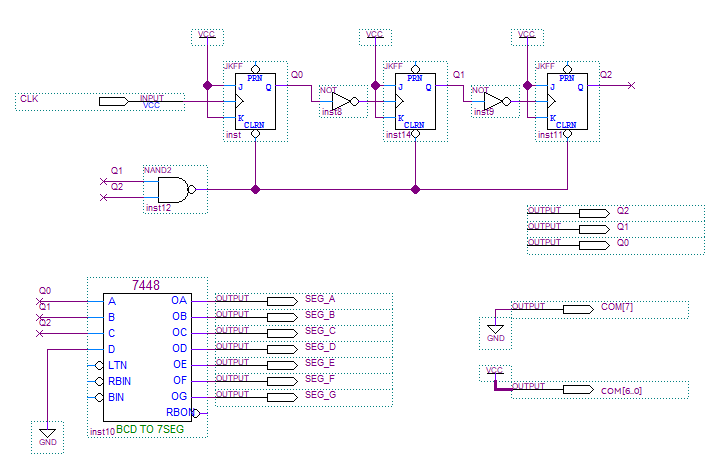
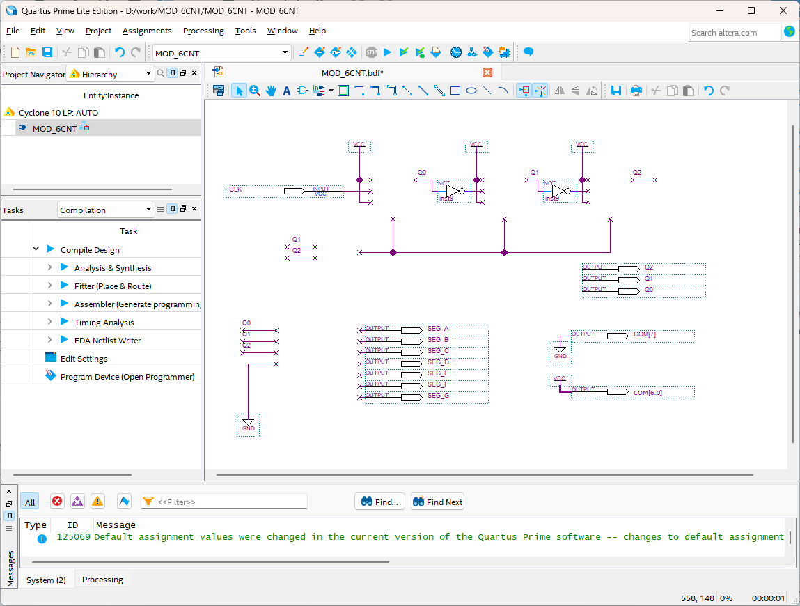
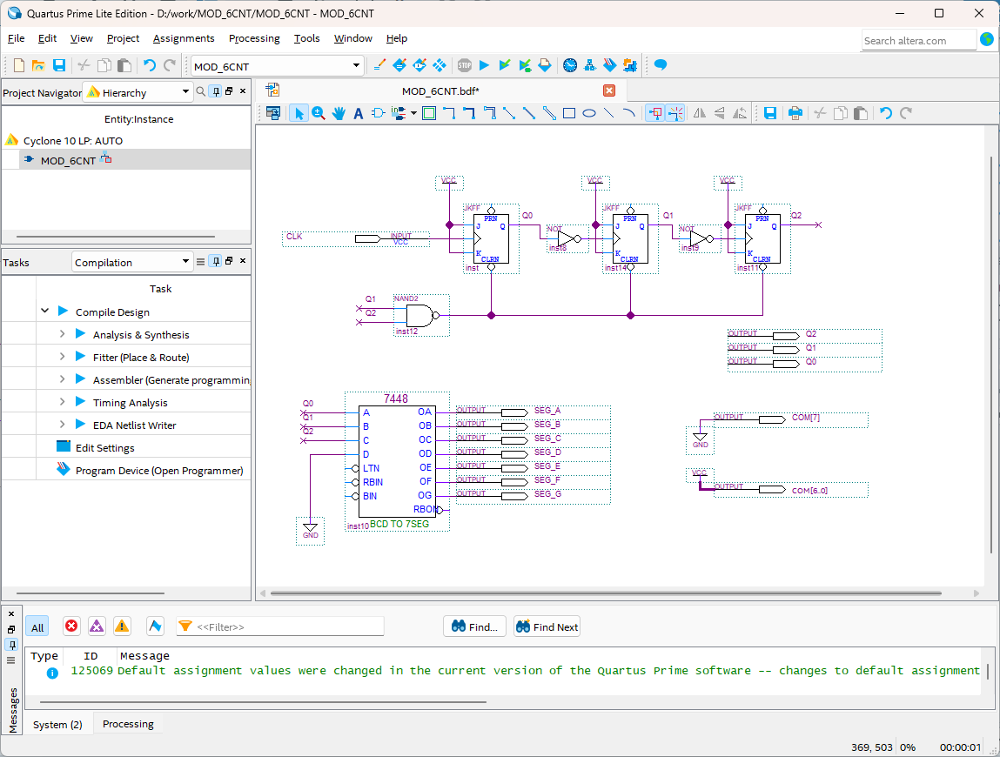
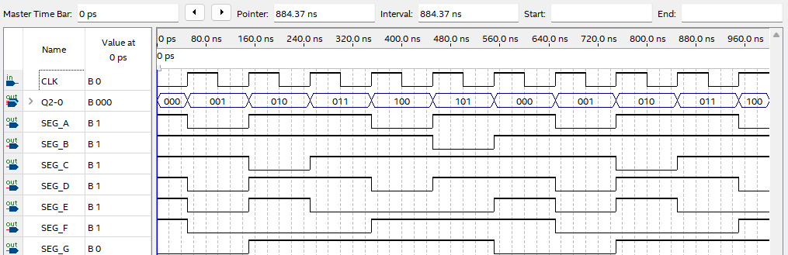

# MOD-N Counter
---

## 이론

일반적으로 제어되는 장치들은 동작하는데 필요한 특정 주파수 클럭을 필요로 한다. 

필요로 하는 모든 주파수를 외부에서 전달해 주면 좋겠지만, 그렇지 못한 경우에는 중심이 되는 주파수를 이용하여 필요한 주파수를 생성해 내는데, 이런 논리 회로를 주파수 카운터라 한다.

이 절에서는 앞에서 설명한 카운터를 응용하여, 실제 논리 회로에서 사용하는 주파수 카운터 설계 방법 을 설명하고 있다. 
 

 

- **MOD-N 카운터**

다음은 3비트 카운터의 데이터 값의 변화를 나타내는 상태 천이도를 그린 그림이다. 

이 상태 천이도를 통해서 3비트 카운터의 데이터 값의 변화를 쉽게 이해 할 수 있다. 
 

 

이 3비트 카운터는 8개의 다른 상태를 갖는다. 

카운트의 순서에 있는 논리 상태의 수를 모드(MOD) 수라고 하는데, 8개의 논리 상태를 갖고 있기 때문에 MOD-8 카운터라고 한다. 

이것이 가장 일반적으로 사용하는 방법이고, 사용자에 의해서 MOD의 수를 변경할 수 있다. 

 

3비트 카운터의 회로 상태 천이도에서 다음 그림과 같이 101의 데이터 상태에서 110의 데이터 상태로 변경하지 않고, 바로 000로 바뀌는 회로로 설계한다. 

이 회로는 6개의 논리 상태를 갖고 있기 때문에 MOD-6 카운터라고 말한다.

 

이 상태 천이도에서 110과 111의 상태일 때 000로 값을 변경하는 상태를 그린 이유는 논리 회로에 전원이 들어오는 순간에 플립플롭들이 알수 없는 임의의 상태가 되어서 110, 111 등의 상태에 나타날 수 있기 때문에다.  

그래서 이것을 해결하기 위한 보정 회로가 추가되어야 한다. 

 

---
## **실습 목표 **

다음의 회로를 설계하여 실험해 보자.

 

 

이 회로에서 아래 그림과 같이 사각형으로 표시된 부분은 MOD-6 카운터를 7-Segment에 표시하기 위해, 앞에서 실습했었던 BCD to 7-Segment 디코더와 연결하는 부분이다. 

이렇게 하면 MOD-6 카운터에서 0-5까지 카운트한 값이, 7-Segment의 1자리에 숫자로 표시된다. 

 

SACT 장비에서 확인하기 위하여 연결된 장치는 다음과 같다. 

|CLK|Q2|Q1|Q0|
|:---:|:---:|:---:|:---:|
|SW7|LED7|LED6|LED5|

 

 

### **설계**

1. 실험을 위해 프로젝트 파일 <a href="./pds/MOD_6CNT.zip" download>MOD_6CNT.zip</a>을 준비한다. 
 

2. 다운로드된 프로젝트의 압축 파일을 d:\work 이동시킨 후, 압축을 푼다.

3. Quartus II를 실행키고, File> Open Project 메뉴를 선택한다. 

 

4. 위에서 압축을 푼 위치인, d:\work\MOD_6CNT 폴더로 이동 후,MOD_6CNT 프로젝트를 OPEN한다. 

 

5. File > Open 메뉴를 선택하여 MOD_6CNT.bdf 파일을 불러오거나, 프로젝트 왼쪽의 MOD_6CNT 부분을 마우스로 더블 클릭한다. 

 

6. 아래 그림과 같이 미완성된 도면이 보이는데, 실습 목표에서 설명한 도면으로 완성시키자. 

 

 

7. jkff 심볼과 7448 심볼, nand2 심볼을 불러오고, wire로 심볼을 연결시켜 회로를 완성시킨다.  

 

 

### **컴파일**

8. File > Save 메뉴를 선택하여 저장하고, Processing > Start Compilation 메뉴를 선택하여 컴파일을 진행한다. 

이 컴파일 과정은 설계한 논리 회로에 오류가 없는 지를 검증하고, 프로그래밍 파일과 시뮬레이션 파일을 만드는 과정이다. 

  

### **시뮬레이션**

9. 컴파일 완료 후, File > Open 메뉴를 선택하고, 나타나는 Open File 창에서 오른쪽 아래 부분의 File Type을 All File(*.*)로 변경한 후, Waveform.vwf 파일을 선택한다. 

10. 아래 그림과 같이 Waveform 창에서, Simulation > Run Functiona Simulation 메뉴를 선택하여 Functional Simulation을 진행하여, 결과를 확인한다. 

 

 
 

### **하드웨어 동작 확인**

11. SACT 장비를 준비한다. USB 케이블과 파워 케이블을 연결하고, 전원 스위치를 눌러 장비에 전원을 인가시킨다. 

12. Quartus 소프트웨어에서 Tool > Programmer 메뉴를 선택한다.

13. Programmer창의 Hardware Setup이 USB Blaster가 연결되어 있는지 확인하고, Start 버튼을 눌러 프로그래밍 하고 장비에서 동작을 확인한다. 

 

14. 버튼 스위치와 슬라이드 스위치를 동작시키고, LED에서 결과를 확인해 보자. 

SACT 장비에서 확인하기 위하여 연결된 장치는 다음과 같다. 

|CLK|Q2|Q1|Q0|
|:---:|:---:|:---:|:---:|
|SW7|LED7|LED6|LED5|

 