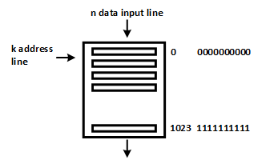

# RAM
---

- **RAM**

모든 Random Access Memory는 메모리에 있는 특정 수의 word로 구성된다. 여기에서 word는 비트들의 집합니다. 

예를 들어 하나의 RAM이 총 1024개의 단어로 구성되어 있다면, 첫번째 단어의 주소는 10진수로 0이다. 그리고, 마지막 단어의 주소는 1023이다. 이것은 2진수로 0000000000(0) - 1111111111(1023)을 의미하며, 모든 단어에 접근하기 위해서는 10개의 Address 줄이 필요하다. 
이 Address 줄의 10비트 Address는 RAM의 어느 위치에 접근하고자 하는지 알려준다. 

 

RAM의 각 word가 n 비트라고 가정해 보면, word의 길이가 n비트라는 말이다. 즉 n개의 Data 줄이 필요하다. 

일반적으로 RAM이 2^k의 단어로 구성되어 있다면, 이 단어에 접근하기 위해서는 k개의 주소 줄이 필요하다. 마찬가지로, word에 Data를 쓰고 싶을 때는 n개의 입력줄이 필요하다. 

일반적으로 메모리에 읽기와 쓰기를 위한 별도의 데이터 라인을 두는 대신, 동일한 라인을 읽기와 쓰기로 사용한다. 

따라서, 읽기 및 쓰기 제어 신호에 의해 데이터를 RAM에 쓸지, 메모리에서 Data를 읽을지가 결정된다. 

 

읽기 및 쓰기 신호는 메모리에서 데이터가 어떤 방향으로 이동할지 결정한다. 

RAM에 있는 데이터를 읽거나 쓰려면 제어신호, address의 특정 수소, 특정 순에 따른 Data의 입력이 필요하다. 

 

일반적으로 사용하는 RAM의 경우 위의 그림과 같이 read와 write의 제어 신호를 두 개의 별도 제어 신호를 두지 않고, 하나의 제어 신호에서 제어할 수 있돌고 구성하여 사용된다. 

위의 메모리는 다음과 같이 제어된다. 

|Enable |Read/Write|Operation|
|:-:|:-:|:-:|
|0|X|None|
|1|0| Data write |
|1|1| Data read|

Read 동작

 

Write 동작

 

---
## **실습 목표 **

다음의 회로를 설계하여 실험해 보자.

 

 

이 회로는 4비트의 데이터 라인과 32개의 데이터를 저장( Address 5비트 ) 할 수 있는 RAM 이다. 

앞에서 설명한 것과 회로의 모습과 동작이 다른데, FPGA 내부 RAM을 사용하는 블록이어서 그렇다. 

차이점은 다음과 같다. 

- DATA 라인이 입력과 출력에 각각 있다. (Dual Port RAM 이라고도 한다.)

- WR 신호가 1 이고 Clock의 Rising Edge에서 Write의 동작을 하며, WR신호가 0이고 Clock의 Rising Edge에서 Read의 동작을 한다. 

 

SACT 장비에서 확인하기 위하여 연결된 장치는 다음과 같다. 

|WR|CLK|ADDR[4]|ADDR[3]|ADDR[2]|ADDR[1]|ADDR[0]|
|:-:|:-:|:-:|:-:|:-:|:-:|:-:|
|S7|SW3|S4|S3|S2|S1|S0|

|DIN[3]|DIN[2]|DIN[1]|DIN[0]|Q[3]|Q[2]|Q[1]|Q[0]|
|:-:|:-:|:-:|:-:|:-:|:-:|:-:|:-:|
|SW7|SW6|SW5|SW4|LED7|LED6|LED5|LED4|

 

 

### **설계**

1. 실험을 위해 프로젝트 파일 <a href="./pds/SACT_RAM.zip" download>SACT_RAM.zip</a>을 준비한다. 
 

2. 다운로드된 프로젝트의 압축 파일을 d:\work 이동시킨 후, 압축을 푼다.

3. Quartus II를 실행키고, File> Open Project 메뉴를 선택한다. 

 

4. 위에서 압축을 푼 위치인, d:\work\SACT_RAM 폴더로 이동 후,SACT_RAM 프로젝트를 OPEN한다. 

 

5. File > Open 메뉴를 선택하여 SACT_RAM.bdf 파일을 불러오거나, 프로젝트 왼쪽의 SACT_RAM 부분을 마우스로 더블 클릭한다. 

 

6. 아래 그림과 같이 미완성된 도면이 보이는데, 실습 목표에서 설명한 도면으로 완성시키자. 

 

7. S_RAM 심볼을 불러오고, wire로 심볼을 연결시켜 회로를 완성시킨다.  

 

 

### **컴파일**

8. File > Save 메뉴를 선택하여 저장하고, Processing > Start Compilation 메뉴를 선택하여 컴파일을 진행한다. 

이 컴파일 과정은 설계한 논리 회로에 오류가 없는 지를 검증하고, 프로그래밍 파일과 시뮬레이션 파일을 만드는 과정이다. 

  

### **시뮬레이션**

9. 컴파일 완료 후, File > Open 메뉴를 선택하고, 나타나는 Open File 창에서 오른쪽 아래 부분의 File Type을 All File(*.*)로 변경한 후, Waveform.vwf 파일을 선택한다. 

10. 아래 그림과 같이 Waveform 창에서, Simulation > Run Functiona Simulation 메뉴를 선택하여 Functional Simulation을 진행하여, 결과를 확인한다. 

 

 
 

### **하드웨어 동작 확인**

11. SACT 장비를 준비한다. USB 케이블과 파워 케이블을 연결하고, 전원 스위치를 눌러 장비에 전원을 인가시킨다. 

12. Quartus 소프트웨어에서 Tool > Programmer 메뉴를 선택한다.

13. Programmer창의 Hardware Setup이 USB Blaster가 연결되어 있는지 확인하고, Start 버튼을 눌러 프로그래밍 하고 장비에서 동작을 확인한다. 

 

14. 아래와 같이 실험을 해보자. 

    - Slide Switch(S4-S0)를 이용해 ADDR[4..0]을 설정한다. 
    - WRITE를 위해 WR(S7)을 1로 놓는다. 
    - DIN[3..0]을 위하여 SW7-SW4에 임의의 데이터를 설정하고, CLK(SW3)을 입력한다. 
    - READ를 위해 WR(S7)을 0으로 놓는다. 
    - CLK를 입력한다. (ADDR[4..0]을 바꾸지 않으면 입력되었던 값이 출력됨.)

    - WR을 1로 설정하고 ADDR과 DATA를 바꾸어가며 입력한다. 
    - WR을 0으로 하고, ADDR을 설정한 후, CLK를 눌러 입력된 값이 출력되는지 확인한다. 

|WR|CLK|ADDR[4]|ADDR[3]|ADDR[2]|ADDR[1]|ADDR[0]|
|:-:|:-:|:-:|:-:|:-:|:-:|:-:|
|S7|SW3|S4|S3|S2|S1|S0|

|DIN[3]|DIN[2]|DIN[1]|DIN[0]|Q[3]|Q[2]|Q[1]|Q[0]|
|:-:|:-:|:-:|:-:|:-:|:-:|:-:|:-:|
|SW7|SW6|SW5|SW4|LED7|LED6|LED5|LED4|

 

 