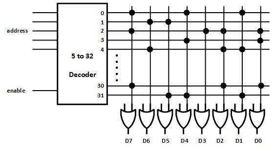
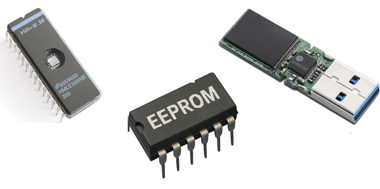
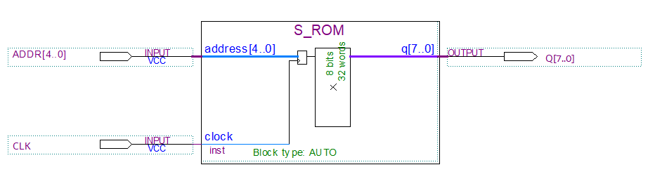
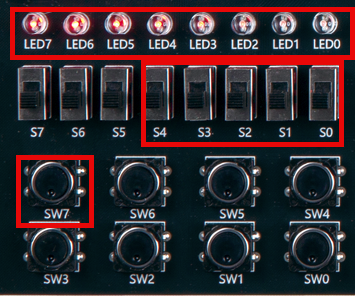
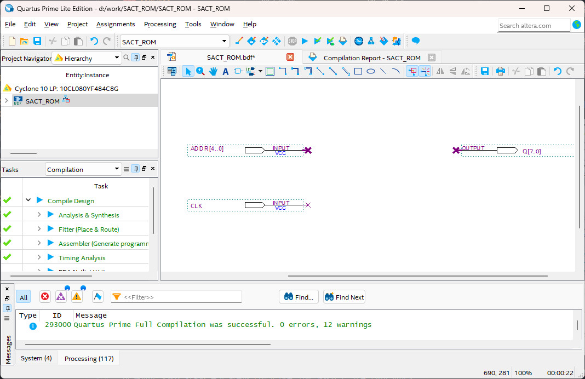
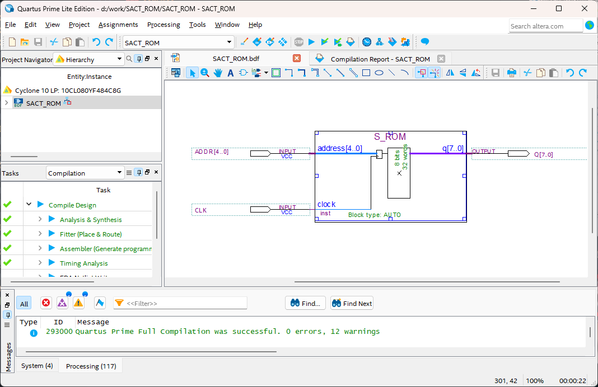
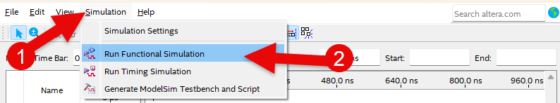
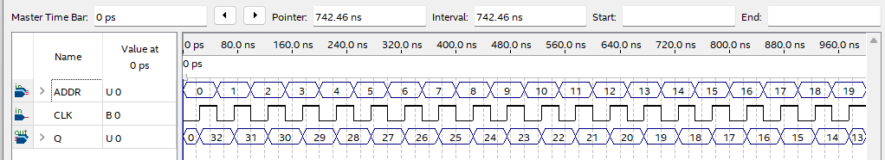
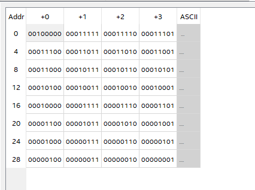

# ROM
---

## 이론

- **ROM**

RAM은 데이터를 썼다가 읽는, 전원을 제거하면 썼던 데이터가 사라지는 휘발성의 메모리 장치이다. 

ROM은 READ ONLY의 데이터를 읽을 수만 있는 비휘발성 메모리이다. 이것은 전원이 끊긴 경우에도 메모리 내용이 그대로 유지된다는 것을 의미한다. 

예를 들어 8비트의 32개 Address를 갖고 있는 ROM이 있다고 가정하면, 이 ROM은 아래 그림과 같이 나타낼 수 있다. 저장된 데이터는 임의의 데이터이다. 

32 x 8 ROM

 

이 내용을 진리표로 만들면 다음과 같다. 

|INPUT||D7|D6|D5|D4|D3|D2|D1|D0|
|:-:|:-:|:-:|:-:|:-:|:-:|:-:|:-:|:-:|:-:|
| 0 0 0 0 0||1|0|0|1|0|0|1|0|
| 0 0 0 0 1||0|1|1|0|0|0|0|0|
| 0 0 0 1 0||1|0|0|0|1|1|0|1|
| 0 0 0 1 1||0|0|0|1|0|0|0|1|
| 0 0 1 0 0||0|1|0|0|0|1|1|0|
| ||||||||||
| ||||||||||
| ||||||||||
| 1 1 1 1 0||1|0|0|0|0|1|0|1|
| 1 1 1 1 1||0|0|1|1|0|0|1|0|

이런 ROM 중에서 PROM이라고하는 Programmable ROM이 있습니다. 

이것은 Programming 할 수 있는 ROM Writer를 이용해 ROM에 데이터를 쓸 수 있는 장치 입니다. 

 

기술이 발전함에 따라 Programming 된 ROM의 데이터를 자외선을 이용해 지울 수도 있는 EPROM과 전기적인 방법으로 지울 수 있는 EEPROM이 사용되었으며, 요즘에는 Flash Memory 등으로 쉽게 데이터를 쓰고 지울 수 있는 장치들이 사용됩니다. 

 

---
## **Practice Objectives **

다음의 회로를 Design하여 실험해 보자.

 

 

이 회로는 32개의 데이터가 저장되어 있는(Address 5비트) 8비트 ROM이다. 

이 ROM에 저장되어 있는 데이터는 다음과 같다. 

|ADDR[4..0]|ADDR(HEX)||Q[7..0]|Q(HEX)|
|:-:|:-:|:-:|:-:|:-:|
| 0 0 0 0 0 |0|| 0 0 1 0 0 0 0 0 |32 |
| 0 0 0 0 1 |1|| 0 0 0 1 1 1 1 1 |31 |
| 0 0 0 1 0 |2|| 0 0 0 1 1 1 1 0 |30 |
| 0 0 0 1 1 |3|| 0 0 0 1 1 1 0 1 |29 |
| 0 0 1 0 0 |4|| 0 0 0 1 1 1 0 0 |28 |
| 0 0 1 0 1 |5|| 0 0 0 1 1 0 1 1 |27 |
| 0 0 1 1 0 |6|| 0 0 0 1 1 0 1 0 |26 |
| 0 0 1 1 1 |7|| 0 0 0 1 1 0 0 1 |25 |
| 0 1 0 0 0 |8|| 0 0 0 1 1 0 0 0 |24 |
| 0 1 0 0 1 |9|| 0 0 0 1 0 1 1 1 |23 |
| 0 1 0 1 0 |10|| 0 0 0 1 0 1 1 0 |22 |
| 0 1 0 1 1 |11|| 0 0 0 1 0 1 0 1 |21 |
| 0 1 1 0 0 |12|| 0 0 0 1 0 1 0 0 |20 |
| 0 1 1 0 1 |13|| 0 0 0 1 0 0 1 1 |19 |
| 0 1 1 1 0 |14|| 0 0 0 1 0 0 1 0 |18 |
| 0 1 1 1 1 |15|| 0 0 0 1 0 0 0 1 |17 |
| 1 0 0 0 0 |16|| 0 0 0 1 0 0 0 0 |16 |
| 1 0 0 0 1 |17|| 0 0 0 0 1 1 1 1 |15 |
| 1 0 0 1 0 |18|| 0 0 0 0 1 1 1 0 |14 |
| 1 0 0 1 1 |19|| 0 0 0 0 1 1 0 1 |13 |
| 1 0 1 0 0 |20|| 0 0 0 0 1 1 0 0 |12 |
| 1 0 1 0 1 |21|| 0 0 0 0 1 0 1 1 |11 |
| 1 0 1 1 0 |22|| 0 0 0 0 1 0 1 0 |10 |
| 1 0 1 1 1 |23|| 0 0 0 0 1 0 0 1 |9 |
| 1 1 0 0 0 |24|| 0 0 0 0 1 0 0 0 |8 |
| 1 1 0 0 1 |25|| 0 0 0 0 0 1 1 1 |7 |
| 1 1 0 1 0 |26|| 0 0 0 0 0 1 1 0 |6 |
| 1 1 0 1 1 |27|| 0 0 0 0 0 1 0 1 |5 |
| 1 1 1 0 0 |28|| 0 0 0 0 0 1 0 0 |4 |
| 1 1 1 0 1 |29|| 0 0 0 0 0 0 1 1 |3 |
| 1 1 1 1 0 |30|| 0 0 0 0 0 0 1 0 |2 |
| 1 1 1 1 1 |31|| 0 0 0 0 0 0 0 1 |1 |

 

SACT 장비에서 확인하기 위하여 연결된 장치는 다음과 같다. 

|CLK|ADDR[4]|ADDR[3]|ADDR[2]|ADDR[1]|ADDR[0]|
|:-:|:-:|:-:|:-:|:-:|:-:|
|SW7|S4|S3|S2|S1|S0|

|Q[7]|Q[6]|Q[5]|Q[4]|Q[3]|Q[2]|Q[1]|Q[0]|
|:-:|:-:|:-:|:-:|:-:|:-:|:-:|:-:|
|LED7|LED6|LED5|LED4|LED3|LED2|LED1|LED0|

 

 

### **Design**

1. 실험을 위해 프로젝트 파일 <a href="./pds/SACT_ROM.zip" download>SACT_ROM.zip</a>을 준비한다. 
 

2. 다운로드된 프로젝트의 압축 파일을 d:\work 이동시킨 후, 압축을 푼다.

3. Quartus II를 실행키고, File> Open Project 메뉴를 선택한다. 

 

4. 위에서 압축을 푼 위치인, d:\work\SACT_ROM 폴더로 이동 후,SACT_ROM 프로젝트를 OPEN한다. 

 

5. File > Open 메뉴를 선택하여 SACT_ROM.bdf 파일을 불러오거나, 프로젝트 왼쪽의 SACT_ROM 부분을 마우스로 더블 클릭한다. 

 

6. 아래 그림과 같이 미완성된 도면이 보이는데, Practice Objectives에서 설명한 도면으로 완성시키자. 

 

7. S_ROM 심볼을 불러오고, wire로 심볼을 연결시켜 회로를 완성시킨다.  

 

 

### **Compile**

8. File > Save 메뉴를 선택하여 저장하고, Processing > Start Compilation 메뉴를 선택하여 Compile을 진행한다. 

이 Compile 과정은 Design한 논리 회로에 오류가 없는 지를 검증하고, 프로그래밍 파일과 Simulation 파일을 만드는 과정이다. 

  

### **Simulation**

9. Compile 완료 후, File > Open 메뉴를 선택하고, 나타나는 Open File 창에서 오른쪽 아래 부분의 File Type을 All File(*.*)로 변경한 후, Waveform.vwf 파일을 선택한다. 

10. 아래 그림과 같이 Waveform 창에서, Simulation > Run Functiona Simulation 메뉴를 선택하여 Functional Simulation을 진행하여, 결과를 확인한다. 

 

 
 

### **Check Hardware Operation**

11. SACT 장비를 준비한다. USB 케이블과 파워 케이블을 연결하고, 전원 스위치를 눌러 장비에 전원을 인가시킨다. 

12. Quartus 소프트웨어에서 Tool > Programmer 메뉴를 선택한다.

13. Programmer창의 Hardware Setup이 USB Blaster가 연결되어 있는지 확인하고, Start 버튼을 눌러 프로그래밍 하고 장비에서 동작을 확인한다. 

 

14. 아래와 같이 실험을 해보자. 

    - Slide Switch(S4-S0)를 이용해 ADDR[4..0]을 설정한다. 
    - CLK(SW7)을 입력한다. 
    - ADDR에 대한 Q의 출력을 LED 를 통해 확인해 본다. 

|CLK|ADDR[4]|ADDR[3]|ADDR[2]|ADDR[1]|ADDR[0]|
|:-:|:-:|:-:|:-:|:-:|:-:|
|SW7|S4|S3|S2|S1|S0|

|Q[7]|Q[6]|Q[5]|Q[4]|Q[3]|Q[2]|Q[1]|Q[0]|
|:-:|:-:|:-:|:-:|:-:|:-:|:-:|:-:|
|LED7|LED6|LED5|LED4|LED3|LED2|LED1|LED0|

 

 

### 응용 Design

15. File > Open 메뉴를 선택하여, 오른쪽 아래의 파일 type을  All File(*.*)로 설정한다. 

    그리고, File Open 창에서 ROM_DATA.mif 파일을 불러온다. 

    
 

 이게 이 챕터에서 작업한 ROM의 데이터 파일이다. 
파일 내용을 수정하고, 저장한다. 

Compile을 진행하여, ROM의 동작을 확인해 보자. 

