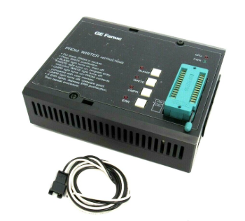

# ROM
---

- **ROM**

RAM is a volatile memory device that writes and reads data, and the written data disappears when the power is off. 

ROM is a non-volatile memory that can read only ‘READ ONLY’ data. This means that memory contents are retained even when power is off.

For example, assuming that there is ROM with 32 8-bit addresses, this ROM can be represented as shown below. The stored data is random data.

[32 x 8 ROM]

 

Truth table would be as below.

|INPUT||D7|D6|D5|D4|D3|D2|D1|D0|
|:-:|:-:|:-:|:-:|:-:|:-:|:-:|:-:|:-:|:-:|
| 0 0 0 0 0||1|0|0|1|0|0|1|0|
| 0 0 0 0 1||0|1|1|0|0|0|0|0|
| 0 0 0 1 0||1|0|0|0|1|1|0|1|
| 0 0 0 1 1||0|0|0|1|0|0|0|1|
| 0 0 1 0 0||0|1|0|0|0|1|1|0|
| ||||||||||
| ||||||||||
| ||||||||||
| 1 1 1 1 0||1|0|0|0|0|1|0|1|
| 1 1 1 1 1||0|0|1|1|0|0|1|0|

Among ROMs, there is Programmable ROM called PROM. 

This is a device that can write data on ROM using programmable ROM Writer. 

 

As technology has advanced, EPROM, which can erase the data in the programmed ROM using ultraviolet ray, and EEPROM, which can erase electrically, have been used. These days, devices such as Flash Memory, which can easily write and erase data, are used.

 

---
## **Practice Objectives **

Let's design and experiment with the circuit below.

 

 

Circuit is 8-bit ROM that stores 32 data(Address 5 bits). 

The data stored in this ROM is as below.

|ADDR[4..0]|ADDR(HEX)||Q[7..0]|Q(HEX)|
|:-:|:-:|:-:|:-:|:-:|
| 0 0 0 0 0 |0|| 0 0 1 0 0 0 0 0 |32 |
| 0 0 0 0 1 |1|| 0 0 0 1 1 1 1 1 |31 |
| 0 0 0 1 0 |2|| 0 0 0 1 1 1 1 0 |30 |
| 0 0 0 1 1 |3|| 0 0 0 1 1 1 0 1 |29 |
| 0 0 1 0 0 |4|| 0 0 0 1 1 1 0 0 |28 |
| 0 0 1 0 1 |5|| 0 0 0 1 1 0 1 1 |27 |
| 0 0 1 1 0 |6|| 0 0 0 1 1 0 1 0 |26 |
| 0 0 1 1 1 |7|| 0 0 0 1 1 0 0 1 |25 |
| 0 1 0 0 0 |8|| 0 0 0 1 1 0 0 0 |24 |
| 0 1 0 0 1 |9|| 0 0 0 1 0 1 1 1 |23 |
| 0 1 0 1 0 |10|| 0 0 0 1 0 1 1 0 |22 |
| 0 1 0 1 1 |11|| 0 0 0 1 0 1 0 1 |21 |
| 0 1 1 0 0 |12|| 0 0 0 1 0 1 0 0 |20 |
| 0 1 1 0 1 |13|| 0 0 0 1 0 0 1 1 |19 |
| 0 1 1 1 0 |14|| 0 0 0 1 0 0 1 0 |18 |
| 0 1 1 1 1 |15|| 0 0 0 1 0 0 0 1 |17 |
| 1 0 0 0 0 |16|| 0 0 0 1 0 0 0 0 |16 |
| 1 0 0 0 1 |17|| 0 0 0 0 1 1 1 1 |15 |
| 1 0 0 1 0 |18|| 0 0 0 0 1 1 1 0 |14 |
| 1 0 0 1 1 |19|| 0 0 0 0 1 1 0 1 |13 |
| 1 0 1 0 0 |20|| 0 0 0 0 1 1 0 0 |12 |
| 1 0 1 0 1 |21|| 0 0 0 0 1 0 1 1 |11 |
| 1 0 1 1 0 |22|| 0 0 0 0 1 0 1 0 |10 |
| 1 0 1 1 1 |23|| 0 0 0 0 1 0 0 1 |9 |
| 1 1 0 0 0 |24|| 0 0 0 0 1 0 0 0 |8 |
| 1 1 0 0 1 |25|| 0 0 0 0 0 1 1 1 |7 |
| 1 1 0 1 0 |26|| 0 0 0 0 0 1 1 0 |6 |
| 1 1 0 1 1 |27|| 0 0 0 0 0 1 0 1 |5 |
| 1 1 1 0 0 |28|| 0 0 0 0 0 1 0 0 |4 |
| 1 1 1 0 1 |29|| 0 0 0 0 0 0 1 1 |3 |
| 1 1 1 1 0 |30|| 0 0 0 0 0 0 1 0 |2 |
| 1 1 1 1 1 |31|| 0 0 0 0 0 0 0 1 |1 |

 

Devices connected to check in SACT equipment are as below. 

|CLK|ADDR[4]|ADDR[3]|ADDR[2]|ADDR[1]|ADDR[0]|
|:-:|:-:|:-:|:-:|:-:|:-:|
|SW7|S4|S3|S2|S1|S0|

|Q[7]|Q[6]|Q[5]|Q[4]|Q[3]|Q[2]|Q[1]|Q[0]|
|:-:|:-:|:-:|:-:|:-:|:-:|:-:|:-:|
|LED7|LED6|LED5|LED4|LED3|LED2|LED1|LED0|

 

 

### **Design**

1. Prepare project file <a href="./pds/SACT_ROM.zip" download>SACT_ROM.zip</a> for the experiment. 
 

2. Move the project compressed file downloaded to d:＼work and unzip it.

3. Run Quartus II and select File > Open Project.

 

4. Go to d:＼work＼SACT_ROM folder, where the files are unzipped, and open SACT_ROM project.

 

5. Select File > Open to import SACT_ROM.bdf file. Or double-click SACT_ROM on the left side of the project.

 

6. Unfinished drawing is shown. Let's complete it with the drawing described before.

 

7. Complete the circuit by importing “S_ROM” symbol and connecting it with wire.

 

 

### **Compile**

8. Select File > Save and save, and select Processing > Start Compilation to compile.

    Compilation is process to verify that there are no errors in the designed logic circuit and create programming file and simulation file.

  

### **Simulation**

9. Select File > Open, and change File Type to All Files (.) in Open File window in the lower right corner, then select Waveform.vwf file.

10. In Waveform window, select Simulation > Run Functional Simulation to run it.

 

 
 

### **Check Hardware Operation**

11. Prepare SACT equipment. Connect USB cable and power cable and press the power switch to supply power to the device.

12. In Quartus software, select Tool > Programmer.

13. Check that USB Blaster is connected in Hardware Setup on Programmer window. Press Start button to program to check the operation on the device.

14. Let’s perform an experiment as below.

    - Set ADDR[4..0] using Slide Switch (S4~S0)
    - Enter CLK(SW7)
    - Check output of Q for ADDR through LED

|CLK|ADDR[4]|ADDR[3]|ADDR[2]|ADDR[1]|ADDR[0]|
|:-:|:-:|:-:|:-:|:-:|:-:|
|SW7|S4|S3|S2|S1|S0|

|Q[7]|Q[6]|Q[5]|Q[4]|Q[3]|Q[2]|Q[1]|Q[0]|
|:-:|:-:|:-:|:-:|:-:|:-:|:-:|:-:|
|LED7|LED6|LED5|LED4|LED3|LED2|LED1|LED0|

 

 

### Application Design

15. Select File > Open menu and set file type in the low right to All Files (.). Import ROM_DATA.mif file in File Open window.

    
 

This is data file for ROM worked on in this chapter. 

Modify the file contents and save it. Compile and check the operation of ROM.

