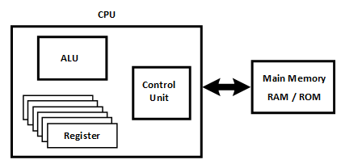

# Memory

## 이론

Flip-Flop practiced earlier can be said memory that stores one bit. 

Combining several flip-flops is called register. 

Therefore, if there is n-bit register, it can store n-bit data.

 

There are several registers in CPU of processor. 

The register stores the data and command that the CPU is currently processing. 

However, the registers can only store a few bits of information.

Big data to process means CPU needs more storage space, typically in megabytes or gigabytes, to keep up with its speed. 

It can also store programs or operating system process while CPU is working.

 

Memory that CPU frequently accesses while working is called main memory.

There are two main types of main memory, RAM and ROM.RAM stands for Random Access Memory, and ROM stands for Read-only Memory. 

ROM is read-only memory. 

You can read the contents of the memory but cannot write. 

Meanwhile, RAM allows both reading and writing data.

## [7-1. RAM](./7-1.RAM.md)

## [7-2. ROM](./7-2.ROM.md)
