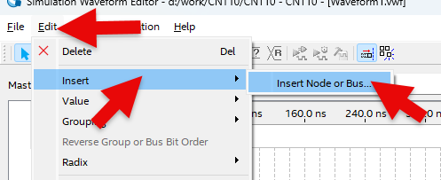
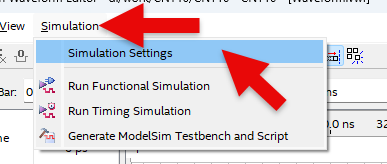

# Traffic Light Control 1
---

## MOD 10 COUNTER 

To control the traffic lights, let's design a 10-counter.

This is designed to change the traffic light values every 10 seconds.
10 count is a continuous counting of values from 0 to 9, such as 0 > 1 > 2 > ... > 9 > 0 > 1 ... by CLK.

Let's design and experiment with the circuit below.
 
This is MOD 10 counter using TTL 7490 performing COUNTER operation.
Truth table for the operation is as below.

 

 

Pin numbers connected to check on SACT equipment are as follows.

 

Truth table for the operation is as below.

||CLK||D3|D2|D1|D0|
|:-:|:-:|:-:|:-:|:-:|:-:|:-:|
|0|-||0|0|0|0|
|1|Falling Edge||0|0|0|1|
|2|Falling Edge||0|0|1|0|
|3|Falling Edge||0|0|1|1|
|4|Falling Edge||0|1|0|0|
|5|Falling Edge||0|1|0|1|
|6|Falling Edge||0|1|1|0|
|7|Falling Edge||0|1|1|1|
|8|Falling Edge||1|0|0|0|
|9|Falling Edge||1|0|0|1|
|10|Falling Edge||0|0|0|0|
|11|Falling Edge||0|0|0|1|

 

Pin numbers connected to check on SACT equipment are as follows.

|PORT NAME|CLK|
|:-:|:-:|
|HARDWARE|SW7|
|PIN NUMBER|W8|

|PORT NAME|D[3]|D[2]|D[1]|D[0]|
|:-:|:-:|:-:|:-:|:-:|
|HARDWARE|LED7|LED6|LED5|LED4|
|PIN NUMBER|W2|Y1|Y2|Y3|

 

 

### **Design**

> In the previous practice, we imported a project, designed only the logic circuit, and checked its operation.

> In project design, we will go through the entire process below in the actual Quartus software.

>Project Creating > Logic Design > Compile > Device & Pin Assignment > Compile > Simulation > Hardware Programming.

1. Select File > New Project Wizard in Quartus to create new project.

2. Set Directory, Name, and Top-Level Entry window as below.

    |Working Directory|d:\work\CNT10|
    |-|-|
    |project Name|CNT10|
    |Top Level Entry Name|CNT10|

      

3. Set Project Type to Empty project, and do not set Add File window.

4. In Family, Device&Board Setting window, first set Device Family/Package/Pin Count/Core speed grade as shown below, and then set Name.
    

    |Device Family|Cyclone 10 LP|
    |-|:-:|
    |Package|FBGA|
    Pin count|484|
    |Core Speed grade|8|
    |Available devices|10CL080YF484C8G|

      

>Be careful that if device name changes, programming is not possible.

5. Do not set ‘EDA Tool Settings’.
    
    Check Summary to confirm the current settings and click Finish to complete project creation.

      

6. Click File > New menu to open New window and select Block Diagram/Schematic File.

      

7. Right-click on the drawing and select Insert > Symbol menu (double-click on the drawing). Import input symbol, output symbol, gnd symbol, 7490 symbol and place them on the drawing.

      

8. Complete the drawing by modifying the names of input and output as shown below and connecting the symbols with wire.

      

9. Save. Set file name to the project name (default setting).

      
      

### **Compile**

10. Select Processing > Start Compilation menu to start compilation.
    
    This is the process of checking for errors in the design and synthesizing/ generating timing information / generating programming file.

      
      

### **Simulation**

11. Once compilation is complete, start simulation.

    Select File > New and select “University Program VWF” under Verification/Debugging Files in New window that appears.
    
      

12. In Simulation Waveform Editor window, select Edit > Insert > Insert Node or Bus.
      

13. Press Node Finder button, press List button (1) in Node Finder window, and press “>>” button (2) in Nodes Found. Then, click OK button to add input/output port to Simulation Waveform Editor window.

      
      
      
      

14. In Simulation Waveform Editor window, select CLK with the mouse (1), select entire input CLK and select [clock] icon above (2) to set Period to 50 ns.

      
      
      

15. SAVE. Leave the file name as default.

      

16. First set it up as below for simulation.
    
    Select Simulation > Simulation Setting menu and delete “ –novopt” in the window that appears.

      
      

    >If this “-novopt’ is not deleted, the following message will appear upon the simulation.

      

17. Select Simulation > Run Functional Simulation menu to run the simulation.
    
    Simulation results show that the counting is done at Falling Edge where CLK changes from 1 to 0.

     

### Device & Pin Assignment

18. After predicting the operation of designed logic circuit through simulation, let’s verify the operation of the hardware through equipment.

    To check the equipment, set the pins for the input/output ports.
 

19. Select Assignment > Device.

    In the Device Settings window that appears, click ‘Device and Pin Options’ button.

     
     
   
20. In ‘Device & Pin Option’ window, select “Unused Pins” category and set “Reserve all unused pins” to “As output driving ground”.

    It is because that default setting is “As input tri-stated with weak pull-up”, which causes the pins not set to be slightly pulled up, in High state.

    Since there are many elements such as LED configured in the equipment, if ‘As output driving ground’ is not set, unset LED may turn ON causing output result confusing. Therefore, it is recommended to set Unused Pin as ‘As output driving ground’.

      

21. Select Assignment > Pin Planner and set PIN number.

     
      

22. Set PIN number in Location as shown in the table below.
    
    If PIN number is set differently, it will be difficult to check the operation of the device.

|PORT NAME|CLK|
|:-:|:-:|
|HARDWARE|SW7|
|PIN NUMBER|W8|

|PORT NAME|D[3]|D[2]|D[1]|D[0]|
|:-:|:-:|:-:|:-:|:-:|
|HARDWARE|LED7|LED6|LED5|LED4|
|PIN NUMBER|W2|Y1|Y2|Y3|

  
  

23. After setting the pin, close the window and select Processing > Start Compilation menu to proceed with compilation.
    
    This is to create a programming file that includes Device option and Pin configuration information.

    
### **Check Hardware Operation**

24. Prepare SACT equipment. Connect USB cable and power cable and press the power switch to supply power to the device.

25. In Quartus software, select Tool > Programmer.

26. Check that USB Blaster is connected in Hardware Setup on Programmer window. Press Start button to program to check the operation on the device.

27. Press button switch and check MOD 10 counter operates.

|PORT NAME|CLK|
|:-:|:-:|
|HARDWARE|SW7|

|PORT NAME|D[3]|D[2]|D[1]|D[0]|
|:-:|:-:|:-:|:-:|:-:|
|HARDWARE|LED7|LED6|LED5|LED4|

  

 

