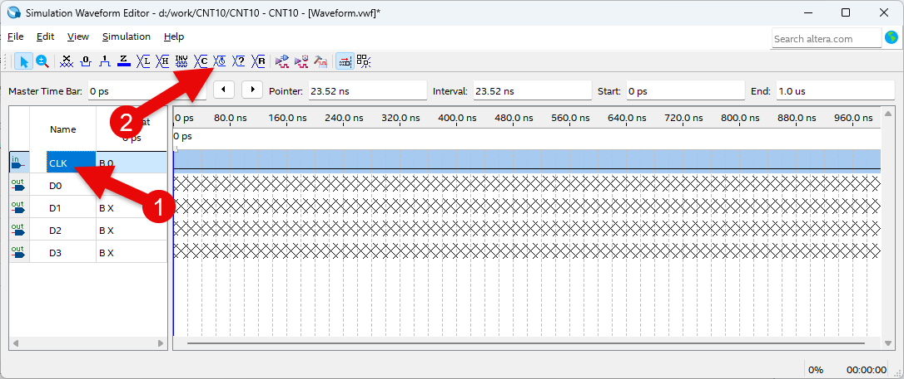
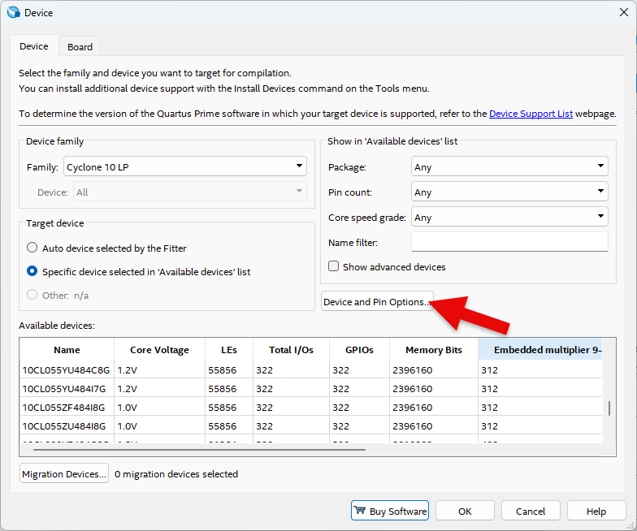

# Traffic Light Control 1
---

## MOD 10 COUNTER 

To control the traffic lights, let's design a 10-counter.

This is designed to change the traffic light values every 10 seconds.
10 count is a continuous counting of values from 0 to 9, such as 0 > 1 > 2 > ... > 9 > 0 > 1 ... by CLK.

Let's design and experiment with the circuit below.
 
This is MOD 10 counter using TTL 7490 performing COUNTER operation.
Truth table for the operation is as below.

 

 

Pin numbers connected to check on SACT equipment are as follows.

 

동작에 대한 진리표는 다음과 같다. 

||CLK||D3|D2|D1|D0|
|:-:|:-:|:-:|:-:|:-:|:-:|:-:|
|0|-||0|0|0|0|
|1|Falling Edge||0|0|0|1|
|2|Falling Edge||0|0|1|0|
|3|Falling Edge||0|0|1|1|
|4|Falling Edge||0|1|0|0|
|5|Falling Edge||0|1|0|1|
|6|Falling Edge||0|1|1|0|
|7|Falling Edge||0|1|1|1|
|8|Falling Edge||1|0|0|0|
|9|Falling Edge||1|0|0|1|
|10|Falling Edge||0|0|0|0|
|11|Falling Edge||0|0|0|1|

 

SACT 장비에서 확인하기 위하여 연결된 장치와 장비에 연결된 핀 번호는 다음과 같다. 

|PORT NAME|CLK|
|:-:|:-:|
|HARDWARE|SW7|
|PIN NUMBER|W8|

|PORT NAME|D[3]|D[2]|D[1]|D[0]|
|:-:|:-:|:-:|:-:|:-:|
|HARDWARE|LED7|LED6|LED5|LED4|
|PIN NUMBER|W2|Y1|Y2|Y3|

 

 

### **설계**

>이전의 실습에서는 프로젝트를 불러와서 논리 회로만 설계하고, 그 동작만 확인하는 과정을 진행했었다. 

>프로젝트 설계에서는 실제 Quartus 소프트웨어에서 프로젝트를 생성 > Logic Design > Compile > Device & Pin Assignment > Compile > Simulation > Hardware Programming 의 과정을 모두 만드는 과정을 진행할 것이다. 

> 이 과정에 대한 자세한 부분은 Getting Started 절의 내용을 참고하기 바란다. 

1. 실험을 위해 Quartus의 File > New Project Wizard 메뉴를 선택하여 새 프로젝트 생성한다. 

2. Directory, Name, Top-Level Entry 창을 다음과 같이 설정한다. 

    |Working Directory|d:\work\CNT10|
    |-|-|
    |project Name|CNT10|
    |Top Level Entry Name|CNT10|

      

3. Project Type을 Empty project로 설정하고, Add File 창은 별다른 설정을 하지 않는다. 

4. Family, Device & Board Setting 창에서 먼저 아래와 같이 Device Family/Package /Pin Count/Core speed grade를 설정하고, Name를 설정한다. 
    

    |Device Family|Cyclone 10 LP|
    |-|:-:|
    |Package|FBGA|
    Pin count|484|
    |Core Speed grade|8|
    |Available devices|10CL080YF484C8G|

      

>디바이스의 Name이 달라지면, Programming이 되지 않기 때문에 주의해야 한다. 

5. EDA Tool Settings도 별다른 설정을 하지 않는다. 

    Summary를 확인해 지금 설정된 내용을 확인한 후, Finish를 눌러 프로젝트 생성을 마친다. 

      

6. File > New 메뉴를 눌러서 New 창을 불러온 후, Block Diagram/Schematic File을 선택한다.

      

7. 도면에서 마우스의 오른쪽 버튼을 눌러 Insert > Symbol 메뉴를 선택(도면을 마우스로 더블 클릭 해도 됨.)하여 input 심볼과 output 심볼, gnd 심볼 그리고 7490 심볼을 불러와서, 도면에 배치한다. 

      

8. 다음 그림과 같이 input과 output의 이름을 수정하고, 심볼 사이를 wire로 연결하여 도면을 완성시킨다. 

      

9. Save 한다. 이 때, 파일명을 Project 명(기본 설정)으로 설정한다. 

      
      

### **컴파일**

10. Processing > Start Compilation 메뉴를 선택하여, 컴파일을 진행한다. 

    설계된 부분의 오류가 있는지를 검사하고, 합성 / 타이밍 정보 생성 / 프로그래밍 파일 생성 을 하는 과정이다. 

      
      

### **시뮬레이션**

11. 컴파일이 완료되면 시뮬레이션을 진행한다. 

    File > New 메뉴를 선택하고, 나타나는 New 창에서 Verification/Debugging Files 항목의 University Program VWF 항목을 선택한다. 
    
      

12. Simulation Waveform Editor창에서 Edit > Insert > Insert Node or Bus 메뉴를 선택한다. 
      

13. Node Finder 버튼을 누르고, Node Finder 창에서 List 버튼(1)을 누르고, Nodes Found에서 >> (2) 버튼을 누른다. 그리고, OK 버튼을 눌러 Simulation Waveform Editor 창에 입출력 포트를 추가한다. 

      
      
      
      

14. Simulation Waveform Editor창에서 CLK 부분을 마우스로 선택(1)하여 입력 CLK의 전체를 선택한 후, 위의 [clock] 아이콘을 선택(2)하여 Period를 50ns로 설정한다.

      
      
      

15. SAVE를 한다. 파일명은 기본 상태 그대로 놓는다. 

      

16. 시뮬레이션을 해야 하는데, 먼저 아래와 같이 설정한다. 

    Simulation > Simulation Setting 메뉴를 선택하여, 나타나는 창에서 -novopt 부분을 지운다. 

      
      

    >이 -novopt를 제거하지 않으면, 시뮬레이션을 진행했을 때 아래와 같은 메시지가 나타난다. 

      

17. Simulation > Run Functional Simulation 메뉴를 선택하여 시뮬레이션을 진행한다. 

    시뮬레이션 결과를 보면 CLK가 1에서 0으로 되는 Falling Edge에 카운트되는 것을 확인할 수 있다. 

     

### Device & Pin Assignment

18. 시뮬레이션을 통해 설계된 논리 회로의 동작을 예상해 보았다면, 장비를 통해서 하드웨어의 동작을 확인해 보아야 한다. 

    장비를 확인하기 위해서, 입출력 포트에 대한 핀을 설정해 주어야 한다. 
 

19. 먼저 Assignment > Device 항목을 선택한다. 

    나타난 Device 설정 창에서 Device and Pin Options 버튼을 누른다. 

     
     
   
20. Device & Pin Option 창에서 Unused Pins 카테고리를 선택하고, Reserve all unused pins를 As output driving ground로 설정한다. 

    이렇게 하는 이유는 기본 설정 값이 As input tri-stated with weak pull-up 인데, 이렇게 할 때 설정하지 않은 핀들이 약간의 pull-up 상태 즉 High의 상태가 된다. 

    장비에 구성된 LED등의 요소가 많기 때문에, As output driving ground로 설정하지 않으면 설정하지 않은 LED에 ON되어 출력된 결과에 혼동이 올 수 있다. 그래서 왠만하면 Unused Pin을 As output driving ground로 설정 해 주는 것이 좋다. 

      

21. Assignment > Pin Planner 메뉴를 선택하여 핀 번호를 설정한다. 

     
      

22. 핀 번호는 Location 부분에 아래 표와 같이 핀 번호를 설정해 주면 된다. 

    핀 번호를 다르게 설정하면, 장비에서 동작을 확인하기 어렵기 때문에 핀 번호를 일치시켜 줘야 한다. 

|PORT NAME|CLK|
|:-:|:-:|
|HARDWARE|SW7|
|PIN NUMBER|W8|

|PORT NAME|D[3]|D[2]|D[1]|D[0]|
|:-:|:-:|:-:|:-:|:-:|
|HARDWARE|LED7|LED6|LED5|LED4|
|PIN NUMBER|W2|Y1|Y2|Y3|

  
  

23. 핀 설정 후 창을 닫고, Processing > Start Compilation 메뉴를 선택하여 컴파일을 진행한다. 

    이것은 최종적으로 설정한 Device 옵션과 핀 설정 정보를 포함한 프로그래밍 파일을 만들기 위한 것이다. 

    
### **하드웨어 동작 확인**

24. SACT 장비를 준비한다. USB 케이블과 파워 케이블을 연결하고, 전원 스위치를 눌러 장비에 전원을 인가시킨다. 

25. Quartus 소프트웨어에서 Tool > Programmer 메뉴를 선택한다.

26. Programmer창의 Hardware Setup이 USB Blaster가 연결되어 있는지 확인하고, Start 버튼을 눌러 프로그래밍 하고 장비에서 동작을 확인한다. 

 

27. 버튼 스위치를 눌러 MOD 10 카운터가 동작하는 것을 확인해 보자.

|PORT NAME|CLK|
|:-:|:-:|
|HARDWARE|SW7|

|PORT NAME|D[3]|D[2]|D[1]|D[0]|
|:-:|:-:|:-:|:-:|:-:|
|HARDWARE|LED7|LED6|LED5|LED4|

  

 

