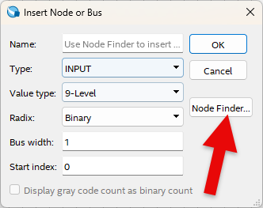
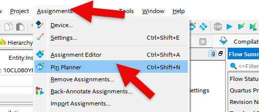

# Traffic Light Control 2
---

## 4bit Comparator 

Traffic light control is described below.

[Traffic lights on the road]

   |SEC|RED|YELLOW|LEFT|GREEN|
   |:-:|:-:|:-:|:-:|:-:|
   |0|OFF|OFF|ON|ON|
   |1|OFF|OFF|ON|ON|
   |2|OFF|OFF|ON|ON|
   |3|OFF|OFF|ON|ON|
   |4|OFF|OFF|ON|ON|
   |5|OFF|OFF|ON|ON|
   |6|OFF|ON|OFF|OFF|
   |7|OFF|ON|OFF|OFF|
   |8|OFF|ON|OFF|OFF|
   |9|OFF|ON|OFF|OFF|

 

[Traffic lights on the crosswalk]

   |SEC|RED|GREEN|
   |:-:|:-:|:-:|
   |0|OFF|ON|
   |1|OFF|ON|
   |2|OFF|ON|
   |3|OFF|ON|
   |4|OFF|ON|
   |5|OFF|ON|
   |6|OFF|Flashing|
   |7|OFF|Flashing|
   |8|OFF|Flashing|
   |9|OFF|Flashing|

 

Comparator is required to output data when each second is counted. 

BCD data from 0 to 9 has a total of 4-bit data lines and 4-bit comparator is required.

This comparator will be designed using 2-bit comparator COMP2 designed in the previous Combination Logic.

 

When comparing the input of 4-bit data A and B, if the values are the same, High(1) is output to value EQ. If value A is greater, High(1) is output to value LA. If value B is greater, value High(1) is output to LB.

 

Devices connected to check in SACT equipment are as below.

|PORT NAME|A[3]|A[2]|A[1]|A[0]|
|:-:|:-:|:-:|:-:|:-:|
|HARDWARE|S7|S6|S5|S4|
|PIN NUMBER|Y6|W7|AB6|AA7|

|PORT NAME|B[3]|B[2]|B[1]|B[0]|
|:-:|:-:|:-:|:-:|:-:|
|HARDWARE|S3|S2|S1|S0|
|PIN NUMBER|Y7|V8|AB7|Y8|

|PORT NAME|EQ|LA|LB|
|:-:|:-:|:-:|:-:|
|HARDWARE|LED7|LED6|LED5|
|PIN NUMBER|W2|Y1|Y2|Y3|

 

 

### **Design**

1. Select File > New Project Wizard in Quartus to create new project.

2. Set Directory, Name, and Top-Level Entry window as below.

    |Working Directory|d:\work\COMP4|
    |-|-|
    |project Name | COMP4|
    |Top Level Entry Name | COMP4|

3. Set Project Type to Empty project, and do not set Add File window.

4. In Family, Device&Board Setting window, first set Device Family/Package/Pin Count/Core speed grade as shown below, and then set Name.

    |Device Family|Cyclone 10 LP|
    |-|:-:|
    |Package|FBGA|
    Pin count|484|
    |Core Speed grade|8|
    |Available devices|10CL080YF484C8G|

      

>Be careful that if device name changes, programming is not possible.

5. Do not set ‘EDA Tool Settings’.

    Check Summary to confirm the current settings and click Finish to complete project creation.

6. To utilize the previously created COMP2 drawing, copy COMP2.bdf file from the previous 2-bit comparator project directory, COMP2, to the current project directory, COMP4.

>COMP2 is a separately created circuit and it must be included in the project folder. If not, error message that there is no file when compiling will come out.

 
      
      

7. Import copied COMP2.bdf file through File > Open.

      

8. Select File > Create / Update > Create Symbol Files for Current File shown below and create a symbol file for the currently imported logic circuit. 
    
    This is because symbol must be used when designing a logic circuit using Schema.

      

9. Click File > New to open New window and select Block Diagram/Schematic File.

      

10. Right-click on the drawing and select Insert > Symbol (double-click on the drawing). Import input symbol, output symbol, COMP2 symbol and place them on the drawing.

      

11. Complete the drawing by modifying the names of input and output and connecting the symbols with wire.
 
      

12. Save. At this time, set the file name to Project name (default setting, COMP4).

### **Compile**

13. Select Processing > Start Compilation menu to start compilation.

    This is the process of checking for errors in the design and synthesizing/ generating timing information / generating programming file.

### **Simulation**

14. Once compilation is complete, start simulation.

    Select File > New and select “University Program VWF” under Verification/Debugging Files in New window that appears.
    

15. In Simulation Waveform Editor window, select Edit > Insert > Insert Node or Bus.

16. Press Node Finder button, press List button (1) in Node Finder window, and press “>>” button (2) in Nodes Found. Then, click OK button to add input/output port to Simulation Waveform Editor window.

      
      
      
      

17. In Simulation Waveform Editor window, select data A with the mouse (1), select icon C (2) above and set ‘Count every’ to 100ns to set value A as data that counts 1 every 100ns.

      
      

18. In Simulation Waveform Editor window, select data A with the mouse (1), and select icon ? (2) to set data B to 0110.

      
      

19. SAVE. Leave the file name as default.

20. Before simulating, select Simulation > Simulation Setting and delete “ -novopt ” in the window that appears.

      
      

>If this “-novopt’ is not deleted, the following message will appear upon the simulation.

     

21. Select Simulation > Run Functional Simulation menu to run the simulation.

    When A and B are the same, High is output to EQ. If value A is greater than B, High is output to LA. If value B is greater than A, High is output to LB.
 

     

### Device & Pin Assignment

22. After predicting the operation of designed logic circuit through simulation, let’s verify the operation of the hardware through equipment.

    To check the equipment, set the pins for the input/output ports.

 

23. Select Assignment > Device.

    In the Device Settings window that appears, click ‘Device and Pin Options’ button.

     
     
   
24. In ‘Device & Pin Option’ window, select “Unused Pins” category and set “Reserve all unused pins” to “As output driving ground”.

    It is because that default setting is “As input tri-stated with weak pull-up”, which causes the pins not set to be slightly pulled up, in High state.

    Since there are many elements such as LED configured in the equipment, if ‘As output driving ground’ is not set, unset LED may turn ON causing output result confusing. Therefore, it is recommended to set Unused Pin as ‘As output driving ground’.

      

25. Select Assignment > Pin Planner and set PIN number.
 
     
      

26. Set PIN number in Location as shown in the table below.
    
    If PIN number is set differently, it will be difficult to check the operation of the device.

|PORT NAME|A[3]|A[2]|A[1]|A[0]|
|:-:|:-:|:-:|:-:|:-:|
|HARDWARE|S7|S6|S5|S4|
|PIN NUMBER|Y6|W7|AB6|AA7|

|PORT NAME|B[3]|B[2]|B[1]|B[0]|
|:-:|:-:|:-:|:-:|:-:|
|HARDWARE|S3|S2|S1|S0|
|PIN NUMBER|Y7|V8|AB7|Y8|

|PORT NAME|EQ|LA|LB|
|:-:|:-:|:-:|:-:|
|HARDWARE|LED7|LED6|LED5|
|PIN NUMBER|W2|Y1|Y2|Y3|

    

   

 
      

27. After setting the pin, close the window and select Processing > Start Compilation menu to proceed with compilation.
    
    This is to create a programming file that includes Device option and Pin configuration information finally set.

    
### **Check Hardware Operation**

28. Prepare SACT equipment. Connect USB cable and power cable and press the power switch to supply power to the device.

29. In Quartus software, select Tool > Programmer.

30. Check that USB Blaster is connected in Hardware Setup on Programmer window. Press Start button to program and check the operation on the device.

31. Move slide switch, compare the data of A and B and check the result on LED.

|PORT NAME|A[3]|A[2]|A[1]|A[0]|
|:-:|:-:|:-:|:-:|:-:|
|HARDWARE|S7|S6|S5|S4|

|PORT NAME|B[3]|B[2]|B[1]|B[0]|
|:-:|:-:|:-:|:-:|:-:|
|HARDWARE|S3|S2|S1|S0|

|PORT NAME|EQ|LA|LB|
|:-:|:-:|:-:|:-:|
|HARDWARE|LED7|LED6|LED5|

    

 

 

