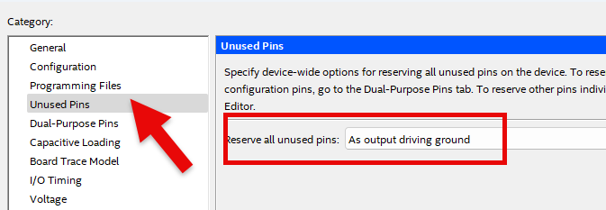

# Traffic Light Control 3
---

## One-Way Traffic Light Control

Let's design one-way traffic light controller using MOD 10 counter and 4-bit comparator practiced previously.

Traffic light control is described below.

[Traffic lights on the road]

   |SEC|RED|YELLOW|LEFT|GREEN|
   |:-:|:-:|:-:|:-:|:-:|
   |0|OFF|OFF|ON|ON|
   |1|OFF|OFF|ON|ON|
   |2|OFF|OFF|ON|ON|
   |3|OFF|OFF|ON|ON|
   |4|OFF|OFF|ON|ON|
   |5|OFF|OFF|ON|ON|
   |6|OFF|ON|OFF|OFF|
   |7|OFF|ON|OFF|OFF|
   |8|OFF|ON|OFF|OFF|
   |9|OFF|ON|OFF|OFF|

 

[Traffic lights on the crosswalk]

   |SEC|RED|GREEN|
   |:-:|:-:|:-:|
   |0|OFF|ON|
   |1|OFF|ON|
   |2|OFF|ON|
   |3|OFF|ON|
   |4|OFF|ON|
   |5|OFF|ON|
   |6|OFF|Flashing|
   |7|OFF|Flashing|
   |8|OFF|Flashing|
   |9|OFF|Flashing|

  

 
 

- It receives input of CLK which is 1-second clock and counts 10 seconds in CNT10.
- SET value is set to 0110(6).
- Compare SETTING value 6 with data in CNT10 in 4-bit comparator.
- GREEN on the road becomes ON when T value on LEFT is 0 ~ 5.
- YELLOW on the road becomes ON when T value is 6 ~ 9.
- GREEN on the crosswalk turns ON when 0~5, and becomes Flashing when 6~9.  
- RED used on the road and on the crosswalk is not used in the circuit and is controlled in the final logic circuit.

 

Devices connected to check in SACT equipment and pin numbers are as below.

|PORT NAME|CLK|
|:-:|:-:|
|HARDWARE|Main Clock|
|PIN NUMBER|G2|

|PORT NAME|C_GREEN|C_LEFT|C_YELLOW|W_GREEN|
|:-:|:-:|:-:|:-:|:-:|
|HARDWARE|N_C_G|N_C_L|N_C_Y|E_W_G|
|PIN NUMBER|W22|V22|Y21|Y17|

 

 

### **설계**

1. Select File > New Project Wizard in Quartus to create new project.

2. Set Directory, Name, and Top-Level Entry window as below.

    |Working Directory|d:\work\TC|
    |-|-|
    |project Name |TC|
    |Top Level Entry Name | TC|

3. In Family, Device&Board Setting window, set Device Family/Package/Pin Count/Core speed grade as shown below, and then set Name.

    |Device Family|Cyclone 10 LP|
    |-|:-:|
    |Package|FBGA|
    Pin count|484|
    |Core Speed grade|8|
    |Available devices|10CL080YF484C8G|

      

>Be careful that if device name changes, programming is not possible.

4. Check Summary, confirm the current settings and click Finish to complete project creation.

5. To use the previously created COMP 10 counter, copy CNT10.bdf file in the CNT10 project to the current project directory TC.

6. Import CNT10.bdf file in File > Open, select File > Create / Update > Create Symbol Files for Current File and create COMP10 symbol.

7. To use the previously created 4-bit comparator, copy COMP2.bdf, COMP2.bsf, COMP4.bdf file in COMP4 project to the current project directory TC.

8. Import COMP4.bdf file in File > Open and select File > Create / Update > Create Symbol Files for Current File and create COMP4 symbol.

>Since CNT10, COMP4, COMP2 are separately created circuits, they must be included in the project folder. If not, error message that there is no file when compiling will come out.

9. Click File > New to open New window and select Block Diagram/Schematic File.

      

10. Right-click on the drawing and select Insert > Symbol (double-click on the drawing). Import input symbol, output symbol, COMP4 symbol and COMP10 symbol created previously and place them on the drawing.

      

11. Complete the drawing by modifying the names of input and output, adding more symbols, and connecting the symbols with wire.

    For 0110 data to be compared, import vcc symbol and gnd symbol and place SET[3], SET[2], SET[1], SET[0].

     
      

12. Save. At this time, set the file name to Project name (default setting, TC).

### **Compile**

13. Select Processing > Start Compilation menu to start compilation.

    This is the process of checking for errors in the design and synthesizing/ generating timing information / generating programming file.

### **Simulation**

14. Once compilation is complete, start simulation.

    Select File > New and select “University Program VWF” under Verification/Debugging Files in New window that appears.
    

15. In Simulation Waveform Editor window, select Edit > Insert > Insert Node or Bus.

      

16. Press Node Finder button, press List button in Node Finder window, and press “>>” button in Nodes Found. Then, click OK button to add input/output port to Simulation Waveform Editor window.

17. In Simulation Waveform Editor window, select CLK with the mouse to select the entire input CLK and select [clock] icon above to set the Period to 50 ns.
 

      

18. SAVE. Leave the file name as default.

19. Before simulating, select Simulation > Simulation Setting and delete “ -novopt ” in the window that appears.

      
      

>If this “-novopt’ is not deleted, the following message will appear upon the simulation.

     

20. Select Simulation > Run Functional Simulation menu to run simulation.

    Result shows that counting is done at Falling Edge where CLK changes from 1 to 0.

     

### Device & Pin Assignment

21. After predicting the operation of designed logic circuit through simulation, let’s verify the operation of the hardware through equipment.

    To check the equipment, set the pins for the input/output ports.

 

22. Select Assignment > Device.

    Click ‘Device and Pin Options’ button in Device Settings window that appears.

     
     
   
23. In ‘Device & Pin Option’ window, select “Unused Pins” category and set “Reserve all unused pins” to “As output driving ground”.
    
    It is because that default setting is “As input tri-stated with weak pull-up”, which causes the pins not set to be slightly pulled up, in High state.
    
    Since there are many elements such as LED configured in the equipment, if ‘As output driving ground’ is not set, unset LED may turn ON causing output result confusing. Therefore, it is recommended to set Unused Pin as ‘As output driving ground’.

      

24. Select Assignment > Pin Planner and set PIN number.

     
      

25. Set PIN number in Location as shown in the table below.

    If PIN number is set differently, it will be difficult to check the operation of the device.

|PORT NAME|CLK|
|:-:|:-:|
|HARDWARE|Main Clock|
|PIN NUMBER|G2|

|PORT NAME|C_GREEN|C_LEFT|C_YELLOW|W_GREEN|
|:-:|:-:|:-:|:-:|:-:|
|HARDWARE|N_C_G|N_C_L|N_C_Y|E_W_G|
|PIN NUMBER|W22|V22|Y21|Y17|

 

26. After setting the pin, close the window and select Processing > Start Compilation menu to proceed with compilation.

    This is to create a programming file that includes Device option and Pin configuration information finally set.

  
    
### **Check Hardware Operation**

27. Prepare SACT equipment. Connect USB cable and power cable and press the power switch to supply power to the device.

28. In Quartus software, select Tool > Programmer.

29. Check that USB Blaster is connected in Hardware Setup on Programmer window. Press Start button to program and check the operation on the device.

 

30. Set to 1Hz by turning CLOCK SELECT SWITCH in CLOCK setting block in the center of the equipment and check traffic light operation.

 

|PORT NAME|CLK|
|:-:|:-:|
|HARDWARE|Main Clock|

|PORT NAME|C_GREEN|C_LEFT|C_YELLOW|W_GREEN|
|:-:|:-:|:-:|:-:|:-:|
|HARDWARE|N_C_G|N_C_L|N_C_Y|E_W_G|

 

 

