# Traffic Light Control 4
---

## Four-Way Traffic Light Control

Let's design four-way traffic light using the previous one-way traffic light.

  

Four-way traffic light control circuit can be designed using the previously designed logic circuit as below.

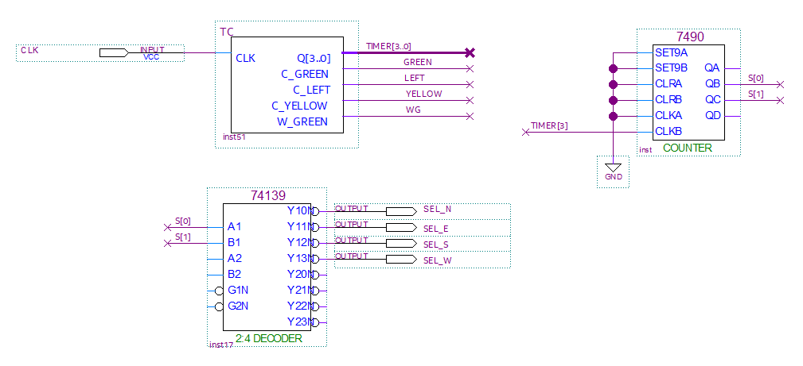
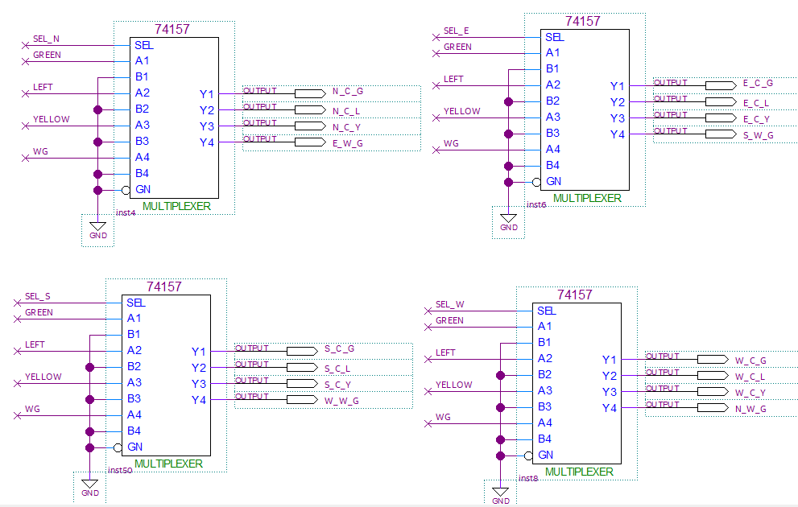
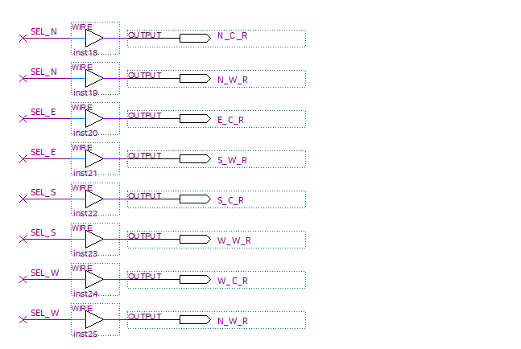

  

[Timer and State block]

  

- Logic circuit of TRAFFIC for traffic light on the road that practiced previously was used.    
    
    GREEN, LEFT, YELLOW lights on the road and GREEN light on the crosswalk are controlled by input of CLOCK with a cycle of 1 second.

- 7490 is counted by TIMER[3] is Falling Edge. That is, every time TRAFFIC counts from 0 to 9, 7490 is counted and S[1..0] counts as 00, 01, 10, 11.

- It is configured for values of S[1..0] to change State of SEL_N, SEL_E, SEL_S, SEL_W using 74139 decoder.

 
 

[Data Transmission Block by State]

    

- 4-bit MULTIPLEXER called 74157 was used.

- It controls LEDs on the road and sidewalk of the intersection traffic light, and output signal of TRAFFIC is transmitted by signals of SEL_N, SEL_E, SEL_S, SEL_W.

    
[RED LED Control]

    

- Block that controls RED LED on the road and crosswalk.
- It is configured so that RED LED turn ON when not selected by signals SEL_N, SEL_E, SEL_S, and SEL_W. 

 

Traffic light control is defined by distinguishing as shown below.

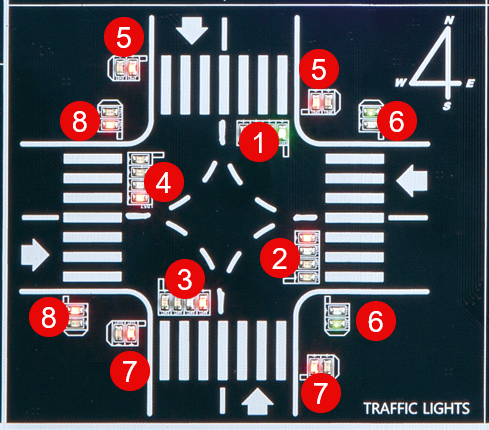 

CROSS indicates traffic light on the road, and WALK indicates traffic light on the sidewalk.

|1|2|3|4|
|:-:|:-:|:-:|:-:|
|NORTH_CROSS|EAST_CROSS|SOUTH_CROSS|WEST_CROSS|
|5|6|7|8|
|NORTH_WALK|EAST_WALK|SOUTH_WALK|WEST_WALK|

Traffic light on the road consists of four traffic lights as shown below.

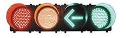 

|RED|YELLOW|LEFT|GREEN|
|-|-|-|-|

Traffic lights on the sidewalk consist of two signals as shown below.

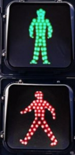 

|GREEN|RED|
|-|-|

 

Define the name as shown in the table below depending on the location and the role of each traffic light on the road and on the crosswalk. Set the pin number when applied to the equipment as shown in the table.

>Since it is configured in hardware, if the pin number is different from the one below, error may occur.

 

|PORT NAME|CLK|
|:-:|:-:|
|HARDWARE|Main Clock|
|PIN NUMBER|G2|

|PORT NAME|N_C_G|N_C_L|N_C_Y|N_C_R|N_W_G|N_W_R|
|:-:|:-:|:-:|:-:|:-:|:-:|:-:|
|PIN NUMBER|W22|V22|Y21|W19|V21|W21|

|PORT NAME|E_C_G|E_C_L|E_C_Y|E_C_R|E_W_G|E_W_R|
|:-:|:-:|:-:|:-:|:-:|:-:|:-:|
|PIN NUMBER|T16|V16|AB16|W17|Y17|U17|

|PORT NAME|S_C_G|S_C_L|S_C_Y|S_C_R|S_W_G|S_W_R|
|:-:|:-:|:-:|:-:|:-:|:-:|:-:|
|PIN NUMBER|AB18|AB19|AB20|AA22|AA16|U16|

|PORT NAME|W_C_G|W_C_L|W_C_Y|W_C_R|W_W_G|W_W_R|
|:-:|:-:|:-:|:-:|:-:|:-:|:-:|
|PIN NUMBER|AA18|AA19|AA20|AA21|W20|Y22|

    

   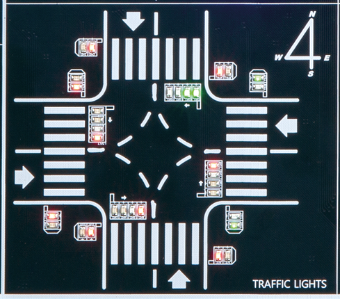

 

### **Design**

1. Select File > New Project Wizard in Quartus to create new project.

2. Set Directory, Name, and Top-Level Entry window as below.

    |Working Directory|d:\work\TRAFFIC|
    |-|-|
    |project Name |TRAFFIC|
    |Top Level Entry Name | TRAFFIC|

3. In Family, Device&Board Setting window, set Device Family/Package/Pin Count/Core speed grade as shown below, and then set Name.

    |Device Family|Cyclone 10 LP|
    |-|:-:|
    |Package|FBGA|
    Pin count|484|
    |Core Speed grade|8|
    |Available devices|10CL080YF484C8G|

>Be careful that if device name changes, programming is not possible.

4. Check Summary, confirm the current settings and click Finish to complete project creation.

5. To use the previously created TC, copy TC.bdf, COMP2.bdf, COMP2.bsf, COMP4.bdf, comp4.bsf, CNT10.bdf, CNT10.bsf file in TC project to the current project directory TRAFFIC.

>TC.bdf file contains other symbols but copy these files because they must be in the project directory when compiled to avoid error.

6. Import TC.bdf file in File > Open, select File > Create / Update > Create Symbol Files for Current File and create TC symbol.   

7. Click File > New to open New window and select Block Diagram/Schematic File.

8. Right-click on the drawing and select Insert > Symbol (double-click on the drawing). Import input symbol, output symbol, TC symbol created previously and place them on the drawing.

9. Complete the drawing by modifying the names of input and output, adding more symbols, and connecting the symbols with wire.

    
    
    

10. Save. At this time, set the file name to Project name (default setting, TRAFFIC).

### **Compile**

11. Select Processing > Start Compilation menu to start compilation.

    This is the process of checking for errors in the design and synthesizing/ generating timing information / generating programming file.

### **Simulation**

12. Once compilation is complete, start simulation.

    Select File > New and select “University Program VWF” under Verification/Debugging Files in New window that appears.
    
13. In Simulation Waveform Editor window, select Edit > Insert > Insert Node or Bus.

 
    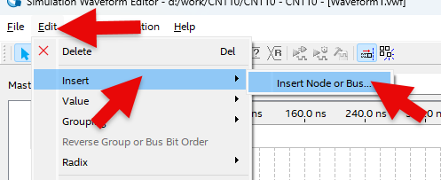  

14. Press Node Finder button, press List button in Node Finder window, and press “>>” button in Nodes Found. Then, click OK button to add input/output port to Simulation Waveform Editor window.

15. To increase the simulation time, select Edit > Set End Time and change End time to 10us.
 
    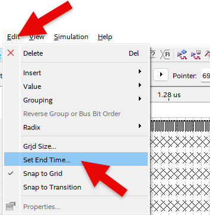  
    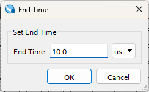  

16. In Simulation Waveform Editor window, select CLK with the mouse to select the entire input CLK, then select [clock] icon above to set Period to 100 ns.

    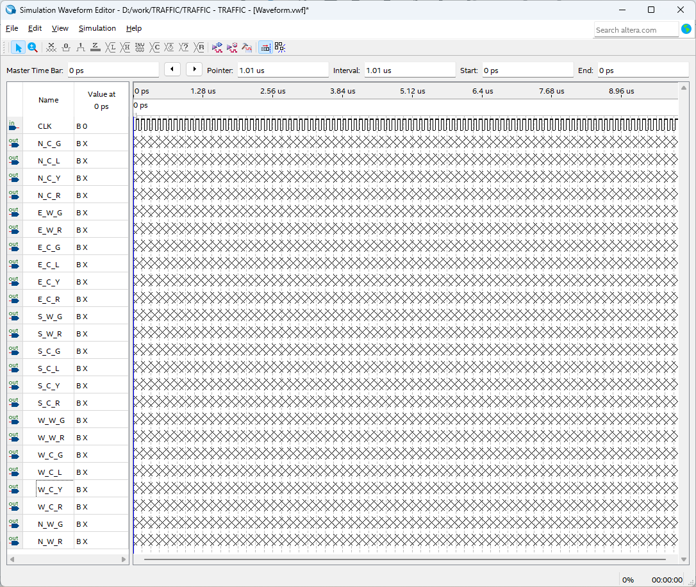  

17. SAVE. Leave the file name as default.

19. Before simulating, select Simulation > Simulation Setting and delete “ -novopt ” in the window that appears.

    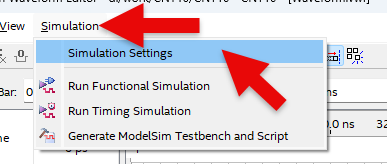  
      

>If this “-novopt’ is not deleted, the following message will appear upon the simulation.

   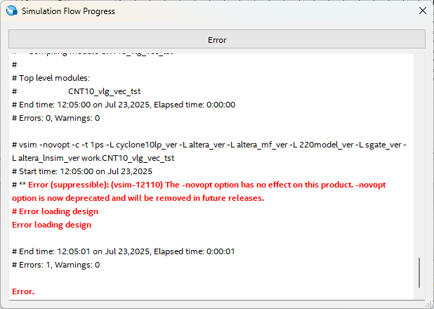  

20. Select Simulation > Run Functional Simulation menu to run simulation.

    Result shows that clock is generated and the values are transmitted in the order of N -> E -> S -> W -> N at certain intervals by the clock and output.

   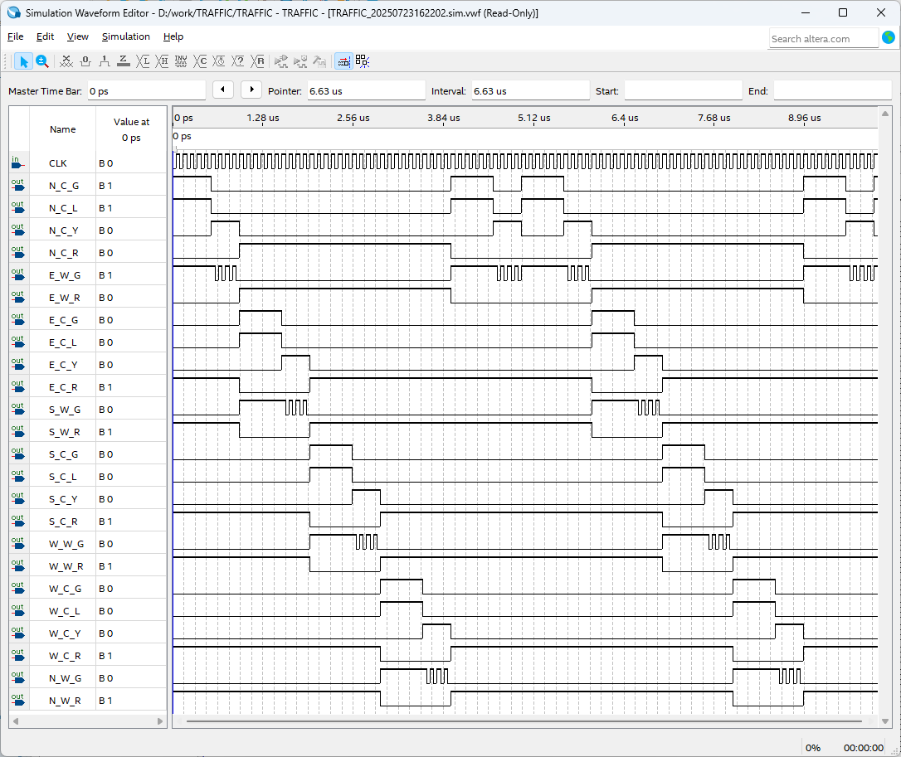  

### Device & Pin Assignment

21. After predicting the operation of designed logic circuit through simulation, let’s verify the operation of the hardware through equipment.

    To check the equipment, set the pins for the input/output ports.

22. Select Assignment > Device.

    Click ‘Device and Pin Options’ button in Device Settings window that appears.
 
   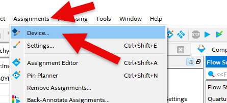  
   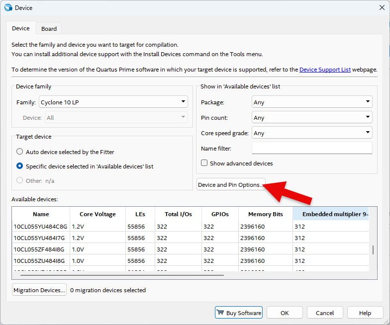  
   
23. In ‘Device & Pin Option’ window, select “Unused Pins” category and set “Reserve all unused pins” to “As output driving ground”.
    
    It is because that default setting is “As input tri-stated with weak pull-up”, which causes the pins not set to be slightly pulled up, in High state.
    
    Since there are many elements such as LED configured in the equipment, if ‘As output driving ground’ is not set, unset LED may turn ON causing output result confusing. Therefore, it is recommended to set Unused Pin as ‘As output driving ground’.

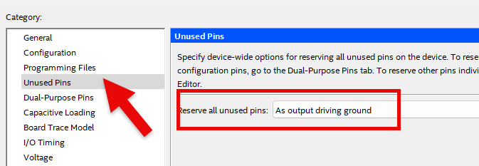  

24. Select Assignment > Pin Planner and set PIN number.

     
    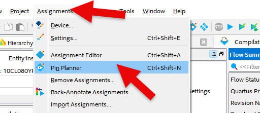  

25. Set PIN number in Location as shown in the table below.

    If PIN number is set differently, it will be difficult to check the operation of the device.

|PORT NAME|CLK|
|:-:|:-:|
|HARDWARE|Main Clock|
|PIN NUMBER|G2|

|PORT NAME|N_C_G|N_C_L|N_C_Y|N_C_R|N_W_G|N_W_R|
|:-:|:-:|:-:|:-:|:-:|:-:|:-:|
|PIN NUMBER|W22|V22|Y21|W19|V21|W21|

|PORT NAME|E_C_G|E_C_L|E_C_Y|E_C_R|E_W_G|E_W_R|
|:-:|:-:|:-:|:-:|:-:|:-:|:-:|
|PIN NUMBER|T16|V16|AB16|W17|Y17|U17|

|PORT NAME|S_C_G|S_C_L|S_C_Y|S_C_R|S_W_G|S_W_R|
|:-:|:-:|:-:|:-:|:-:|:-:|:-:|
|PIN NUMBER|AB18|AB19|AB20|AA22|AA16|U16|

|PORT NAME|W_C_G|W_C_L|W_C_Y|W_C_R|W_W_G|W_W_R|
|:-:|:-:|:-:|:-:|:-:|:-:|:-:|
|PIN NUMBER|AA18|AA19|AA20|AA21|W20|Y22|

    

   

  

26. After setting the pin, close the window and select Processing > Start Compilation menu to proceed with compilation.
    
    This is to create a programming file that includes Device option and Pin configuration information finally set.

    
### **Checkm Hardware Operation**

27. Prepare SACT equipment. Connect USB cable and power cable and press the power switch to supply power to the device.

28. In Quartus software, select Tool > Programmer.

29. Check that USB Blaster is connected in Hardware Setup on Programmer window. Press Start button to program and check the operation on the device.

30. Set to 1Hz by turning CLOCK SELECT SWITCH in CLOCK setting block in the center of the equipment and check traffic light operation.

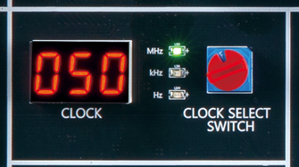  

 

 

 

## Application Design

31. Let's design various operation of traffic light. Try to design a circuit that all yellow lights blink upon specific signal input.

