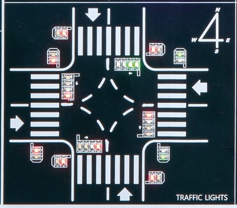

# Traffic Light Control
---

## 기획

이 절에서는 그동안 실습하였던 GATE에 대한 동작 내용을 응용하여 신호등 제어하는 예제를 진행하려고 한다. 

 

 

장비에 응용 회로를 제어하도록 신호등이 구성되어 있다. 

국내에서 주로 보이는 네거리 신호등의 형식이다. 

 

동작에 대한 사항은 다음과 같다. 

1. 신호등은 네거리에 있는 차도의 신호등과 횡단보도의 신호등으로 서로 연계되어 제어된다. 

2. 네거리의 차도와 횡단보도의 신호등은 위치에 따라 NORTH/EAST/SOUTH/WEST로 구별한다. 

3. 차도를 기준으로 신호등은 NORTH -> EAST -> SOUTH -> WEST -> NORTH의 시계 방향으로 상태가 회전하며 제어된다. 

횡단보도를 기준으로는 EAST -> SOUTH -> WEST -> NORTH -> EAST의 시계 방향으로 상태가 회전하여 제어된다. 

 

|순서| 차도 방향 | 횡단보도 방향 |
|:-:|:-:|:-:|
|1|NORTH|EAST|
|2|EAST|SOUTH|
|3|SOUTH|WEST|
|4|WEST|NORTH|
|5|NORTH|EAST|
|...|...|...|

 

4. 각 상태의 변화는 10초를 기준으로 이루어진다. 

5. 각 차도의 신호등은 RED/YELLOW/LEFT/GREEN의 4개 신호가 제어된다. 

     
    |RED|YELLOW|LEFT|GREEN|
    |-|-|-|-|

6. 각 횡단보도의 신호등은 GREEN/RED의 2개의 신호가 제어되며, 각 방향의 양쪽에 있는 횡단보도의 신호등이 동시에 제어된다. 

    
    |GREEN|RED|
    |-|-|

7. 차도의 기준에서 상태가 변하는 10초의 기준을 두고 다음과 같이 움직인다. 

    RED는 상태가 현재의 방향이 아닐 때 ON된다. 

   |SEC|RED|YELLOW|LEFT|GREEN|
   |:-:|:-:|:-:|:-:|:-:|
   |0|OFF|OFF|ON|ON|
   |1|OFF|OFF|ON|ON|
   |2|OFF|OFF|ON|ON|
   |3|OFF|OFF|ON|ON|
   |4|OFF|OFF|ON|ON|
   |5|OFF|OFF|ON|ON|
   |6|OFF|ON|OFF|OFF|
   |7|OFF|ON|OFF|OFF|
   |8|OFF|ON|OFF|OFF|
   |9|OFF|ON|OFF|OFF|

7. 횡단보도의 기준에서 상태가 변하는 10초의 기준을 두고 다음과 같이 움직인다. 

    RED는 상태가 현재의 방향이 아닐 때 ON된다. 

   |SEC|RED|GREEN|
   |:-:|:-:|:-:|
   |0|OFF|ON|
   |1|OFF|ON|
   |2|OFF|ON|
   |3|OFF|ON|
   |4|OFF|ON|
   |5|OFF|ON|
   |6|OFF|Flashing|
   |7|OFF|Flashing|
   |8|OFF|Flashing|
   |9|OFF|Flashing|

 

---
## 하드웨어 정의

신호등을 제어하기 위해서 아래 그림과 같이 구별하여 정의한다. 

 

CROSS는 차도의 신호등을 의미하고, WALK는 횡단보도의 신호등을 의미한다. . 

|1|2|3|4|
|:-:|:-:|:-:|:-:|
|NORTH_CROSS|EAST_CROSS|SOUTH_CROSS|WEST_CROSS|
|5|6|7|8|
|NORTH_WALK|EAST_WALK|SOUTH_WALK|WEST_WALK|

차도의 신호등은 아래와 같이 4개의 신호등으로 구성되어 있다. 

 

|RED|YELLOW|LEFT|GREEN|
|-|-|-|-|

횡단보도의 신호등은 아래와 같이 2개의 신호등으로 구성되어 있다. 

 
|GREEN|RED|
|-|-|

 

신호등의 각 위치 및 차도의 신호등일 때의 역할과 횡단보도의 신호등일 때의 역할에 따라 아래 표와 같이 이름을 정의한다. 

- NORTH
 
    |Location|Port Name|Description|
    |:-:|:-|:-|
    |1|N_C_G|NORTH CROSS GREEN|
    |1|N_C_L|NORTH CROSS GREEN LEFT|
    |1|N_C_Y|NORTH CROSS YELLOW|
    |1|N_C_R|NORTH CROSS RED|
    |5|N_W_G|NORTH WALKING GREEN|
    |5|N_W_R|NORTH WALKING RED|

- EAST
 
    |Location|Port Name|Description|
    |:-:|:-|:-|
    |2|E_C_G|EAST CROSS GREEN|
    |2|E_C_L|EAST CROSS GREEN LEFT|
    |2|E_C_Y|EAST CROSS YELLOW|
    |2|E_C_R|EAST CROSS RED|
    |6|E_W_G|EAST WALKING GREEN|
    |6|E_W_R|EAST WALKING RED|

- SOUTH
 
    |Location|Port Name|Description|
    |:-:|:-|:-|
    |3|S_C_G|SOUTH CROSS GREEN|
    |3|S_C_L|SOUTH CROSS GREEN LEFT|
    |3|S_C_Y|SOUTH CROSS YELLOW|
    |3|S_C_R|SOUTH CROSS RED|
    |7|S_W_G|SOUTH WALKING GREEN|
    |7|S_W_R|SOUTH WALKING RED|

- WEST
 
    |Location|Port Name|Description|
    |:-:|:-|:-|
    |4|W_C_G|WEST CROSS GREEN|
    |4|W_C_L|WEST CROSS GREEN LEFT|
    |4|W_C_Y|WEST CROSS YELLOW|
    |4|W_C_R|WEST CROSS RED|
    |8|W_W_G|WEST WALKING GREEN|
    |8|W_W_R|WEST WALKING RED|

 

## [8-1. MOD 10 Counter](./8-1.CNT_MOD10.md)

## [8-2. 4bit Comparator](./8-2.COMPARE4.md)

## [8-3. One way Traffic Light](./8-3.ONE_WAY.md)

## [8-4. 4 way Traffic Light](./8-4.TRAFFIC_LIGHT.md)

