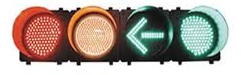
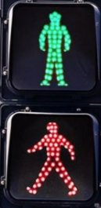

# Traffic Light Control
---

## 기획

In this chapter, we will proceed with an example of controlling traffic light by applying the operation of GATE that we have practiced so far.

 

 

The equipment is equipped with a traffic light to control the application circuit. Below is the type of traffic light most commonly seen at intersections in Korea.

 

Details of the operation are as below.

1. Traffic light is controlled by the traffic light on the road and the traffic light at the crosswalk at the intersection.

2. Traffic light on the road and traffic light at the crosswalk at the intersection are classified as NORTH/EAST/SOUTH/WEST depending on their location.

3. Traffic light on the road is controlled by rotating clockwise in the order of NORTH -> EAST -> SOUTH -> WEST -> NORTH.

4. Traffic light on the crosswalk is controlled by rotating clockwise in the order of EAST -> SOUTH -> WEST -> NORTH -> EAST.

 

|순서| 차도 방향 | 횡단보도 방향 |
|:-:|:-:|:-:|
|1|NORTH|EAST|
|2|EAST|SOUTH|
|3|SOUTH|WEST|
|4|WEST|NORTH|
|5|NORTH|EAST|
|...|...|...|

 

5. Each state changes every 10 seconds.

6. Traffic light on each road is controlled by four signals, RED/YELLOW/LEFT/GREEN.

     
    |RED|YELLOW|LEFT|GREEN|
    |-|-|-|-|

 

7. Traffic light on each crosswalk is controlled by two signals, GREEN/RED, and traffic lights on each crosswalk on both sides in each direction are controlled simultaneously.

    
    |GREEN|RED|
    |-|-|
    
     

8. It moves with 10-second standard for changing condition on the road as follows. 
 
    RED becomes ON when the state is not in the current direction.

   |SEC|RED|YELLOW|LEFT|GREEN|
   |:-:|:-:|:-:|:-:|:-:|
   |0|OFF|OFF|ON|ON|
   |1|OFF|OFF|ON|ON|
   |2|OFF|OFF|ON|ON|
   |3|OFF|OFF|ON|ON|
   |4|OFF|OFF|ON|ON|
   |5|OFF|OFF|ON|ON|
   |6|OFF|ON|OFF|OFF|
   |7|OFF|ON|OFF|OFF|
   |8|OFF|ON|OFF|OFF|
   |9|OFF|ON|OFF|OFF|
 

9. It moves with 10-second standard for changing condition on the crosswalk as follows. 
 
    RED becomes ON when the state is not in the current direction.

   |SEC|RED|GREEN|
   |:-:|:-:|:-:|
   |0|OFF|ON|
   |1|OFF|ON|
   |2|OFF|ON|
   |3|OFF|ON|
   |4|OFF|ON|
   |5|OFF|ON|
   |6|OFF|Flashing|
   |7|OFF|Flashing|
   |8|OFF|Flashing|
   |9|OFF|Flashing|

 

---
## Hardware

Define and distinguish as below in order to control traffic lights.

 

CROSS refers to the traffic light on the road, and WALK refers to the traffic light on the sidewalk.

|1|2|3|4|
|:-:|:-:|:-:|:-:|
|NORTH_CROSS|EAST_CROSS|SOUTH_CROSS|WEST_CROSS|
|5|6|7|8|
|NORTH_WALK|EAST_WALK|SOUTH_WALK|WEST_WALK|

Traffic lights on the road consists of 4 traffic lights as shown below.

 

|RED|YELLOW|LEFT|GREEN|
|-|-|-|-|

Traffic lights on the sidewalk consist of 2 signals as shown below.

 
|GREEN|RED|
|-|-|

 

Define the name as shown in the table below depending on the location and the role of each traffic light on the road and on the crosswalk.

- NORTH
 
    |Location|Port Name|Description|
    |:-:|:-|:-|
    |1|N_C_G|NORTH CROSS GREEN|
    |1|N_C_L|NORTH CROSS GREEN LEFT|
    |1|N_C_Y|NORTH CROSS YELLOW|
    |1|N_C_R|NORTH CROSS RED|
    |5|N_W_G|NORTH WALKING GREEN|
    |5|N_W_R|NORTH WALKING RED|

- EAST
 
    |Location|Port Name|Description|
    |:-:|:-|:-|
    |2|E_C_G|EAST CROSS GREEN|
    |2|E_C_L|EAST CROSS GREEN LEFT|
    |2|E_C_Y|EAST CROSS YELLOW|
    |2|E_C_R|EAST CROSS RED|
    |6|E_W_G|EAST WALKING GREEN|
    |6|E_W_R|EAST WALKING RED|

- SOUTH
 
    |Location|Port Name|Description|
    |:-:|:-|:-|
    |3|S_C_G|SOUTH CROSS GREEN|
    |3|S_C_L|SOUTH CROSS GREEN LEFT|
    |3|S_C_Y|SOUTH CROSS YELLOW|
    |3|S_C_R|SOUTH CROSS RED|
    |7|S_W_G|SOUTH WALKING GREEN|
    |7|S_W_R|SOUTH WALKING RED|

- WEST
 
    |Location|Port Name|Description|
    |:-:|:-|:-|
    |4|W_C_G|WEST CROSS GREEN|
    |4|W_C_L|WEST CROSS GREEN LEFT|
    |4|W_C_Y|WEST CROSS YELLOW|
    |4|W_C_R|WEST CROSS RED|
    |8|W_W_G|WEST WALKING GREEN|
    |8|W_W_R|WEST WALKING RED|

 

## [8-1. MOD 10 Counter](./8-1.CNT_MOD10.md)

## [8-2. 4bit Comparator](./8-2.COMPARE4.md)

## [8-3. One way Traffic Light](./8-3.ONE_WAY.md)

## [8-4. 4 way Traffic Light](./8-4.TRAFFIC_LIGHT.md)

